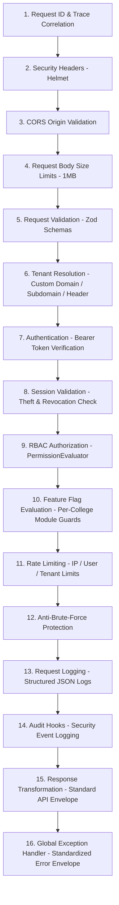

# College Hub: API Gateway, Security Middleware & Request Pipeline (MS-17)

## Document Overview

- **Project**: College Hub (Enterprise Multi-College Platform)
- **Document Title**: Request Pipeline Architecture, Security Middleware & Error Handler Specification
- **Document Version**: 1.0.0-FINAL
- **Application Reference**: `apps/api`
- **Status**: Official API Architecture Standard (MS-17 Complete)

---

## 1. 16-Step Permanent Request Processing Pipeline

Every HTTP request entering the College Hub API monolith passes through 16 ordered security and context steps:



---

## 2. Standardized API Response & Error Envelopes

### 2.1 Success Response Envelope

```json
{
  "success": true,
  "data": {
    "status": "OK"
  },
  "meta": {
    "requestId": "9b1deb4d-3b7d-4bad-9bdd-2b0d7b3dcb6d",
    "timestamp": "2026-08-02T23:30:00.000Z"
  }
}
```

### 2.2 Error Response Envelope

```json
{
  "success": false,
  "error": {
    "code": "NOT_FOUND",
    "message": "The requested endpoint does not exist.",
    "requestId": "9b1deb4d-3b7d-4bad-9bdd-2b0d7b3dcb6d"
  }
}
```

---

## 3. Security & OWASP Alignment

- **Helmet HSTS & CSP**: Prevents Clickjacking (`X-Frame-Options: DENY`), MIME sniffing (`X-Content-Type-Options: nosniff`), and XSS injection via strict Content-Security-Policy headers.
- **Rate Limiting**: Protects against Denial-of-Service (DoS) attacks using multi-dimensional keys (`tenantId:userId:ipAddress`).
- **Correlation ID Propagation**: `x-request-id` is returned on every response header and propagated into `AsyncLocalStorage` for end-to-end trace correlation.

---

_End of API Gateway & Security Middleware Specification._
