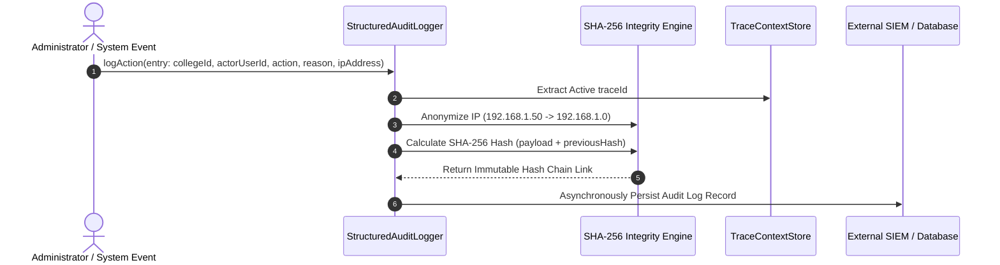

# College Hub: Administrative Audit Logging & Security Event System (MS-14)

## Document Overview

- **Project**: College Hub (Enterprise Multi-College Platform)
- **Document Title**: Immutable Audit Logging, Cryptographic Hash Chaining & Security Event System
- **Document Version**: 1.0.0-FINAL
- **Package Reference**: `@college-hub/security`
- **Status**: Official Security Standard (MS-14 Complete)

---

## 1. Audit Logging & Security Event Architecture

The `@college-hub/security` package provides tamper-evident administrative audit logging, privacy-preserving IP anonymization, trace ID correlation, and cryptographic hash chain verification.

---

## 2. Security Event Taxonomy

Events are classified into 4 severity levels:

| Severity Level | Description                  | Example Actions                                        | Retention Policy     |
| -------------- | ---------------------------- | ------------------------------------------------------ | -------------------- |
| **INFO**       | Routine operational actions  | `THEME_UPDATED`, `CONFIG_VIEWED`                       | 90 Days              |
| **WARNING**    | Unusual operational events   | `FAILED_LOGIN_ATTEMPT`, `MODULE_ACCESSED_DISABLED`     | 180 Days             |
| **SECURITY**   | Security policy violations   | `CROSS_TENANT_ACCESS_BLOCKED`, `IP_RATE_LIMITED`       | 365 Days             |
| **CRITICAL**   | Destructive admin operations | `TENANT_DELETED`, `DATABASE_RESTORED`, `ROLE_ELEVATED` | 7 Years (Legal Hold) |

---

## 3. Cryptographic Hash Chain Integrity Strategy

To guarantee tamper-evidence (detecting if a malicious database administrator tries to alter or delete past audit logs):

1. **Hash Chaining**: Every log entry includes `previousHash` pointing to the SHA-256 hash of the preceding record.
2. **Hash Computation**:
   $$\text{hash} = \text{SHA256}(\text{id} + \text{collegeId} + \text{action} + \text{oldValue} + \text{newValue} + \text{reason} + \text{timestamp} + \text{previousHash})$$
3. **Chain Verification (`verifyIntegrity()`)**: Validates the entire historical sequence. If any historical record is modified, the hash chain breaks at that exact record index.

---

## 4. Privacy & IP Anonymization

To comply with global privacy regulations (GDPR / CCPA):

- **IPv4 Anonymization**: Masks the final octet (e.g. `192.168.1.50` -> `192.168.1.0`).
- **IPv6 Anonymization**: Masks the host segment (e.g. `2001:db8:85a3:8d3:1319:8a2e:370:7348` -> `2001:db8:85a3:8d3:0000:0000:0000:0000`).

---

## 5. SIEM & Observability Integration Strategy

Audit logs emit structured JSON payloads tagged with `traceId` and `collegeId`, enabling seamless ingestion into enterprise SIEM platforms (Splunk, Datadog, Grafana Loki, AWS CloudWatch).

---

_End of Audit Logging Specification._
