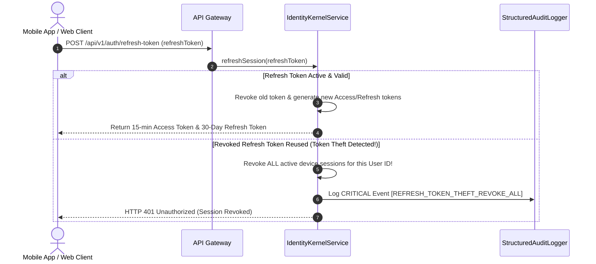

# College Hub: Multi-Tenant Authentication & Identity Kernel (MS-15 - Refined)

## Document Overview

- **Project**: College Hub (Enterprise Multi-College Platform)
- **Document Title**: Authentication Architecture, Argon2id Hashing, Password History & Session Engine
- **Document Version**: 2.0.0-REFINED
- **Package Reference**: `@college-hub/security`
- **Status**: Official Security Architecture Standard (MS-15 Complete & Verified)

---

## 1. Argon2id Hashing & Password History Policy

### 1.1 OWASP Argon2id Parameter Selection

All passwords are hashed exclusively with **Argon2id** (`$argon2id`) using OWASP recommended parameters:

- **Time Cost ($t$)**: `3` iterations
- **Memory Cost ($m$)**: `65536` KiB (64 MB)
- **Parallelism ($p$)**: `4` threads
- **Hash Output Length**: `32` bytes (256 bits)

### 1.2 Automatic Hash Rehashing (`needsRehash`)

If OWASP security standards increase or server parameters are upgraded in the future, the identity kernel automatically evaluates `needsRehash(storedHash, currentOptions)` upon successful login and re-hashes the user's password to the latest security parameters without interrupting the user experience.

### 1.3 Password History Reuse Prevention

To prevent password reuse attacks, the identity kernel maintains an array of historical Argon2id password hashes (`passwordHistory: string[]`). The system prevents reuse of the **last 5 passwords** (configurable via `passwordHistoryLimit`).

---

## 2. Configurable Session & Device Metadata Architecture

### 2.1 Token Lifetimes

- **Access Token**: `15 minutes`
- **Refresh Token**: `30 days` (Default, configurable per-college via `CollegeConfigEngine`)

### 2.2 Rich Device Session Metadata

Every user session tracks comprehensive device telemetry:

- `deviceName`: e.g. `"iPhone 15 Pro"`, `"MacBook Pro 16"`
- `platform`: `"Mobile"`, `"Desktop"`, `"Web"`
- `browser`: e.g. `"Safari 17"`, `"Chrome 125"`
- `os`: e.g. `"iOS 17.4"`, `"macOS Sonoma"`, `"Windows 11"`
- `approximateLocation`: e.g. `"Cambridge, MA, USA"`
- `firstLoginAt` & `lastActiveAt` timestamps

---

## 3. Sequence Diagrams

### 3.1 Refresh Token Theft Detection & Multi-Device Session Revocation

---

## 4. Anonymous Identity & Blind Reference Architecture

$$\text{anonymousToken} = \text{HMAC-SHA256}(\text{userId} + \text{collegeId}, \text{secretSalt})$$

- **Privacy Guarantee**: Neither platform owners nor database administrators can trace an anonymous post back to a student's real identity.

---

_End of Authentication & Identity Kernel Specification._
