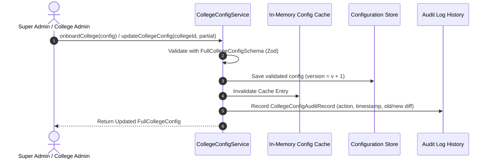

# College Hub: Per-College Configuration & Customization Engine (MS-13)

## Document Overview

- **Project**: College Hub (Enterprise Multi-College Platform)
- **Document Title**: Per-College Dynamic Configuration, Onboarding Strategy & Audit Trail
- **Document Version**: 1.0.0-FINAL
- **Package Reference**: `@college-hub/config`
- **Status**: Official Engineering Standard (MS-13 Complete)

---

## 1. College Configuration Architecture

The `@college-hub/config` package provides runtime configuration loading, strict Zod schema validation, per-college module customization, and instant version rollback capabilities.



---

## 2. Configurable Settings Matrix

Every college onboarded to College Hub manages independent configurations without code modifications:

| Configuration Domain     | Configurable Options                                                                    | Default Fallback                     |
| ------------------------ | --------------------------------------------------------------------------------------- | ------------------------------------ |
| **Identity & Branding**  | Name, Slug, Logo URL, Favicon URL, HEX Primary/Secondary colors                         | Stanford Maroon `#8C1515`            |
| **Email Domains**        | Allowed email suffix array (e.g. `['@stanford.edu']`)                                   | Mandatory array                      |
| **Enabled Modules**      | Feature module enrollment array (`['rate-my-professor', 'marketplace']`)                | Baseline academic modules            |
| **Maintenance Mode**     | Master toggle, message, allowed roles                                                   | `enabled: false`                     |
| **Moderation Policies**  | Confessions auto-approve, Professor review moderation (`PRE`/`POST`), AI flag threshold | `POST_MODERATION`, `threshold: 0.85` |
| **Marketplace Settings** | Max active listings per student, allowed item categories                                | `10 listings max`                    |
| **Confession Settings**  | Max character length, student email verification requirement                            | `500 chars max`                      |
| **Rate My Professor**    | Anonymous review toggle, minimum review character length                                | `anonymous: true`, `20 chars min`    |
| **Legal Pages**          | Privacy Policy URL, Terms of Service URL, Community Guidelines URL                      | Default platform legal URLs          |

---

## 3. Zero-Code Onboarding Strategy

Onboarding a new institution requires zero code modifications or application redeployments:

```typescript
import { CollegeConfigService } from '@college-hub/config';

const configService = new CollegeConfigService();
configService.onboardCollege({
  collegeId: 'college-berkeley-004',
  name: 'UC Berkeley',
  slug: 'berkeley',
  allowedEmailDomains: ['@berkeley.edu'],
  branding: {
    primaryColor: '#003262',
    secondaryColor: '#FDB515',
    logoUrl: 'https://berkeley.edu/logo.png',
    faviconUrl: 'https://berkeley.edu/favicon.ico',
    darkModeDefault: false
  }
});
```

---

## 4. Audit History & Version Rollback

Every update records an immutable audit record containing:

- Action type (`ONBOARDED`, `UPDATED`, `ROLLBACK`).
- Version number increment (`v1 -> v2`).
- Old configuration snapshot and new configuration snapshot.
- Actor ID (`updatedBy`).

Administrators can call `configService.rollbackCollegeConfig(collegeId, targetVersion)` to immediately restore previous settings.

---

_End of College Configuration Engine Specification._
