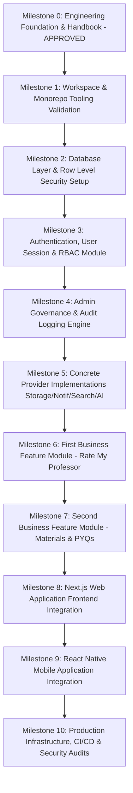

# College Hub: Engineering Handbook & Governance Standards (Phase 0)

## Document Overview

- **Project**: College Hub (Enterprise Multi-College Platform)
- **Document Title**: Engineering Standards, Architecture Governance & Operations Handbook
- **Document Version**: 1.0.0-FINAL
- **Target Audience**: All Software Engineers, Architects, Security Engineers, and DevOps Maintainers
- **Status**: Official Engineering Specification (Phase 0 Foundation)

---

## Table of Contents

1. [Engineering Principles](#1-engineering-principles)
2. [Software Architecture Principles](#2-software-architecture-principles)
3. [Security Standards & OWASP Governance](#3-security-standards--owasp-governance)
4. [Database Standards & Schema Governance](#4-database-standards--schema-governance)
5. [API Design Standards & RESTful Contracts](#5-api-design-standards--restful-contracts)
6. [Frontend Engineering Standards](#6-frontend-engineering-standards)
7. [Mobile Development Standards](#7-mobile-development-standards)
8. [UI/UX & Design System Standards](#8-uiux--design-system-standards)
9. [Accessibility (a11y) Standards](#9-accessibility-a11y-standards)
10. [Performance & Web Vitals Standards](#10-performance--web-vitals-standards)
11. [Git Workflow Governance](#11-git-workflow-governance)
12. [Branching Strategy](#12-branching-strategy)
13. [Commit Message Convention (Conventional Commits)](#13-commit-message-convention-conventional-commits)
14. [Pull Request Checklist](#14-pull-request-checklist)
15. [Code Review Checklist & Code Quality Gates](#15-code-review-checklist--code-quality-gates)
16. [Documentation Standards](#16-documentation-standards)
17. [Testing Strategy & Quality Pyramid](#17-testing-strategy--quality-pyramid)
18. [Logging & Monitoring Standards](#18-logging--monitoring-standards)
19. [Error Handling & Resilience Standards](#19-error-handling--resilience-standards)
20. [Configuration & Environment Standards](#20-configuration--environment-standards)
21. [Secrets Management Policy](#21-secrets-management-policy)
22. [Dependency Management Policy](#22-dependency-management-policy)
23. [Release & Versioning Strategy (SemVer)](#23-release--versioning-strategy-semver)
24. [Backup & Disaster Recovery Policy](#24-backup--disaster-recovery-policy)
25. [Security Incident Response Policy](#25-security-incident-response-policy)
26. [Future Module Integration Rules](#26-future-module-integration-rules)
27. [Coding Style Guide & SOLID Matrix](#27-coding-style-guide--solid-matrix)
28. [Naming Conventions Matrix](#28-naming-conventions-matrix)
29. [Folder Organization Standards](#29-folder-organization-standards)
30. [Architecture Decision Record (ADR) Standards](#30-architecture-decision-record-adr-standards)
31. [Implementation Roadmap & Phased Execution Plan](#31-implementation-roadmap--phased-execution-plan)

---

## 1. Engineering Principles

### 1.1 Why It Exists

Engineering principles establish a shared mental model for engineers when evaluating tradeoffs, reviewing pull requests, and designing systems. Without explicit principles, technical debt accumulates rapidly due to inconsistent design philosophies.

### 1.2 Applicability to College Hub

College Hub is targeted to support hundreds of colleges and hundreds of thousands of active students across desktop and mobile. This multi-tenant scale requires extreme discipline to avoid architectural entropy over time.

### 1.3 Core Principles

- **Simplicity Before Cleverness (KISS)**: Write explicit, predictable code over terse or overly abstract solutions.
- **Don't Repeat Yourself (DRY) vs. Wrong Abstraction**: Abstract code only after identifying three identical use cases. Prefer duplication over coupling distinct business domains.
- **You Aren't Gonna Need It (YAGNI)**: Implement only what is required by current specifications. Avoid pre-building speculative features without empirical user demand.
- **Fail Fast & Visibly**: Detect invalid states immediately at system boundaries (e.g. via Zod runtime schema validation) rather than allowing corrupted data to propagate deep into application layers.

### 1.4 Common Mistakes to Avoid

- Over-engineering early abstractions for hypothetical use cases.
- Copy-pasting domain logic across modules instead of creating shared utilities in `packages/core`.

### 1.5 Industry References

- _Clean Code_ by Robert C. Martin.
- _The Pragmatic Programmer_ by Andrew Hunt and David Thomas.

---

## 2. Software Architecture Principles

### 2.1 Why It Exists

Architectural standards maintain system integrity across team growth and codebase evolution, ensuring high cohesion and low coupling.

### 2.2 Applicability to College Hub

College Hub uses a **Modular Monolith Kernel Architecture**. Every feature module (Rate My Professor, Materials, Marketplace, Confessions) must operate independently without direct cross-module database dependencies or tight coupling.

### 2.3 Core Principles

- **Separation of Concerns**: Controllers handle serialization; Services handle business logic; Repositories handle database operations.
- **Dependency Inversion (DIP)**: High-level business logic depends on domain abstractions (interfaces), never on concrete implementations (e.g., depends on `IStorageProvider`, not `AWS.S3`).
- **Zero Direct Cross-Module Database Joins**: Modules communicate exclusively via typed domain events or provider APIs.
- **Stateless Application Tier**: All API instances must remain completely stateless to support seamless horizontal auto-scaling.

### 2.4 Common Mistakes to Avoid

- Directly importing internal database tables or services from another module.
- Storing ephemeral state in node memory instead of Redis.

### 2.5 Industry References

- Martin Fowler's _Modular Monolith Architecture_.
- Eric Evans' _Domain-Driven Design (DDD)_.

---

## 3. Security Standards & OWASP Governance

### 3.1 Why It Exists

Security must be baked into every architectural boundary to protect sensitive student data, anonymous confession identities, and multi-tenant administrative assets.

### 3.2 Applicability to College Hub

As a multi-tenant platform serving educational institutions, security violations (e.g. cross-college data leaks or unauthorized PII access) carry severe legal and compliance ramifications.

### 3.3 Best Practices & Defensive Rules

- **OWASP Top 10 Defense**:
  - _Broken Access Control_: Enforce PostgreSQL Row Level Security (RLS) and API RBAC guards on every route.
  - _Cryptographic Failures_: Argon2id for password hashing; AES-256-GCM for encrypted database fields; TLS 1.3 enforced in transit.
  - _Injection_: Use Drizzle ORM parameterized queries exclusively; zero raw string SQL concatenation.
  - _Security Misconfiguration_: Enforce strict Content Security Policy (CSP), HTTP-Only SameSite=Strict cookies, disabled server headers.
- **Input Sanitization & Validation**: Parse and sanitize all incoming request bodies, params, and headers with Zod schemas at API boundary.
- **Rate Limiting**: Sliding window rate limiters backed by Redis per IP and per User ID.

### 3.4 Common Mistakes to Avoid

- Trusting client-supplied tenant IDs or user IDs without verifying JWT session context.
- Storing plain-text tokens or keys in Git repositories or log files.

### 3.5 Industry References

- OWASP API Security Top 10 (2023).
- NIST SP 800-63B Authentication Guidelines.

---

## 4. Database Standards & Schema Governance

### 4.1 Why It Exists

Database schemas are difficult to alter once deployed to production. Standardizing database design prevents performance degradation, data corruption, and tenant isolation failures.

### 4.2 Applicability to College Hub

College Hub utilizes a **Shared Database, Isolated Schema with Row Level Security (RLS)** model. Every table must support multi-tenant isolation.

### 4.3 Standards & Rules

- **Mandatory Tenant Column**: Every multi-tenant table MUST include a indexed `college_id uuid NOT NULL` foreign key.
- **Row Level Security (RLS)**:
  ```sql
  ALTER TABLE <table_name> ENABLE ROW LEVEL SECURITY;
  CREATE POLICY tenant_isolation_policy ON <table_name>
    USING (college_id = CURRENT_SETTING('app.current_college_id', true));
  ```
- **Primary & Foreign Keys**: Primary keys must be UUID v4. Indexes must be created on all foreign keys and frequently queried fields.
- **Auditing Columns**: Tables must include `created_at timestamp default now() not null` and `updated_at timestamp default now() not null`.
- **Migrations**: Schema changes must be committed as versioned Drizzle ORM migration scripts. Down migrations must be tested.

### 4.4 Common Mistakes to Avoid

- Omitting index on `college_id`, resulting in full table scans under RLS.
- Executing schema migrations manually in production instead of automated CI pipelines.

### 4.5 Industry References

- PostgreSQL Official Documentation on Row Level Security.
- Database Refactoring Patterns by Scott Ambler.

---

## 5. API Design Standards & RESTful Contracts

### 5.1 Why It Exists

Consistent API contracts reduce integration friction between backend services, web applications, and mobile apps.

### 5.2 Applicability to College Hub

Shared API client packages generate type-safe SDKs consumed by Web (Next.js) and Mobile (React Native) applications.

### 5.3 Standards & Rules

- **RESTful Resource Naming**: Plural nouns for resources (`/api/v1/professors`, `/api/v1/materials`).
- **Standard HTTP Verbs**:
  - `GET`: Idempotent read.
  - `POST`: Resource creation.
  - `PUT`: Complete resource update.
  - `PATCH`: Partial resource update.
  - `DELETE`: Resource removal.
- **Uniform Response Envelope**:
  ```typescript
  export interface ApiResponse<T> {
    success: boolean;
    data?: T;
    error?: {
      code: string;
      message: string;
      details?: Record<string, unknown>;
    };
    meta?: {
      page?: number;
      limit?: number;
      total?: number;
    };
  }
  ```
- **Versioning**: Prefix all API routes with `/api/v1/`. Breaking changes mandate a major version increment (`/api/v2/`).

### 5.4 Common Mistakes to Avoid

- Returning HTTP status code `200 OK` for payload errors (e.g. 200 with `{ error: "Unauthorized" }`).
- Inconsistent JSON property casing (camelCase required).

---

## 6. Frontend Engineering Standards

### 6.1 Why It Exists

Frontend code bases easily degenerate into bloated, unmaintainable component trees without strict state management and component boundaries.

### 6.2 Applicability to College Hub

Web application relies on **Next.js 15 (App Router)** and **React 19** with TailwindCSS v4.

### 6.3 Standards & Rules

- **Component Architecture**:
  - _Server Components (RSC)_: Default choice for data fetching, static rendering, and layout wrappers.
  - _Client Components (`'use client'`)_: Reserved exclusively for interactive elements (form handlers, dynamic state toggles).
- **State Management**:
  - Local component state for UI toggles (`useState`).
  - Server state managed via TanStack Query / React Server Actions (zero global Redux boilerplate).
  - URL state for filters and pagination (`searchParams`).
- **Zero Inline Styling**: All styling must use Tailwind utility classes or Shadcn UI design system primitives.

### 6.4 Common Mistakes to Avoid

- Fetching data inside client components using `useEffect` instead of Server Components or TanStack Query.
- Mutating state directly instead of immutable updates.

---

## 7. Mobile Development Standards

### 7.1 Why It Exists

Mobile apps execute in resource-constrained hardware environments across diverse device dimensions and unstable connectivity.

### 7.2 Applicability to College Hub

Mobile application relies on **React Native (Expo SDK 51+)** with Clean Architecture.

### 7.3 Standards & Rules

- **Clean Architecture Layers**:
  - `/presentation`: UI Views and React Native Screens.
  - `/domain`: Pure business entities and use cases.
  - `/data`: Storage repositories and API client network layer.
- **Offline-First Resilience**: Cache critical read data in MMKV local storage; queue offline actions for sync upon network restoration.
- **Performance Optimization**: Use `FlashList` over legacy `FlatList` for long feeds (Confessions, Professor Reviews); optimize image caching using `expo-image`.

### 7.4 Common Mistakes to Avoid

- Unnecessary re-renders caused by passing inline objects to list items.
- Storing sensitive auth tokens in `AsyncStorage` instead of secure keychain (`expo-secure-store`).

---

## 8. UI/UX & Design System Standards

### 8.1 Why It Exists

A cohesive design system builds user trust and enforces brand consistency across platforms.

### 8.2 Applicability to College Hub

Supports multi-college white-labeling (dynamic college brand colors, logos, and typography) through `@college-hub/theme-engine`.

### 8.3 Standards & Rules

- **Design Tokens**: Standardized color scales (50-900), spacing multipliers (4px grid), border radii, and typography scales defined in design system.
- **Component Reusability**: All buttons, inputs, modals, cards, and dropdowns must be imported from `@college-hub/ui` (Shadcn UI base).
- **Responsive Design**: Mobile-first media queries (`sm`, `md`, `lg`, `xl`).

### 8.4 Common Mistakes to Avoid

- Hardcoding static pixel offsets (e.g. `margin-left: 17px`) instead of standard token steps (`ml-4`).
- Using generic unharmonious default colors (pure black `#000000` or plain red `#FF0000`).

---

## 9. Accessibility (a11y) Standards

### 9.1 Why It Exists

Software must be accessible to all students, including those with visual, auditory, motor, or cognitive impairments.

### 9.2 Applicability to College Hub

Compliance with **WCAG 2.1 Level AA** standards is mandatory across Web and Mobile applications.

### 9.3 Standards & Rules

- **Color Contrast**: Contrast ratio of at least **4.5:1** for normal text and **3:1** for large text.
- **Keyboard Navigation**: All interactive elements must be focusable with clear visual focus indicators.
- **ARIA Attributes**: Use semantic HTML5 elements (`<nav>`, `<main>`, `<header>`, `<article>`); attach `aria-label`, `aria-expanded`, and `role` attributes where required.
- **Screen Reader Support**: Mobile components must include `accessible={true}` and `accessibilityLabel` attributes.

### 9.4 Common Mistakes to Avoid

- Using non-semantic elements (`<div onClick={...}>`) for buttons without keyboard event listeners or ARIA roles.
- Icon-only buttons missing visual text or screen reader labels.

---

## 10. Performance & Web Vitals Standards

### 10.1 Why It Exists

Page speed directly influences user engagement, retention, and SEO rankings.

### 10.2 Applicability to College Hub

Core Web Vitals targets must be met consistently across all public and authenticated pages.

### 10.3 Metrics & Target Thresholds

- **Largest Contentful Paint (LCP)**: `< 2.5 seconds`.
- **First Input Delay / Interaction to Next Paint (INP)**: `< 200 milliseconds`.
- **Cumulative Layout Shift (CLS)**: `< 0.1`.
- **API Response Latency**: P95 `< 150ms`, P99 `< 300ms`.

### 10.4 Optimization Techniques

- Dynamic import and code splitting for heavy client components.
- Image auto-optimization (WebP/AVIF formatting, responsive sizing).
- Redis caching for frequent database query responses.

---

## 11. Git Workflow Governance

### 11.1 Why It Exists

Enforces clean history, prevents code collisions, and ensures traceable release histories.

### 11.2 Applicability to College Hub

All engineers submit changes through pull requests audited by CI automated checks.

### 11.3 Rules & Best Practices

- **Trunk-Based Development**: Short-lived feature branches merged frequently into `main`.
- **Rebase Strategy**: Prefer `git rebase` over merge commits for feature branches to maintain linear git history.
- **No Direct Commits**: Direct commits to `main` or `staging` branches are strictly blocked via GitHub branch protection rules.

---

## 12. Branching Strategy

### 12.1 Branch Naming Taxonomy

- **Features**: `feature/<module-name>/<short-description>` (e.g. `feature/rate-my-professor/add-rating-form`)
- **Bug Fixes**: `fix/<module-name>/<issue-id>` (e.g. `fix/auth/token-refresh-error`)
- **Refactoring**: `refactor/<module-name>/<short-description>`
- **Documentation**: `docs/<short-description>`
- **Infrastructure**: `infra/<short-description>`

---

## 13. Commit Message Convention (Conventional Commits)

### 13.1 Format Specification

```
<type>(<scope>): <short summary in imperative mood>

[optional detailed body]

[optional issue reference]
```

### 13.2 Allowed Types

- `feat`: New feature for the user.
- `fix`: Bug fix for the user.
- `docs`: Documentation changes only.
- `style`: Code formatting (white-space, formatting, missing semi-colons).
- `refactor`: Code change that neither fixes a bug nor adds a feature.
- `perf`: Code change that improves performance.
- `test`: Adding missing tests or correcting existing tests.
- `chore`: Maintenance tasks, build configuration, dependency updates.

### 13.3 Example

```
feat(confessions): add automated AI moderation check prior to feed publishing

Closes #142
```

---

## 14. Pull Request Checklist

Before submitting a Pull Request (PR), the author MUST verify:

- [ ] PR title follows Conventional Commits format.
- [ ] PR description details _What_ was changed and _Why_.
- [ ] Associated issue/ticket linked.
- [ ] Code passes all local linting (`pnpm lint`), type checking (`pnpm type-check`), and formatting (`pnpm format`).
- [ ] Unit & Integration tests written and passing (`pnpm test` >85% coverage).
- [ ] Database migrations included and tested (if schema modified).
- [ ] No hardcoded secrets, API keys, or credentials present.
- [ ] Tenant context and PostgreSQL RLS policies verified for multi-tenant safety.

---

## 15. Code Review Checklist & Quality Gates

Code reviewers MUST evaluate PRs against these gates:

- **Security**: Are input boundaries validated with Zod? Is tenant data isolated with `college_id`?
- **Architecture**: Does the change respect module boundaries? Are provider abstractions utilized?
- **Performance**: Are there N+1 database queries? Are indexes present for new foreign keys?
- **Maintainability**: Is code self-documenting? Are complex algorithms commented?
- **Test Coverage**: Are edge cases and failure paths covered by tests?

---

## 16. Documentation Standards

### 16.1 Rules

- **Code Comments**: Document _Why_ code exists, not _What_ code does (self-documenting code).
- **JSDoc / TSDoc**: Exported functions, interfaces, and classes must include TSDoc annotations.
- **API Specs**: All API routes must maintain up-to-date OpenAPI/Swagger schemas.
- **Architecture Decision Records (ADRs)**: Mandatory for all major structural, tech stack, or policy decisions under `docs/adr/`.

---

## 17. Testing Strategy & Quality Pyramid

```
        / \
       /   \     E2E Tests (Playwright / Mobile Detox) - 10%
      /-----\
     /       \   Integration Tests (Testcontainers + Supertest) - 30%
    /---------\
   /           \ Unit Tests (Vitest) - 60%
  --------------
```

### 17.1 Test Categories & Thresholds

- **Unit Testing (Vitest)**: Tests pure domain logic, utility transformers, and calculations. Minimum code coverage: **85%**.
- **Integration Testing (Testcontainers + Supertest)**: Boots real ephemeral PostgreSQL & Redis Docker containers to verify API endpoints, database queries, RLS policies, and event handlers.
- **End-to-End (E2E) Testing (Playwright / Detox)**: Validates critical user journeys (sign-up, rating submission, marketplace checkout).

---

## 18. Logging & Monitoring Standards

### 18.1 Structured JSON Logging

All application logs are produced in single-line JSON format via `@college-hub/logger` (Pino).

### 18.2 Mandatory Log Attributes

```json
{
  "level": "info",
  "time": "2026-08-02T22:41:00.000Z",
  "pid": 1234,
  "hostname": "api-pod-1",
  "traceId": "c7a8e9f0-1234-5678-9abc-def012345678",
  "tenantId": "college-stanford-001",
  "userId": "usr-9876",
  "msg": "User submitted confession for moderation review"
}
```

### 18.3 Redaction Rules

Sensitive fields (`password`, `token`, `authorization`, `creditCard`) are automatically redacted via logger serializers.

---

## 19. Error Handling & Resilience Standards

### 19.1 Error Handling Rules

- **No Swallowing Exceptions**: Never catch an error with an empty `catch` block or return generic empty fallbacks silently.
- **Custom Application Exceptions**: Throw typed domain exceptions extending `BaseApplicationError`:
  ```typescript
  export class NotFoundError extends BaseApplicationError {
    constructor(message: string, details?: Record<string, unknown>) {
      super(message, 'NOT_FOUND', 404, details);
    }
  }
  ```
- **Graceful Degradation**: If non-critical secondary services (e.g. recommendations or analytics) fail, the core user request must still succeed.

---

## 20. Configuration & Environment Standards

### 20.1 Rules

- **Zero Hardcoded Configs**: Operational parameters (ports, URLs, timeouts, feature flags) must be supplied via environment variables.
- **Strict Runtime Validation**: Environment variables are parsed at boot time using Zod schemas in `@college-hub/config`. If any variable is missing or invalid, the process halts immediately.
- **`.env.example` Maintenance**: Whenever a new environment variable is introduced, `.env.example` MUST be updated with descriptions.

---

## 21. Secrets Management Policy

### 21.1 Security Policy Rules

- **Zero Plain-Text Secrets in Git**: Plain-text API keys, database passwords, or JWT secrets in source code will result in immediate commit rejection via Git pre-commit hooks (GitGuardian).
- **Production Secret Vault**: Production secrets are injected at runtime via HashiCorp Vault, AWS Secrets Manager, or Doppler.
- **Secret Rotation**: Database credentials and API keys must be rotated every 90 days.

---

## 22. Dependency Management Policy

### 22.1 Rules & Security

- **Package Manager**: `pnpm` exclusively (enforced via `packageManager` field in `package.json`).
- **Lockfile Integrity**: `pnpm-lock.yaml` must be committed to Git. CI builds enforce `--frozen-lockfile`.
- **Vulnerability Auditing**: Automated dependency vulnerability scanning executed daily via Socket.dev and Dependabot. High/Critical vulnerabilities block PR merges.

---

## 23. Release & Versioning Strategy (SemVer)

### 23.1 Semantic Versioning (`MAJOR.MINOR.PATCH`)

- **MAJOR**: Incompatible API breaking changes.
- **MINOR**: New backward-compatible feature functionality added.
- **PATCH**: Backward-compatible bug fixes and security patches.

---

## 24. Backup & Disaster Recovery Policy

### 24.1 SLAs & Recovery Objectives

- **Recovery Point Objective (RPO)**: `< 5 minutes` (maximum tolerable data loss).
- **Recovery Time Objective (RTO)**: `< 15 minutes` (maximum tolerable system downtime).

### 24.2 Automated Procedures

- **Continuous Write-Ahead Log (WAL)**: Streamed continuously to multi-region cloud object storage for Point-in-Time Recovery (PITR up to 35 days).
- **Daily Full Snapshots**: Automated geo-replicated database backups taken daily at 02:00 UTC.

---

## 25. Security Incident Response Policy

### 25.1 Incident Lifecycle Stages

1. **Identification & Alerting**: Real-time automated alert triggered via Sentry / GuardDuty.
2. **Containment**: Revoke compromised API keys/sessions; isolate affected pods or tenant contexts via WAF/Redis key invalidation.
3. **Eradication & Patching**: Apply fix, deploy via emergency patch pipeline, verify integrity.
4. **Post-Mortem**: Produce public Incident Report detailing root cause, timeline, and corrective actions within 48 hours.

---

## 26. Future Module Integration Rules

To integrate a new module into College Hub without touching core infrastructure:

1. Module directory MUST be created under `/modules/<module-name>`.
2. Module class MUST implement `CollegeHubModule` interface (`id`, `name`, `version`, `registerRoutes`, `registerEventHandlers`, `healthCheck`).
3. Module database tables MUST include `college_id` foreign key and PostgreSQL RLS policies.
4. All third-party capabilities MUST consume Provider Abstractions (`IStorageProvider`, `INotificationProvider`, `ISearchProvider`, `IAIProvider`).
5. Module access MUST be guarded by `FeatureFlagEngine` and `PermissionGuard`.

---

## 27. Coding Style Guide & SOLID Matrix

- **Single Responsibility Principle (SRP)**: Each class/module must have exactly one reason to change.
- **Open/Closed Principle (OCP)**: Systems are open for extension via modules/events, closed for modification.
- **Liskov Substitution Principle (LSP)**: Subtypes must be substitutable for their base abstractions.
- **Interface Segregation Principle (ISP)**: Interfaces must be granular and client-specific.
- **Dependency Inversion Principle (DIP)**: Depend on abstractions, not concrete implementations.

---

## 28. Naming Conventions Matrix

| Target Artifact           | Convention               | Example                                |
| :------------------------ | :----------------------- | :------------------------------------- |
| **Directories**           | `kebab-case`             | `rate-my-professor/`, `user-profile/`  |
| **TypeScript Files**      | `kebab-case.type.ts`     | `professor-review.service.ts`          |
| **TypeScript Classes**    | `PascalCase`             | `ProfessorReviewService`               |
| **TypeScript Interfaces** | `PascalCase`             | `TenantContext`, `NotificationPayload` |
| **Variables & Functions** | `camelCase`              | `calculateAverageRating()`             |
| **Constants & Enums**     | `UPPER_SNAKE_CASE`       | `MAX_FILE_SIZE_BYTES`                  |
| **Database Tables**       | `snake_case` (plural)    | `professor_reviews`, `college_tenants` |
| **Database Columns**      | `snake_case`             | `created_at`, `college_id`             |
| **API Endpoints**         | `kebab-case` (lowercase) | `/api/v1/rate-my-professor/professors` |

---

## 29. Folder Organization Standards

```
college-hub/
├── docs/                         # Handbooks & ADRs
│   ├── adr/
│   └── ENGINEERING_HANDBOOK.md
├── apps/                         # Executable Applications
│   ├── api/                      # Fastify Monolith Kernel Server
│   ├── web/                      # Next.js Web App
│   ├── mobile/                   # React Native (Expo) Mobile App
│   └── admin/                    # Platform Admin Console
├── packages/                     # Core Shared Infrastructure
│   ├── core/                     # Kernel Interfaces & Event Bus
│   ├── database/                 # Drizzle Schema & Migrations
│   ├── security/                 # Audit Logger & RBAC Guards
│   ├── feature-flags/            # Feature Flag Engine
│   ├── theme-engine/             # White-label Theme Engine
│   ├── providers/                # Storage, Notification, Search, AI Interfaces
│   ├── ui/                       # Design System Components
│   ├── config/                   # Environmental Schemas
│   ├── logger/                   # Pino Logger
│   └── types/                    # Shared DTOs
└── modules/                      # Plug & Play Business Feature Modules
```

---

## 30. Architecture Decision Record (ADR) Standards

### 30.1 ADR Format Template

Every ADR created in `docs/adr/NNNN-title.md` MUST follow this structure:

```markdown
# ADR NNNN: <Short Title>

- **Status**: [Proposed | Approved | Superseded | Rejected]
- **Date**: YYYY-MM-DD
- **Deciders**: <Names/Roles>

## Context

<What is the problem or architectural need we are solving?>

## Decision

<What choice are we making and why?>

## Consequences

### Positive

- <Benefit 1>
- <Benefit 2>

### Negative

- <Tradeoff/Constraint 1>
```

---

## 31. Implementation Roadmap & Phased Execution Plan

To execute College Hub with extreme precision and safety, implementation is divided into **small, reviewable milestones**:



### Detailed Milestone Breakdown

- **Milestone 1: Workspace & Monorepo Tooling Validation**
  - Finalize workspace tooling, verify Turborepo task caching, root scripts, and local Docker compose stack.
- **Milestone 2: Database Layer & Row Level Security Setup**
  - Establish Drizzle ORM PostgreSQL connection pool, multi-tenant RLS policies, tenant context resolution middleware, and base migration scripts.
- **Milestone 3: Authentication, User Session & RBAC Module**
  - Build `@college-hub/mod-auth` handling sign-up, email domain verification, JWT access tokens, refresh token rotation in Redis, password hashing with Argon2id, and RBAC permission guards.
- **Milestone 4: Admin Governance & Audit Logging Engine**
  - Build `@college-hub/mod-admin-governance`, per-college configuration manager, feature flag admin controls, and tamper-evident audit log query APIs.
- **Milestone 5: Concrete Provider Implementations**
  - Implement concrete provider adapters: Local Disk & S3 Storage Provider, Firebase/Expo Push Notification Provider, Postgres/Typesense Search Provider, and OpenAI/Ollama AI Provider.
- **Milestone 6: Feature Module - Rate My Professor**
  - Complete `@college-hub/mod-rate-my-professor` end-to-end API endpoints, moderation hooks, professor review submit/query workflows.
- **Milestone 7: Feature Module - Materials & PYQs**
  - Build `@college-hub/mod-materials-pyqs` handling pre-signed URL PDF uploads, course tags, semester filtering, and study material downloads.
- **Milestone 8: Next.js Web Application Frontend**
  - Construct Next.js 15 Web App (`apps/web`), dynamic per-college theme engine integration, Shadcn UI components, and public/authenticated page routes.
- **Milestone 9: React Native Mobile Application**
  - Build React Native Expo App (`apps/mobile`), offline storage sync with MMKV, push notifications, and native screen navigation.
- **Milestone 10: Production Infrastructure & CI/CD**
  - Configure GitHub Actions CI/CD pipelines, container security scanning with Trivy, staging/production deployments, and backup DR validation.

---

_End of Engineering Handbook (Phase 0)._
