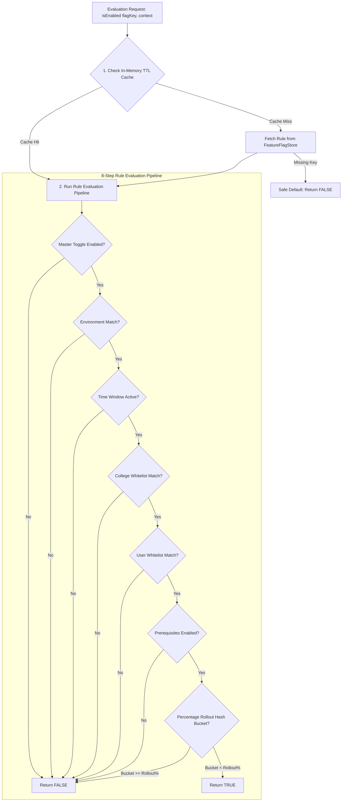

# College Hub: Tenant Feature Flag Engine Architecture (MS-10)

## Document Overview

- **Project**: College Hub (Enterprise Multi-College Platform)
- **Document Title**: Tenant Feature Flag Engine, Rollout Strategy & Audit History
- **Document Version**: 1.0.0-FINAL
- **Package Reference**: `@college-hub/feature-flags`
- **Status**: Official Engineering Standard (MS-10 Complete)

---

## 1. Feature Flag Evaluation Architecture

The `@college-hub/feature-flags` engine provides runtime feature gating, per-college beta rollouts, and instant module enable/disable capabilities without server restarts.

---

## 2. Rule Evaluation Sequence Matrix

1. **Master Toggle (`enabled`)**: Global kill switch.
2. **Environment Filtering (`environments`)**: Restricts flag to specific environments (`development`, `testing`, `staging`, `production`).
3. **Time Bounds (`validFrom`, `validUntil`)**: Automatically schedules feature launches or deprecation windows.
4. **Per-College Whitelist (`collegeIds`)**: Gating features or modules to specific institution tenants.
5. **Per-User Whitelist (`userIds`)**: Targeting internal QA testers or beta user cohorts.
6. **Prerequisites Check (`prerequisites`)**: Ensures prerequisite modules/flags are active before enabling dependent features.
7. **Percentage Rollout (`percentageRollout`)**: Deterministic hash evaluation (`seed = flagKey + tenantId`) allocating users into percentage buckets (0% to 100%) for gradual rollouts.

---

## 3. Audit Trail & Rollback Strategy

- **Version History**: Every modification increments rule version counter (`v1 -> v2`).
- **Audit Recording**: Stores immutable audit logs recording `action` (`CREATED` | `UPDATED` | `ROLLBACK`), timestamp, actor, `oldRule`, and `newRule`.
- **Instant Rollback**: Administrators can invoke `store.rollbackFlag(key, targetVersion)` to restore previous configurations instantly.

---

## 4. Cache & Failure Recovery Strategy

- **In-Memory TTL Caching (`FeatureFlagCache`)**: Eliminates database lookups for flag checks.
- **Safe Defaults**: If a flag rule configuration is corrupted or missing, `isEnabled()` returns `false` by default, protecting system availability.

---

_End of Feature Flag Engine Specification._
