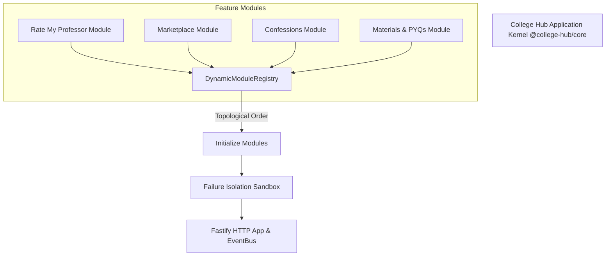
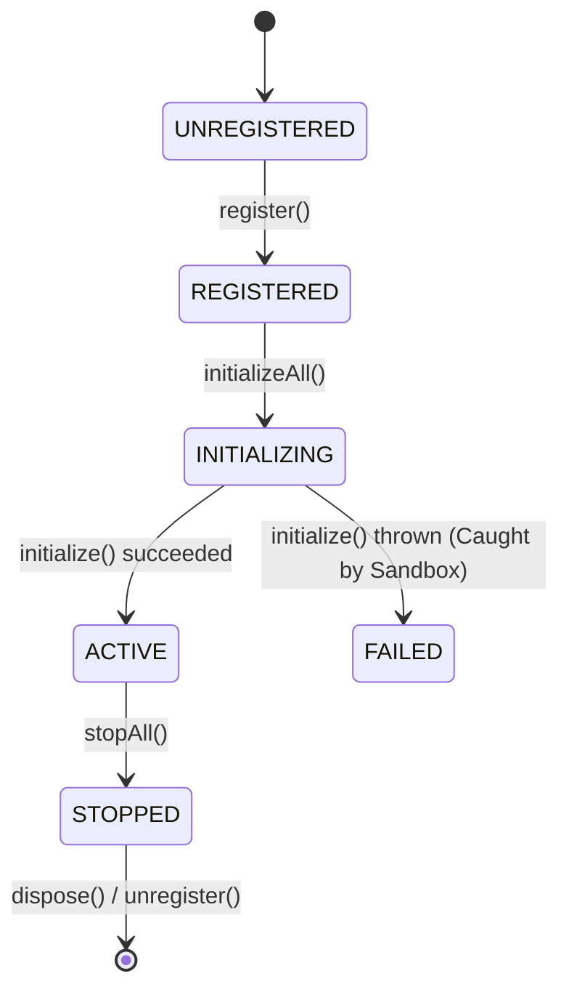

# College Hub: Modular Kernel Architecture & Module Lifecycle Guide (MS-09)

## Document Overview

- **Project**: College Hub (Enterprise Multi-College Platform)
- **Document Title**: Modular Kernel Architecture, Lifecycle Hooks & Extension Guide
- **Document Version**: 1.0.0-FINAL
- **Package Reference**: `@college-hub/core`
- **Status**: Official Engineering Standard (MS-09 Complete)

---

## 1. Modular Kernel Architecture

The College Hub Kernel (`@college-hub/core`) acts as the immutable application engine. Feature modules (Rate My Professor, Marketplace, Confessions, Materials, Blind Date, etc.) plug into the kernel as independent, self-contained packages without modifying core code.



---

## 2. Module Lifecycle State Machine



### Lifecycle Hooks Matrix

1. **`register()`**: Executed upon enrolling the module into `DynamicModuleRegistry`. Used for light setup.
2. **`initialize(app, eventBus)`**: Mounts Fastify HTTP route handlers and registers EventBus topic subscribers.
3. **`start()`**: Invoked after all platform modules have completed initialization.
4. **`stop()`**: Graceful shutdown hook executed during application termination.
5. **`dispose()`**: Resource cleanup hook executed when unregistering a module dynamically.
6. **`healthCheck()`**: Invoked periodically by `/health` monitoring endpoint.

---

## 3. Failure Isolation Sandbox

To guarantee that a buggy or throwing third-party module cannot crash the entire platform:

- Every lifecycle hook call is wrapped in `safeExecute(moduleId, phase, fn)`.
- If a module throws an unhandled exception during `initialize()`, the sandbox catches the exception, logs structured JSON error metrics, marks the module status as `FAILED`, and allows all other healthy modules to continue running normally.

---

## 4. Module Development Quickstart ("Hello Module")

```typescript
import type { PlatformModule, ModuleManifest, EventBus } from '@college-hub/core';
import type { FastifyInstance } from 'fastify';

export class FeatureModule implements PlatformModule {
  public readonly manifest: ModuleManifest = {
    id: 'feature-module-id',
    name: 'Feature Module Name',
    version: '1.0.0',
    minKernelVersion: '1.0.0',
    dependencies: [],
    permissions: ['feature:read']
  };

  public initialize(app: FastifyInstance, eventBus: EventBus): void {
    app.get('/api/v1/feature', async (req, reply) => {
      return reply.send({ success: true, message: 'Feature module active' });
    });
  }

  public healthCheck() {
    return { moduleId: this.manifest.id, status: 'ACTIVE', healthy: true };
  }
}
```

---

_End of Modular Kernel Architecture Specification._
