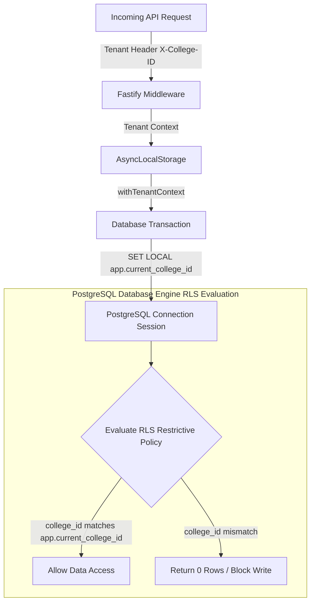

# College Hub: Multi-Tenant Row-Level Security (RLS) Architecture (MS-07)

## Document Overview

- **Project**: College Hub (Enterprise Multi-College Platform)
- **Document Title**: PostgreSQL Row-Level Security (RLS) Isolation Engine & Policy Guide
- **Document Version**: 1.0.0-FINAL
- **Package Reference**: `@college-hub/database`
- **Status**: Official Security Standard (MS-07 Complete)

---

## 1. RLS Architecture & Database Isolation Principles

College Hub relies on **PostgreSQL Engine-Level Row-Level Security (RLS)** as its primary tenant isolation boundary. Backend application code is **never** relied upon as the sole defense against cross-college data leaks.



---

## 2. Restrictive Policy Design

Every multi-tenant database table implements a mandatory `AS RESTRICTIVE` policy:

```sql
ALTER TABLE "users" ENABLE ROW LEVEL SECURITY;

CREATE POLICY tenant_isolation_policy ON "users"
  AS RESTRICTIVE
  USING (
    CURRENT_SETTING('app.is_super_admin', true) = 'true' OR
    college_id::text = CURRENT_SETTING('app.current_college_id', true)
  )
  WITH CHECK (
    CURRENT_SETTING('app.is_super_admin', true) = 'true' OR
    college_id::text = CURRENT_SETTING('app.current_college_id', true)
  );
```

### Policy Execution Matrix

- `USING` clause: Filters read operations (`SELECT`), updates (`UPDATE`), and deletes (`DELETE`). If a query attempts to read rows belonging to another college, PostgreSQL automatically filters out those rows at the engine level (returning 0 records).
- `WITH CHECK` clause: Validates write operations (`INSERT`, `UPDATE`). If an application attempts to write a record with a `college_id` mismatching the current session context, PostgreSQL throws an immediate RLS policy violation exception.

---

## 3. Session Context Lifecycle

1. **Request Ingestion**: Request arrives with tenant context (`X-College-ID`).
2. **Transaction Scoping (`withTenantContext`)**:
   ```typescript
   await withTenantContext(db, { collegeId: 'college-stanford-001' }, async (tx) => {
     // Every query inside tx automatically runs under SET LOCAL app.current_college_id = 'college-stanford-001'
     return tx.select().from(users);
   });
   ```
3. **Automatic Cleanup**: `SET LOCAL` variables are scoped **strictly** to the duration of the PostgreSQL transaction block. Upon transaction commit or rollback, session state resets automatically, preventing connection pool dirty state leaks.

---

## 4. Performance & Indexing Standards for RLS

Because PostgreSQL evaluates RLS policy expressions on every table query:

- **Mandatory Foreign Key Index**: Every table with a `college_id` column MUST include a B-tree index on `college_id` (e.g. `CREATE INDEX ON "users" (college_id)`).
- **Composite Indexes**: Frequently queried columns MUST use composite indexes prefixed with `college_id` (e.g. `CREATE INDEX ON "users" (college_id, email)`).

---

## 5. Future Module Integration Rules

When building a new business feature module (e.g. Marketplace, Materials, Confessions):

1. Include `college_id uuid NOT NULL` foreign key column referencing `college_tenants.id`.
2. Apply `enableRlsSql(tableName)` and `createTenantPolicySql(tableName)` in initial module migration scripts.
3. Wrap module database operations inside `withTenantContext`.

---

_End of Multi-Tenant RLS Security Specification._
