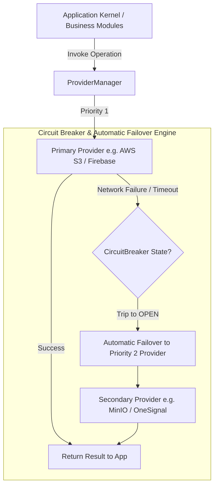

# College Hub: Provider Abstraction Layer & Plugin Architecture (MS-11)

## Document Overview

- **Project**: College Hub (Enterprise Multi-College Platform)
- **Document Title**: Provider Abstraction Layer, Failover Engine & Plugin Architecture
- **Document Version**: 1.0.0-FINAL
- **Package Reference**: `@college-hub/providers`
- **Status**: Official Engineering Standard (MS-11 Complete)

---

## 1. Provider Abstraction Architecture

The `@college-hub/providers` package completely decouples core business logic from third-party service vendors (S3, Cloudflare R2, Firebase FCM, Expo, OpenAI, Typesense, Elasticsearch, Stripe).



---

## 2. Supported Provider Interfaces Matrix

| Provider Type        | Interface Name            | Key Operations                                 | Reference Mock Implementation |
| -------------------- | ------------------------- | ---------------------------------------------- | ----------------------------- |
| **Storage**          | `StorageProvider`         | `upload`, `download`, `delete`, `getPublicUrl` | `MockStorageProvider`         |
| **Notification**     | `NotificationProvider`    | `sendNotification`, `sendBatchNotifications`   | `MockNotificationProvider`    |
| **Search**           | `SearchProvider`          | `indexDocument`, `search`, `deleteDocument`    | `MockSearchProvider`          |
| **AI**               | `AiProvider`              | `generateText`, `generateEmbeddings`           | `MockAiProvider`              |
| **Email**            | `EmailProvider`           | `sendEmail`                                    | `MockEmailProvider`           |
| **Image Processing** | `ImageProcessingProvider` | `resizeImage`, `compressImage`                 | —                             |
| **Analytics**        | `AnalyticsProvider`       | `trackEvent`                                   | —                             |
| **CAPTCHA**          | `CaptchaProvider`         | `verifyToken`                                  | —                             |
| **Payment**          | `PaymentProvider`         | `createCheckoutSession`                        | —                             |

---

## 3. Automatic Failover & Circuit Breaker Engine

1. **Priority Ordering**: Providers register with numeric priority values (e.g. `1` for primary Cloudflare R2, `2` for fallback MinIO/S3).
2. **Failover Execution (`executeWithFailover`)**: When an operation fails on the primary provider, `ProviderManager` logs a structured warning and automatically re-executes the operation on the secondary provider.
3. **Circuit Breaker (`CircuitBreaker`)**: Tracks consecutive error counts. After 3 failures, the circuit transitions to `OPEN` for 10 seconds, blocking calls to the unhealthy vendor and immediately routing traffic to backup providers without latency penalties.

---

## 4. Implementing Future Production Providers

To add a new vendor (e.g., AWS S3):

```typescript
import type { StorageProvider, StorageUploadResult, ProviderHealth } from '@college-hub/providers';

export class AwsS3StorageProvider implements StorageProvider {
  public readonly name = 'aws-s3';
  public readonly type = 'STORAGE' as const;
  public readonly version = '1.0.0';
  public readonly priority = 1;

  public async initialize(): Promise<void> {
    /* S3 Client Init */
  }
  public async healthCheck(): Promise<ProviderHealth> {
    return { healthy: true };
  }
  public getCapabilities(): string[] {
    return ['upload', 'download', 'delete', 'getPublicUrl'];
  }

  public async upload(path: string, content: Buffer, mimeType: string): Promise<StorageUploadResult> {
    // AWS S3 PutObjectCommand logic
    return { path, url: `https://bucket.s3.amazonaws.com/${path}`, sizeBytes: content.length };
  }
  public async download(path: string): Promise<Buffer> {
    /* GetObject */
  }
  public async delete(path: string): Promise<boolean> {
    /* DeleteObject */
  }
  public getPublicUrl(path: string): string {
    return `https://bucket.s3.amazonaws.com/${path}`;
  }
}
```

---

_End of Provider Abstraction Architecture Specification._
