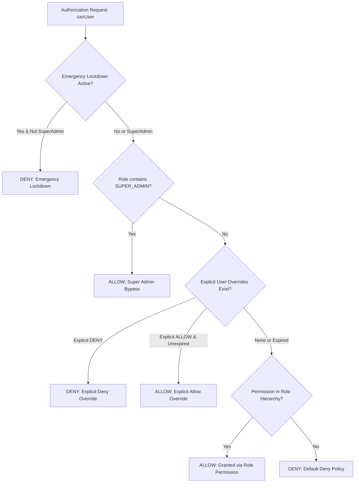
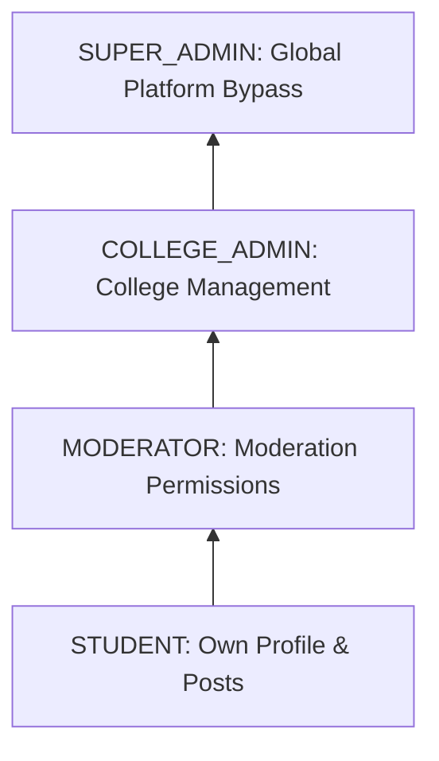

# College Hub: Core RBAC & Fine-Grained Permission Engine (MS-16)

## Document Overview

- **Project**: College Hub (Enterprise Multi-College Platform)
- **Document Title**: Fine-Grained Permission Engine, Role Inheritance & Authorization Architecture
- **Document Version**: 1.0.0-FINAL
- **Package Reference**: `@college-hub/security`
- **Status**: Official Security Architecture Standard (MS-16 Complete)

---

## 1. Permission Evaluation Architecture

The `@college-hub/security` package implements a strict **Default Deny** authorization engine evaluated in order of security precedence:

---

## 2. Canonical Permission Naming Specification

All permission strings follow a 4-part structured format:

$$\text{module}.\text{resource}.\text{action}.\text{scope}$$

### Examples

- `professor.review.create.own`: Student writing a review for their own professor.
- `professor.review.delete.college`: College Admin deleting a review within their college context.
- `marketplace.listing.approve.college`: Moderator approving a marketplace listing.
- `college.settings.update.college`: College Admin modifying college configuration.
- `system.admin.super`: Platform Super Administrator.

---

## 3. System Roles & Inheritance Hierarchy

| Role Name         | Inherits From | Key Permissions Granted                                                                                |
| ----------------- | ------------- | ------------------------------------------------------------------------------------------------------ |
| **STUDENT**       | —             | `professor.review.create.own`, `marketplace.listing.create.own`, `confession.post.create.own`          |
| **MODERATOR**     | `STUDENT`     | `confession.post.moderate.college`, `marketplace.listing.approve.college`, `materials.approve.college` |
| **COLLEGE_ADMIN** | `MODERATOR`   | `professor.review.delete.college`, `college.settings.update.college`                                   |
| **SUPER_ADMIN**   | —             | `system.admin.super` (Wildcard access to all resources)                                                |

---

## 4. Emergency Lockdown Mode

Calling `evaluator.enableLockdown()` instantly blocks all non-`SUPER_ADMIN` authorization requests across the entire platform. Designed for severe platform incidents or active security breaches.

---

_End of RBAC & Permission Engine Specification._
