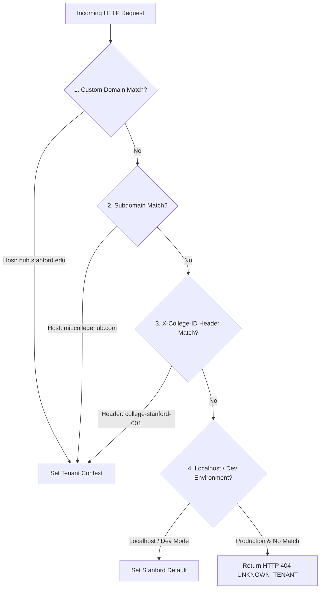
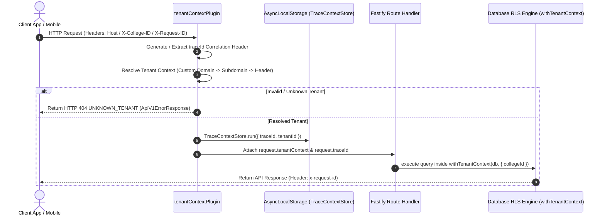

# College Hub: Tenant Resolution & Request Context Specification (MS-08)

## Document Overview

- **Project**: College Hub (Enterprise Multi-College Platform)
- **Document Title**: Tenant Resolution Engine & Request Context Propagation
- **Document Version**: 1.0.0-FINAL
- **App Reference**: `@college-hub/api`
- **Status**: Official Engineering Standard (MS-08 Complete)

---

## 1. Multi-Tenant Resolution Priority Engine

Every incoming API request passes through `tenantContextPlugin` which evaluates tenant context using a 4-tier resolution priority:

---

## 2. Request Lifecycle & Context Propagation

---

## 3. Concurrent Request Isolation Guarantee

Because Node.js runs an event loop handling hundreds of concurrent async requests:

- Request-scoped data (`tenantContext`, `traceId`) is bound directly to the Fastify `request` instance and Node.js `AsyncLocalStorage`.
- Concurrent request execution threads maintain isolated memory stores, preventing race condition data leaks.
- Verified via automated integration tests processing 20 parallel concurrent requests.

---

## 4. Development vs Production Behavior

- **Development (`NODE_ENV=development`)**: Unspecified host headers default to `college-stanford-001` for frictionless developer onboarding.
- **Production (`NODE_ENV=production`)**: Localhost fallback disabled; requests without a valid domain, subdomain, or explicit tenant header return an immediate `HTTP 404 UNKNOWN_TENANT` response.

---

_End of Tenant Resolution Specification._
