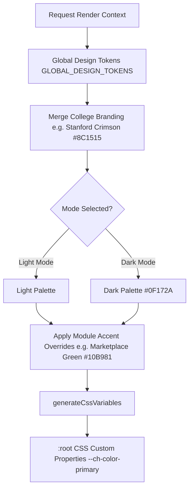

# College Hub: Multi-Tenant Theme Engine & Design System (MS-12)

## Document Overview

- **Project**: College Hub (Enterprise Multi-College Platform)
- **Document Title**: Multi-Tenant Theme Engine, Design Tokens & CSS Variable Generator
- **Document Version**: 1.0.0-FINAL
- **Package Reference**: `@college-hub/theme-engine`
- **Status**: Official Design Standard (MS-12 Complete)

---

## 1. Multi-Tenant Theme Resolution Flow

The `@college-hub/theme-engine` package dynamically resolves visual tokens by cascading global platform defaults through per-college white-label branding and per-module accent overrides.



---

## 2. Complete Design Token Architecture

### Spacing Scale (4px Base Grid)

- `0`: `0px`
- `1`: `4px`
- `2`: `8px`
- `3`: `12px`
- `4`: `16px` (Default Component Padding)
- `6`: `24px`
- `8`: `32px`
- `12`: `48px`
- `16`: `64px`

### Responsive Breakpoints

- `xs`: `320px` (Compact Mobile)
- `sm`: `640px` (Large Mobile)
- `md`: `768px` (Tablets)
- `lg`: `1024px` (Desktops)
- `xl`: `1280px` (Wide Screens)

### Per-Module Theme Accents

- **Rate My Professor**: Indigo (`#4F46E5`)
- **Marketplace**: Emerald (`#10B981`)
- **Confessions**: Violet (`#8B5CF6`)
- **Blind Date**: Pink (`#EC4899`)
- **Materials & PYQs**: Amber (`#F59E0B`)
- **Placement**: Blue (`#3B82F6`)

---

## 3. Accessibility Standards (WCAG 2.1 AA)

- **Contrast Ratios**: All text vs background combinations MUST satisfy a minimum contrast ratio of **4.5:1** for standard text and **3:0:** for large text. Tested via `calculateContrastRatio(hex1, hex2)`.
- **Reduced Motion**: Respects `prefers-reduced-motion` system settings by reducing animation durations to `0ms` via `--ch-motion-duration`.

---

## 4. Runtime Theme Switching (CSS Variables)

```typescript
import { resolveTheme, generateCssVariables } from '@college-hub/theme-engine';

const theme = resolveTheme(collegeBranding, 'dark', 'marketplace');
const cssString = generateCssVariables(theme);
// Injects --ch-color-primary: #8C1515; --ch-color-accent: #10B981; onto :root
```

---

_End of Theme Engine Specification._
