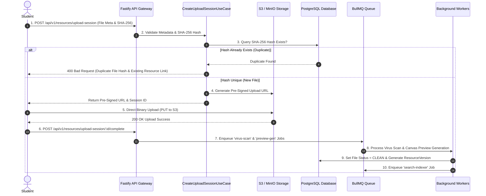
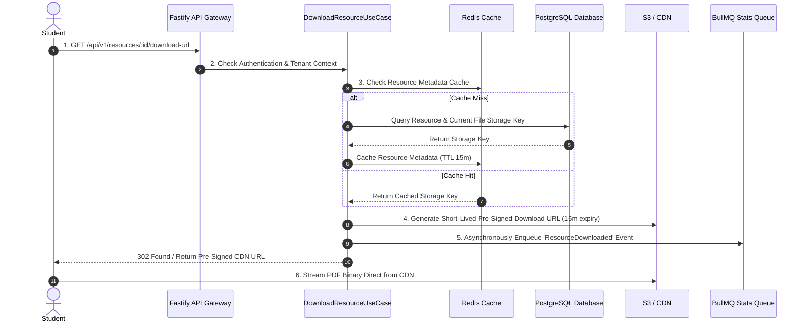
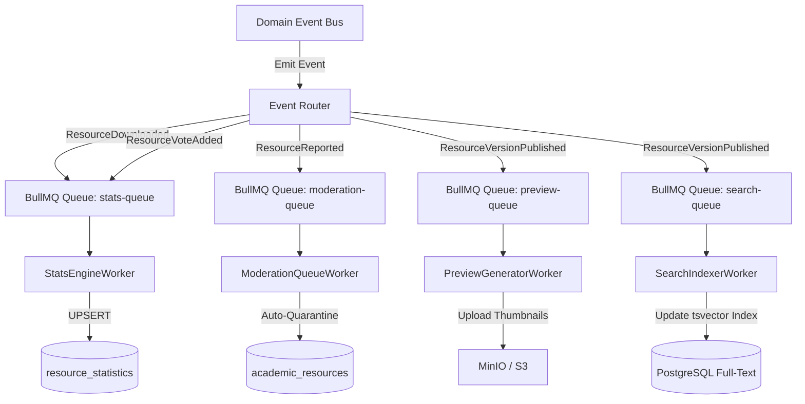
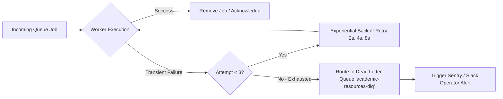

# Technical Architecture & Technology Blueprint: Academic Resource Hub (MS-19.6)

## Document Information

- **Project**: College Hub (Enterprise Multi-College Platform)
- **Document Title**: Technical Architecture Blueprint, Module Boundaries, Pipelines & Telemetry: Academic Resource Hub
- **Target Audience**: Principal Software Architects, Lead Backend Engineers, DevOps / Infrastructure Leads, Security Engineers
- **Status**: Official Technical Architecture Blueprint (MS-19.6 Complete)
- **Implementation Constraint**: Pure Software Architecture Specification (Zero Application Code / Zero Database Schema Creation / Zero API Implementation / Zero UI Code)

---

## 1. Executive Summary & SLA Target Performance

The **Academic Resource Hub Technical Architecture** is designed to provide horizontal scalability, fault tolerance, strict multi-tenant isolation, and low latency across hundreds of college institutions.

### System Performance SLA Targets

| Performance Metric                | Target SLA        | Strategy / Architectural Mechanism                       |
| :-------------------------------- | :---------------- | :------------------------------------------------------- |
| **Search Query Latency**          | $< 300\text{ ms}$ | Redis query cache + PostgreSQL `tsvector` indexed search |
| **Resource Page Load Time**       | $< 500\text{ ms}$ | Composite read-model payload + ETag HTTP caching         |
| **Upload Session Initialization** | $< 1\text{ s}$    | SHA-256 pre-flight check + Direct-to-S3 pre-signed URLs  |
| **PDF Preview Generation**        | $< 3\text{ s}$    | Asynchronous BullMQ `PreviewGeneratorWorker`             |
| **System Availability**           | $99.95\%$ Uptime  | Decoupled worker queues + Graceful degradation fallbacks |

---

## 2. System Architecture Diagrams

### 2.1 System High-Level Architecture Diagram

```mermaid
flowchart TD
    subgraph Client Layer
        Web[Next.js Web App]
        Mobile[React Native Mobile App]
    end

    subgraph Gateway & Load Balancer Layer
        Nginx[Nginx / Cloudflare CDN]
        FastifyGateway[Fastify API Gateway Monolith]
    end

    subgraph Bounded Context: Academic Resource Hub
        Controller[Resource Controllers]
        AppService[Application Use Cases]
        CQRSQuery[CQRS Fast-Path Read Engine]
        Domain[Domain Model & Invariants]
        Repo[Drizzle Repositories]
    end

    subgraph Infrastructure & Storage Layer
        PostgreSQL[(PostgreSQL 16 + RLS)]
        Redis[(Redis 7 Cache & BullMQ)]
        MinIO[MinIO / S3 Object Storage]
        ClamAV[ClamAV Virus Scanner Service]
    end

    Client Layer -->|HTTPS / REST| Nginx
    Nginx --> FastifyGateway
    FastifyGateway --> Controller
    Controller --> AppService
    Controller --> CQRSQuery
    AppService --> Domain
    AppService --> Repo
    CQRSQuery --> Redis
    Repo --> PostgreSQL
    AppService -->|Pre-Signed URLs| MinIO
    AppService -->|File Stream| ClamAV
```

---

### 2.2 Component & Layered Architecture Diagram

```mermaid
graph TD
    subgraph API Layer
        ResourceController[ResourceController]
        UploadController[UploadController]
        CollectionController[CollectionController]
    end

    subgraph Application & Use Case Layer
        CreateResourceUC[CreateResourceUseCase]
        PublishVersionUC[PublishVersionUseCase]
        DownloadResourceUC[DownloadResourceUseCase]
        SearchResourcesUC[SearchResourcesUseCase]
    end

    subgraph Domain Layer
        AcademicResourceAggregate[AcademicResource Aggregate]
        ResourceVersionEntity[ResourceVersion Entity]
        DomainEventBus[InMemoryEventBus / Event Router]
    end

    subgraph Infrastructure Layer
        DrizzleRepo[DrizzleResourceRepository]
        S3StorageProvider[S3StorageProvider Adapter]
        ClamAVProvider[ClamAVScanner Adapter]
        BullMQWorkers[BullMQ Background Worker Fleet]
    end

    API Layer --> Application & Use Case Layer
    Application & Use Case Layer --> Domain Layer
    Application & Use Case Layer --> Infrastructure Layer
    Infrastructure Layer --> Domain Layer
```

---

### 2.3 End-to-End Upload Sequence Diagram



---

### 2.4 End-to-End Download Sequence Diagram



---

### 2.5 Event Bus & Async Worker Flow Diagram



---

## 3. Package Boundaries & Layered Architecture

The Academic Resource Hub is packaged as a canonical module within the monorepo workspace at `modules/academic-resource-hub` (`@college-hub/mod-academic-resource-hub`):

```
modules/academic-resource-hub/
├── src/
│   ├── controllers/            # HTTP Request Handlers & Fastify Routes
│   │   ├── resource.controller.ts
│   │   ├── upload.controller.ts
│   │   └── collection.controller.ts
│   ├── use-cases/              # Application Use-Case Logic (Command Handlers)
│   │   ├── create-resource.use-case.ts
│   │   ├── publish-version.use-case.ts
│   │   └── download-resource.use-case.ts
│   ├── queries/                # CQRS Fast-Path Read Queries
│   │   ├── get-resource-detail.query.ts
│   │   └── search-resources.query.ts
│   ├── domain/                 # Domain Model & Aggregates
│   │   ├── academic-resource.aggregate.ts
│   │   ├── resource-version.entity.ts
│   │   ├── invariants.ts
│   │   └── events.ts
│   ├── repositories/           # Infrastructure Repository Adapters
│   │   └── drizzle-resource.repository.ts
│   ├── providers/              # Storage & Scan Abstraction Adapters
│   │   ├── s3-storage.provider.ts
│   │   └── clamav-scan.provider.ts
│   ├── workers/                # BullMQ Background Workers
│   │   ├── stats-engine.worker.ts
│   │   ├── preview-generator.worker.ts
│   │   ├── search-indexer.worker.ts
│   │   └── dlq-manager.worker.ts
│   └── index.ts                # PlatformModule Registration Entry Point
```

---

## 4. Component Design & Specifications

### 4.1 `ResourceController`

- **Responsibility**: Inspects Fastify request envelopes, verifies `x-college-id` tenant headers, parses Zod request schemas, and delegates to application use-cases.

### 4.2 `CreateUploadSessionUseCase`

- **Responsibility**: Performs client-side SHA-256 duplicate validation against `resource_files`, calculates file bounds, and generates pre-signed S3 upload locators.

### 4.3 `DrizzleResourceRepository`

- **Responsibility**: Encapsulates Drizzle ORM queries, enforcing PostgreSQL Row-Level Security (`app.current_college_id`) across multi-tenant database operations.

### 4.4 `BullMQBackgroundWorkers`

- **Responsibility**: Manages decoupled background processing queues backed by Redis 7, implementing automatic exponential backoff retries and Dead Letter Queue (DLQ) routing.

---

## 5. Storage Provider Abstraction Architecture

Storage operations are executed via a provider-agnostic interface:

```typescript
export interface StorageProviderLocator {
  provider: 'S3' | 'MINIO' | 'LOCAL' | 'R2';
  bucket: string;
  key: string;
}

export interface IStorageProvider {
  generatePreSignedUploadUrl(key: string, mimeType: string, expiresInSec: number): Promise<string>;
  generatePreSignedDownloadUrl(key: string, expiresInSec: number): Promise<string>;
  deleteFile(key: string): Promise<void>;
  fileExists(key: string): Promise<boolean>;
}
```

This abstraction allows seamless transitions between local MinIO (for offline local development) and AWS S3 or Cloudflare R2 (for production).

---

## 6. Background Workers & Queue Management



### Worker Specifications Matrix

| Worker Name              | Queue Name           | Trigger Event              | Retry Policy           | Idempotency Key           |
| :----------------------- | :------------------- | :------------------------- | :--------------------- | :------------------------ |
| `VirusScanWorker`        | `virus-scan-queue`   | File Upload Completed      | 3 Retries (2s backoff) | `fileId + sha256`         |
| `PreviewGeneratorWorker` | `preview-gen-queue`  | Version Published          | 3 Retries (5s backoff) | `versionId`               |
| `SearchIndexerWorker`    | `search-index-queue` | Resource Published/Updated | 5 Retries (2s backoff) | `resourceId + updatedAt`  |
| `StatsEngineWorker`      | `stats-engine-queue` | Download/Vote Event        | 3 Retries (1s backoff) | `resourceId + dateBucket` |
| `ModerationQueueWorker`  | `moderation-queue`   | Resource Reported          | 3 Retries (2s backoff) | `reportId`                |

---

## 7. Multi-Tier Caching Strategy

```
+-----------------------------------------------------------------------------------+
|                           MULTI-TIER CACHING ENGINE                               |
+-----------------------------------------------------------------------------------+
| Layer 1: In-Memory L1 Cache    --> Fastify Instance LRU Cache (TTL 5 Seconds)     |
| Layer 2: Distributed L2 Cache  --> Redis 7 Key-Value Cache (TTL 5m - 1 Hour)       |
| Layer 3: HTTP Edge CDN Cache   --> Cloudflare Cache-Control Header (s-maxage=300)|
+-----------------------------------------------------------------------------------+
```

### Cache Key Taxonomy & Invalidation Rules

- **Subject Material Grid**: `ch:tenant:{collegeId}:subject:{subjectId}:materials` (TTL: 1 Hour, Invalidated on `ResourceVersionPublished`).
- **Resource Composite Detail**: `ch:tenant:{collegeId}:resource:{resourceId}:detail` (TTL: 15 Minutes, Invalidated on `AcademicResourceUpdated`).
- **Statistics Read Model**: `ch:tenant:{collegeId}:resource:{resourceId}:stats` (TTL: 5 Minutes, Updated by `StatsEngineWorker`).

---

## 8. Failure Scenarios & Graceful Degradation Strategy

```
+-----------------------------------------------------------------------------------+
|                        FAILURE & GRACEFUL DEGRADATION MATRIX                      |
+-----------------------------------------------------------------------------------+
| 1. Redis Cache Failure   --> Fallback directly to PostgreSQL RLS queries           |
| 2. Search Engine Outage --> Fallback to exact subject code B-Tree database lookup  |
| 3. Virus Scan Timeout   --> Mark file "PENDING_SCAN", allow preview but delay DL  |
| 4. MinIO / S3 Outage     --> Return HTTP 503 "Storage Temporarily Unavailable"    |
| 5. Worker Crash          --> BullMQ locks expire after 30s; job re-delivered      |
+-----------------------------------------------------------------------------------+
```

---

## 9. Security, Tenant Isolation & Compliance

1. **Row-Level Security Isolation**: Every multi-tenant SQL query executes under session variable `SET LOCAL app.current_college_id = '...'`.
2. **Short-Lived Pre-Signed Locators**: S3 pre-signed upload and download URLs expire after **15 minutes**.
3. **OWASP Upload Sanitation**: File extensions and MIME headers are strictly validated; raw executable content is rejected at the gateway.

---

## 10. Monitoring, Telemetry & OpenTelemetry Metrics

The module exports Prometheus metrics via OpenTelemetry instrumentation:

- `academic_resource_uploads_total{tenant, status}`: Counter tracking successful/failed uploads.
- `academic_resource_download_bytes_total{tenant}`: Meter tracking download bandwidth.
- `academic_resource_search_latency_seconds{tenant}`: Histogram measuring search query P95/P99 latency.
- `bullmq_queue_depth{queue_name}`: Gauge monitoring worker backlog.

---

## 11. Future Extension Architecture Provisions

The technical architecture reserves non-breaking extension hooks for future phases:

1. **AI OCR Parsing Pipeline**: Enqueueing `ocr-extraction-queue` on `ResourceVersionPublished` to extract handwritten mathematical text.
2. **Video & Audio Media Transcoding**: Registering `ffmpeg-transcoder-worker` for processing video lecture recordings.

---

## 12. Technical Definition of Done Verification

| Architecture Requirement      | Verification Status | Rationale / Reference                                              |
| :---------------------------- | :------------------ | :----------------------------------------------------------------- |
| **Layered Monorepo Package**  | ✅ Verified         | Package boundary `@college-hub/mod-academic-resource-hub`.         |
| **Upload Pipeline & SHA-256** | ✅ Verified         | Complete sequence diagram with pre-signed S3 URLs & deduplication. |
| **Worker Queue Specs**        | ✅ Verified         | BullMQ worker matrix, retry policies, and DLQ handling defined.    |
| **Caching & Invalidation**    | ✅ Verified         | L1/L2 Redis caching taxonomy & domain event invalidation triggers. |
| **No Code Implementation**    | ✅ Verified         | Pure technical architecture blueprint.                             |

---

_End of Technical Architecture & Technology Blueprint: Academic Resource Hub (MS-19.6)._
