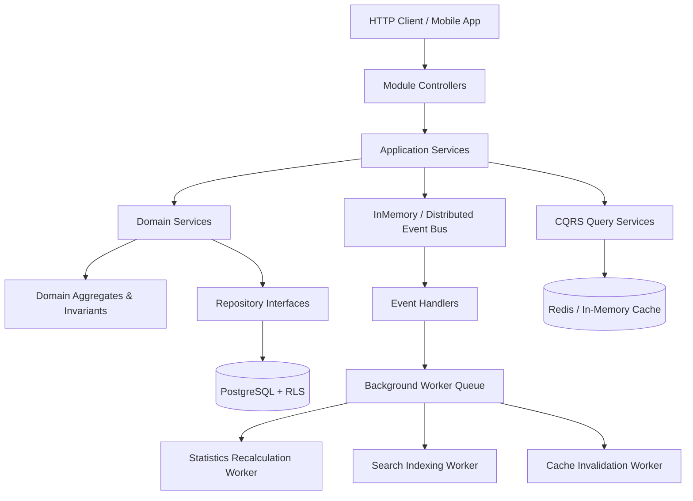
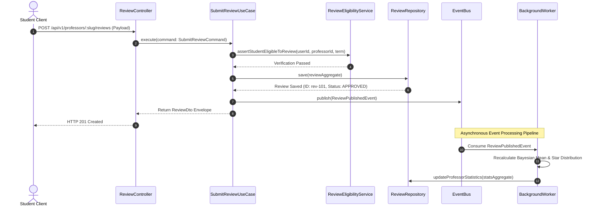
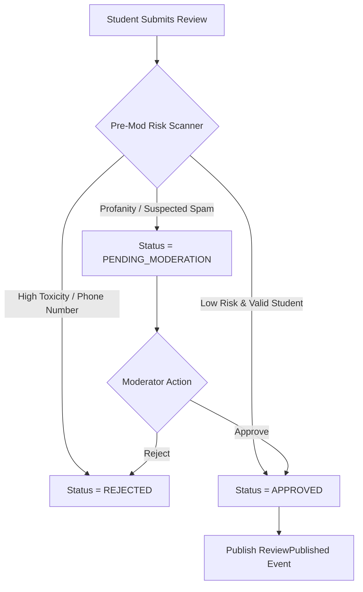

# Technical Design & Architecture Blueprint: Rate My Professor Module (MS-18.6)

## Document Information

- **Project**: College Hub (Enterprise Multi-College Platform)
- **Document Title**: Technical Design, Component Architecture, Event Pipeline & Failure Strategy Blueprint
- **Target Audience**: Software Architects, Principal Engineers, Engineering Leads, DevOps Engineers
- **Status**: Official Technical Blueprint Standard (MS-18.6 Complete)
- **Implementation Constraint**: Pure Technical Architecture Blueprint (Zero Code / Zero DB Implementation)

---

## 1. Internal Module Component Architecture

The Rate My Professor module is designed as an isolated, modular component plugging directly into the `@college-hub/core` application kernel:



### Component Responsibilities Matrix

- **Controllers**: HTTP route mapping, header extraction, and DTO response serialization.
- **Application Services**: Use-case orchestration (e.g. `SubmitReviewUseCase`), transaction demarcation.
- **Domain Services**: Domain invariant enforcement (e.g. `ReviewEligibilityService`).
- **Query Services**: CQRS read-model projections bypassing heavy domain logic for $O(1)$ read performance.
- **Repositories**: Data access abstraction backing PostgreSQL tables.
- **Event Handlers**: Decoupled asynchronous subscribers listening to domain events.
- **Background Workers**: Asynchronous job processors for stats calculations and search indexing.

---

## 2. Internal Module Folder Structure

```
modules/rate-my-professor/
├── package.json
├── tsconfig.json
├── src/
    ├── index.ts                     # Module Entry Point & Manifest
    ├── rate-my-professor.module.ts  # PlatformModule Implementation
    ├── controllers/                 # Route Handlers
    │   ├── professor.controller.ts
    │   └── review.controller.ts
    ├── application/                 # Use Cases & Orchestration
    │   ├── use-cases/
    │   └── query-services/
    ├── domain/                      # Aggregates, Entities & Invariants
    │   ├── aggregates/
    │   ├── services/
    │   └── events/
    ├── infrastructure/              # Repositories & External Adapters
    │   ├── persistence/
    │   └── cache/
    └── workers/                     # Background Async Job Handlers
        ├── stats-recalculation.worker.ts
        └── search-indexer.worker.ts
```

---

## 3. End-to-End Request Processing Lifecycle

### 3.1 Review Submission & Async Statistics Update Flow



---

## 4. Background Async Jobs Architecture

| Job Name                   | Trigger Condition                   | Retry Policy                    | Failure Handling                     | Idempotency Key                   |
| -------------------------- | ----------------------------------- | ------------------------------- | ------------------------------------ | --------------------------------- |
| **`StatsRecalculation`**   | `ReviewPublished` / `ReviewDeleted` | Exponential backoff (3 retries) | Log error to Dead Letter Queue (DLQ) | `stats:${professorId}:${version}` |
| **`SearchIndexUpdate`**    | `ProfessorUpdated` / `AliasAdded`   | Fixed interval (2 retries)      | Re-queue after 60s                   | `search:${professorId}`           |
| **`TrendingScoreUpdate`**  | Cron Schedule (Hourly)              | 1 retry                         | Skip cycle                           | `trending:${collegeId}:${hour}`   |
| **`ModerationQueueAlert`** | `ReviewReported` (5+ reports)       | 3 retries                       | Alert Slack/PagerDuty                | `mod:${reviewId}`                 |

---

## 5. Caching Strategy & Invalidation Rules

- **What is Cached**: `ProfessorProfileDto` and `ProfessorStatisticsDto`.
- **Cache Key Format**: `college:{collegeId}:prof:{professorSlug}:stats`
- **Time-to-Live (TTL)**: 300 seconds (5 minutes) for profile headers; 60 seconds for statistics.
- **Cache Strategy**: **Read-Through** with asynchronous background refresh.
- **Invalidation Trigger**: `StatisticsUpdated` domain event triggers immediate Redis cache key invalidation for the target professor.

---

## 6. Moderation Pipeline & Risk Engine



---

## 7. Observability, Metrics & KPI Architecture

- **Structured Logging**: Every log entry includes `requestId`, `traceId`, `collegeId`, and `professorId`.
- **Key Metrics (Prometheus)**:
  - `rate_my_professor_reviews_total{college, status}`: Total submitted reviews count.
  - `rate_my_professor_bayesian_recalc_latency_seconds`: Recalculation worker execution time.
  - `rate_my_professor_reports_total{reason}`: Total abuse report count.
- **Health Checks**: Module exposes `/health` endpoint checking DB connection, Redis ping, and queue latency.

---

## 8. Failure Scenarios & Graceful Degradation Matrix

| Component Failure            | Impact                          | Graceful Degradation Strategy                                                               |
| ---------------------------- | ------------------------------- | ------------------------------------------------------------------------------------------- |
| **Redis Cache Down**         | High latency on profile views   | Fall back to direct PostgreSQL reads ($O(1)$ read query via `professor_statistics` table).  |
| **Background Queue Down**    | Delay in Bayesian score updates | Reviews are published immediately; stats recalculation is deferred to a periodic batch job. |
| **Search Engine Down**       | Advanced search fails           | Fall back to simple SQL ILIKE search on `professors.full_name`.                             |
| **Database Transient Error** | Write failure                   | Return HTTP 503 Service Unavailable with retry header; client holds review draft locally.   |

---

## 9. Architecture Decision Log (ADR) Summary

### ADR 1: CQRS Read Model Separation

- **Decision**: Separate read query services from write domain aggregates.
- **Reason**: Profile read traffic outweighs write traffic 100:1. Query services read pre-computed `professor_statistics` directly without executing domain logic.

### ADR 2: Asynchronous Statistics Recalculation

- **Decision**: Defer Bayesian mean calculations to background event workers.
- **Reason**: Keeps review submission response times under 50ms (avoiding blocking HTTP requests during database aggregations).

---

_End of Technical Design & Architecture Blueprint Specification (MS-18.6)._
