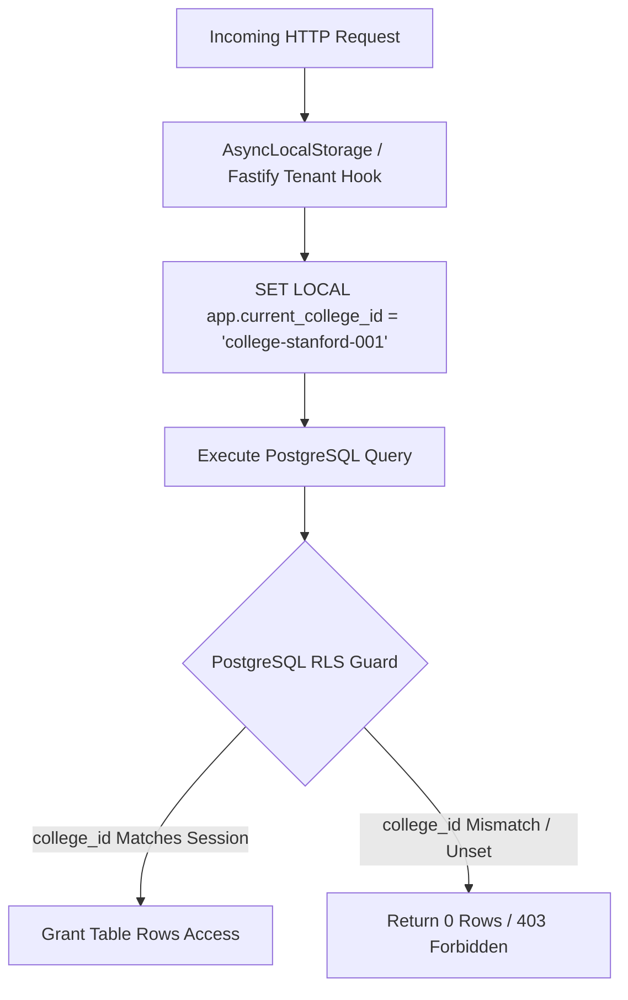
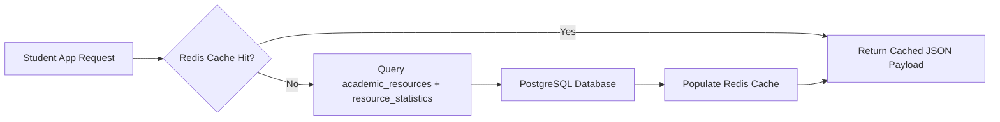
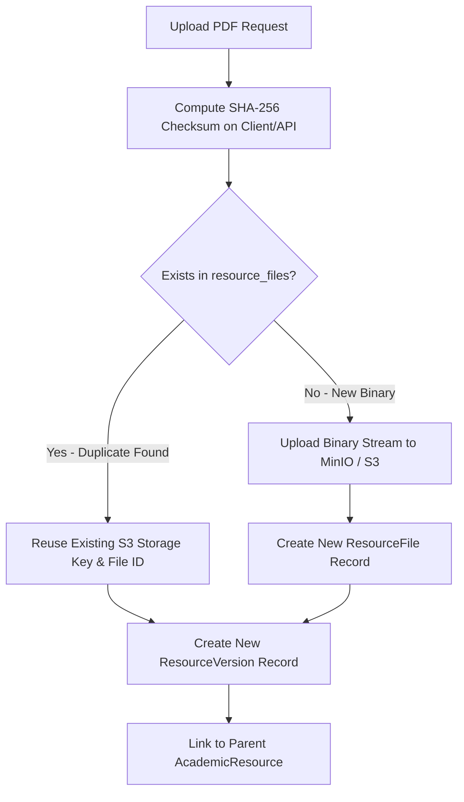
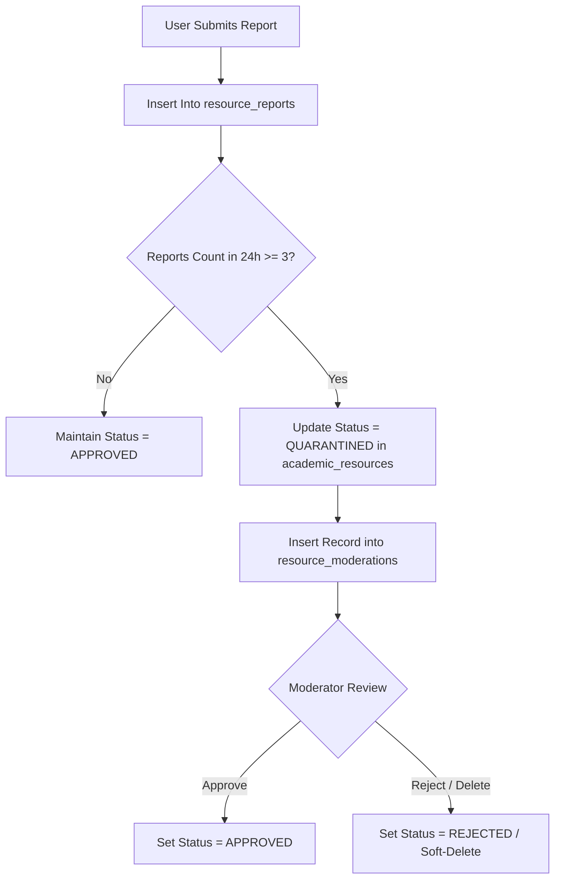
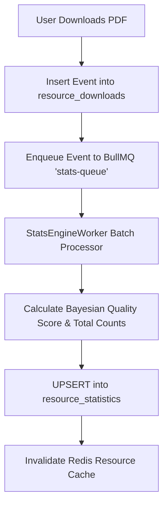

# Database Architecture & Data Model Specification: Academic Resource Hub (MS-19.3)

## Document Information

- **Project**: College Hub (Enterprise Multi-College Platform)
- **Document Title**: Enterprise Production-Grade Multi-Tenant Database Architecture & Entity Specifications: Academic Resource Hub
- **Target Audience**: Principal Database Architects, Backend Engineers, Operations Leads, Security Engineers
- **Status**: Official Database Architecture Specification Standard (MS-19.3 Complete)
- **Implementation Constraint**: Pure Database Architecture & Schema Specification (Zero Application Code / Zero API Implementation / Zero UI Code)

---

## 1. Executive Summary & Design Principles

The **Academic Resource Hub Database Architecture** is engineered to support hundreds of university colleges, millions of academic resources, and tens of millions of download events with sub-10ms query latency.

### Core Architectural Principles

1. **Resource-Centric, Not File-Centric**: 
   A study resource is a logical academic entity (`AcademicResource`), distinct from its historical revisions (`ResourceVersion`), and its physical file representations (`ResourceFile`). A single resource can evolve through multiple revisions, and a single revision can be backed by multiple binary renditions (e.g., original PDF, optimized web PDF, thumbnail image, plain-text OCR extract).
2. **Immutable Audit & Revision Lineage**:
   Resource versions and file binaries are never overwritten in-place. Edits generate new version records, maintaining an unalterable audit trail and enabling 1-click version rollbacks.
3. **Strict Multi-Tenant Row-Level Security (RLS)**:
   All multi-tenant tables inherit a mandatory `college_id` foreign key bound to PostgreSQL Row-Level Security policies (`USING (college_id = CURRENT_SETTING('app.current_college_id', true))`).
4. **Decoupled Asynchronous Aggregation**:
   High-velocity append-only user activity logs (`resource_downloads`, `resource_views`, `resource_votes`) are decoupled from entity query tables. Pre-aggregated statistics tables (`resource_statistics`) are updated asynchronously via background queue workers to keep read paths blazing fast.
5. **SHA-256 Binary Deduplication**:
   Storage binaries are deduplicated across users and tenants via SHA-256 cryptographic hashes.

---

## 2. System Architecture Diagrams

### 2.1 Complete Entity-Relationship (ER) Diagram

```mermaid
erDiagram
    colleges ||--o{ departments : owns
    departments ||--o{ subjects : offers
    colleges ||--o{ subjects : scope
    subjects ||--o{ courses : contains
    
    colleges ||--o{ academic_resources : isolates
    departments ||--o{ academic_resources : categorizes
    subjects ||--o{ academic_resources : relates
    courses ||--o{ academic_resources : maps
    
    academic_resources ||--o{ resource_versions : contains_history
    academic_resources ||--1| resource_statistics : maintains_stats
    academic_resources ||--o{ resource_moderations : flagged_by
    academic_resources ||--o{ resource_tag_mappings : tagged_with
    
    resource_versions ||--o{ resource_files : renders_as
    
    academic_resources ||--o{ collection_resources : included_in
    study_collections ||--o{ collection_resources : bundles
    colleges ||--o{ study_collections : isolates
    
    academic_resources ||--o{ resource_relationships : source_node
    academic_resources ||--o{ resource_relationships : target_node
    
    academic_resources ||--o{ resource_votes : receives_vote
    academic_resources ||--o{ resource_bookmarks : bookmarked_by
    academic_resources ||--o{ resource_downloads : downloaded_by
    academic_resources ||--o{ resource_views : viewed_by
    academic_resources ||--o{ resource_reports : reported_by

    resource_tags }|--|| resource_tag_mappings : defines
    resource_types }|--|| academic_resources : categorizes_type
    resource_categories }|--|| academic_resources : categorizes_dept
    academic_schemes }|--|| academic_resources : specifies_scheme
    exam_types }|--|| academic_resources : specifies_exam
    academic_years }|--|| academic_resources : specifies_year
```

---

### 2.2 Data Ownership & Multi-Tenant RLS Flow



---

### 2.3 Read & Fast-Path Query Flow



---

### 2.4 Upload & SHA-256 Deduplication Flow



---

### 2.5 Moderation & Quarantine Flow



---

### 2.6 Asynchronous Statistics Aggregation Flow



---

## 3. Detailed Entity Catalogue & Table Specifications

### 3.1 Academic Reference Tables (Shared / Reference)

#### 1. `academic_schemes`
- **Purpose**: Defines university academic regulation schemes (e.g., `2018 Scheme`, `2021 Regulation`, `2024 NEP Scheme`).
- **Why Separate**: Regulations change every 3-4 years across Indian universities. Isolating schemes allows resources to be explicitly tagged with their syllabus version.
- **Merge Analysis**: Cannot be merged into subjects because a single subject (e.g. `Operating Systems`) exists across multiple regulation schemes with different syllabus modules.
- **Ownership**: System / Platform Shared.
- **RLS**: Public read, platform admin write.
- **Columns**:
  - `id`: `UUID` (PK, Default `gen_random_uuid()`)
  - `code`: `VARCHAR(32)` (NOT NULL, UNIQUE, e.g. `SCHEME_2021`)
  - `title`: `VARCHAR(128)` (NOT NULL, e.g. `2021 CBCS Regulation`)
  - `effective_year`: `INTEGER` (NOT NULL, e.g. `2021`)
  - `created_at`: `TIMESTAMPTZ` (NOT NULL, Default `NOW()`)
- **Indexing Strategy**: B-Tree index on `code`.
- **Expected Size**: $<100$ rows.

#### 2. `exam_types`
- **Purpose**: Standardized taxonomy of academic examinations (e.g. `MID_SEM_1`, `MID_SEM_2`, `END_SEM`, `LAB_VIVA`, `MAKEUP_EXAM`).
- **Why Separate**: Enforces standardized filtering across all colleges and material query APIs.
- **Merge Analysis**: Cannot be merged into `academic_resources` as a string to prevent typos and ensure API schema consistency.
- **Ownership**: Platform Shared.
- **RLS**: Public read.
- **Columns**:
  - `id`: `UUID` (PK)
  - `code`: `VARCHAR(32)` (NOT NULL, UNIQUE)
  - `display_label`: `VARCHAR(64)` (NOT NULL)
  - `sort_order`: `INTEGER` (NOT NULL, Default `0`)
- **Expected Size**: $<20$ rows.

#### 3. `resource_types`
- **Purpose**: Standardized material classification (e.g. `PYQ`, `LECTURE_NOTES`, `LAB_MANUAL`, `FORMULA_SHEET`, `SYLLABUS_COPY`).
- **Why Separate**: Controls UI icons, filter badges, and upload validation rules per material category.
- **Expected Size**: $<15$ rows.

---

### 3.2 Academic Structure Tables (Multi-Tenant)

#### 4. `colleges`
- **Purpose**: Represents tenant college institutions (e.g. `Stanford University`, `NIT Trichy`, `AKTU Campus`).
- **Ownership**: Platform Root Entity.
- **Columns**:
  - `id`: `UUID` (PK)
  - `name`: `VARCHAR(256)` (NOT NULL)
  - `slug`: `VARCHAR(128)` (NOT NULL, UNIQUE)
  - `domain_whitelist`: `TEXT[]` (NOT NULL, e.g. `['stanford.edu', 'nitt.edu']`)
  - `created_at`: `TIMESTAMPTZ` (NOT NULL, Default `NOW()`)

#### 5. `departments`
- **Purpose**: Academic departments within a college (e.g. `Computer Science & Engineering`).
- **RLS Policy**: `USING (college_id = CURRENT_SETTING('app.current_college_id', true))`
- **Columns**:
  - `id`: `UUID` (PK)
  - `college_id`: `UUID` (FK -> `colleges.id`, NOT NULL)
  - `code`: `VARCHAR(32)` (NOT NULL, e.g. `CSE`)
  - `name`: `VARCHAR(128)` (NOT NULL)
- **Indexing**: Composite B-Tree `(college_id, code)`.

#### 6. `subjects`
- **Purpose**: Canonical subject entities within a department and college (e.g. `CS501: Operating Systems`).
- **RLS Policy**: Tenant isolated.
- **Columns**:
  - `id`: `UUID` (PK)
  - `college_id`: `UUID` (FK -> `colleges.id`, NOT NULL)
  - `department_id`: `UUID` (FK -> `departments.id`, NOT NULL)
  - `code`: `VARCHAR(32)` (NOT NULL, e.g. `CS501`)
  - `name`: `VARCHAR(256)` (NOT NULL, e.g. `Operating Systems`)
  - `semester_number`: `INTEGER` (NOT NULL, e.g. `5`)
- **Indexing**: Composite B-Tree `(college_id, code)`, B-Tree `(college_id, semester_number)`.

---

### 3.3 Core Resource Tables (Resource-Centric Paradigm)

#### 7. `academic_resources` (Core Logical Entity)
- **Purpose**: The canonical logical record representing a study resource. Does NOT store binary file data directly.
- **Why Separate**: Separates resource metadata (title, subject, uploader, overall quality score) from physical file blobs and historical version revisions.
- **Merge Analysis**: Merging with `resource_files` would break multi-format support and version history.
- **RLS Policy**: `USING (college_id = CURRENT_SETTING('app.current_college_id', true))`
- **Columns**:
  - `id`: `UUID` (PK, Default `gen_random_uuid()`)
  - `college_id`: `UUID` (FK -> `colleges.id`, NOT NULL)
  - `subject_id`: `UUID` (FK -> `subjects.id`, NOT NULL)
  - `department_id`: `UUID` (FK -> `departments.id`, NOT NULL)
  - `scheme_id`: `UUID` (FK -> `academic_schemes.id`, NULLABLE)
  - `exam_type_id`: `UUID` (FK -> `exam_types.id`, NULLABLE)
  - `resource_type_id`: `UUID` (FK -> `resource_types.id`, NOT NULL)
  - `uploader_user_id`: `UUID` (NOT NULL)
  - `title`: `VARCHAR(256)` (NOT NULL)
  - `slug`: `VARCHAR(300)` (NOT NULL)
  - `description`: `TEXT` (NULLABLE)
  - `academic_year`: `VARCHAR(16)` (NOT NULL, e.g. `2023-24`)
  - `semester_number`: `INTEGER` (NOT NULL)
  - `is_anonymous`: `BOOLEAN` (NOT NULL, Default `true`)
  - `author_display_name`: `VARCHAR(128)` (NULLABLE)
  - `status`: `VARCHAR(32)` (NOT NULL, Default `'APPROVED'`, Values: `'PENDING'`, `'APPROVED'`, `'QUARANTINED'`, `'REJECTED'`)
  - `verification_status`: `VARCHAR(32)` (NOT NULL, Default `'UNVERIFIED'`, Values: `'UNVERIFIED'`, `'STUDENT_VERIFIED'`, `'FACULTY_VERIFIED'`)
  - `current_version_id`: `UUID` (NULLABLE, Circular FK -> `resource_versions.id`)
  - `created_at`: `TIMESTAMPTZ` (NOT NULL, Default `NOW()`)
  - `updated_at`: `TIMESTAMPTZ` (NOT NULL, Default `NOW()`)
- **Indexing Strategy**:
  - Composite B-Tree: `(college_id, subject_id, status)` [Hot Read Path]
  - Composite B-Tree: `(college_id, uploader_user_id)`
  - GIN Index: `to_tsvector('english', title || ' ' || COALESCE(description, ''))` [Full-Text Search]
- **Expected Size**: 5,000,000+ rows across platform.

#### 8. `resource_versions`
- **Purpose**: Stores immutable revision lineage for an `AcademicResource`.
- **Why Separate**: Enables 1-click rollback, changelog tracking, and multi-file attachment without mutating the parent resource record.
- **Columns**:
  - `id`: `UUID` (PK)
  - `resource_id`: `UUID` (FK -> `academic_resources.id`, NOT NULL)
  - `version_number`: `INTEGER` (NOT NULL, e.g. `1`, `2`)
  - `changelog_notes`: `TEXT` (NULLABLE)
  - `created_by_user_id`: `UUID` (NOT NULL)
  - `created_at`: `TIMESTAMPTZ` (NOT NULL, Default `NOW()`)
- **Constraints**: `UNIQUE (resource_id, version_number)`.

#### 9. `resource_files`
- **Purpose**: Stores metadata and cloud storage locator pointers for physical binaries.
- **Why Separate**: Allows a single version to have multiple renditions (e.g. original PDF, Web-Optimized PDF, PNG Thumbnail grid, Plain-Text OCR extract).
- **Columns**:
  - `id`: `UUID` (PK)
  - `version_id`: `UUID` (FK -> `resource_versions.id`, NOT NULL)
  - `storage_provider`: `VARCHAR(32)` (NOT NULL, e.g. `'S3'`, `'MINIO'`, `'LOCAL'`)
  - `storage_key`: `VARCHAR(512)` (NOT NULL, Unique S3 key path)
  - `file_name`: `VARCHAR(256)` (NOT NULL)
  - `file_size_bytes`: `BIGINT` (NOT NULL)
  - `mime_type`: `VARCHAR(128)` (NOT NULL, e.g. `'application/pdf'`)
  - `sha256_hash`: `VARCHAR(64)` (NOT NULL, Deduplication Checksum)
  - `page_count`: `INTEGER` (NULLABLE)
  - `has_preview`: `BOOLEAN` (NOT NULL, Default `false`)
  - `virus_scan_status`: `VARCHAR(32)` (NOT NULL, Default `'CLEAN'`)
  - `created_at`: `TIMESTAMPTZ` (NOT NULL, Default `NOW()`)
- **Indexing Strategy**: B-Tree index on `sha256_hash` (Global Deduplication Lookups).

---

### 3.4 Study Collections & Graph Relationship Tables

#### 10. `study_collections`
- **Purpose**: Ordered bundles of study materials curated by students or faculty ("Exam Survival Kits").
- **Columns**:
  - `id`: `UUID` (PK)
  - `college_id`: `UUID` (FK -> `colleges.id`, NOT NULL)
  - `owner_user_id`: `UUID` (NOT NULL)
  - `title`: `VARCHAR(256)` (NOT NULL)
  - `description`: `TEXT` (NULLABLE)
  - `is_public`: `BOOLEAN` (NOT NULL, Default `true`)
  - `created_at`: `TIMESTAMPTZ` (NOT NULL, Default `NOW()`)

#### 11. `collection_resources`
- **Purpose**: Join table mapping resources into a collection with explicit positional ordering.
- **Columns**:
  - `collection_id`: `UUID` (FK -> `study_collections.id`, NOT NULL)
  - `resource_id`: `UUID` (FK -> `academic_resources.id`, NOT NULL)
  - `position_order`: `INTEGER` (NOT NULL, Default `0`)
  - `section_header`: `VARCHAR(128)` (NULLABLE, e.g. `'PYQs'`, `'Formula Sheets'`)
- **Constraints**: Primary Key `(collection_id, resource_id)`.

#### 12. `resource_relationships`
- **Purpose**: Directed relationship graph linking academic resources.
- **Why Separate**: Supports explicit graph edges like:
  - `SOLUTION_FOR`: (Resource B is the solution key for PYQ Resource A)
  - `LAB_FOR`: (Resource B is the practical lab manual for Theory Subject A)
  - `REPLACEMENT_OF`: (Resource B is an updated syllabus revision of Resource A)
- **Columns**:
  - `id`: `UUID` (PK)
  - `source_resource_id`: `UUID` (FK -> `academic_resources.id`, NOT NULL)
  - `target_resource_id`: `UUID` (FK -> `academic_resources.id`, NOT NULL)
  - `relationship_type`: `VARCHAR(64)` (NOT NULL, e.g. `'SOLUTION_FOR'`, `'REPLACEMENT_OF'`)
  - `created_at`: `TIMESTAMPTZ` (NOT NULL, Default `NOW()`)
- **Constraints**: `UNIQUE (source_resource_id, target_resource_id, relationship_type)`.

---

### 3.5 Engagement & Analytics Tables

#### 13. `resource_statistics` (Pre-Aggregated Read Cache Table)
- **Purpose**: Stores pre-computed aggregate metrics and Bayesian quality scores for instant resource card rendering.
- **Why Separate**: Eliminates runtime `COUNT(*)` operations across millions of download/view log rows.
- **Columns**:
  - `resource_id`: `UUID` (PK, FK -> `academic_resources.id`)
  - `college_id`: `UUID` (FK -> `colleges.id`, NOT NULL)
  - `total_downloads`: `INTEGER` (NOT NULL, Default `0`)
  - `total_views`: `INTEGER` (NOT NULL, Default `0`)
  - `helpful_votes`: `INTEGER` (NOT NULL, Default `0`)
  - `unhelpful_votes`: `INTEGER` (NOT NULL, Default `0`)
  - `report_count`: `INTEGER` (NOT NULL, Default `0`)
  - `bookmark_count`: `INTEGER` (NOT NULL, Default `0`)
  - `bayesian_quality_score`: `NUMERIC(4,2)` (NOT NULL, Default `0.00`)
  - `last_calculated_at`: `TIMESTAMPTZ` (NOT NULL, Default `NOW()`)
- **Indexing Strategy**: B-Tree `(college_id, bayesian_quality_score DESC)`.

#### 14. `resource_downloads` (Append-Only Log)
- **Purpose**: Audit log of file downloads for analytics and rate limiting.
- **Columns**: `id`, `college_id`, `resource_id`, `user_id`, `ip_address`, `downloaded_at`.
- **Partitioning Strategy**: Range Partitioned by Month (`downloaded_at`).

#### 15. `resource_votes`
- **Purpose**: Tracks student helpfulness votes (`HELPFUL` / `UNHELPFUL`).
- **Columns**: `resource_id`, `user_id`, `college_id`, `vote_type`, `created_at`.
- **Constraints**: Primary Key `(resource_id, user_id)`.

---

## 4. Multi-Tenancy & Row-Level Security (RLS) Strategy

Every multi-tenant query automatically applies tenant isolation via PostgreSQL RLS policies.

### Example Policy Definition (`academic_resources`)

```sql
-- Enable Row Level Security
ALTER TABLE academic_resources ENABLE ROW LEVEL SECURITY;

-- Tenant Isolation Policy for SELECT
CREATE POLICY academic_resources_tenant_isolation_policy ON academic_resources
    FOR ALL
    USING (college_id = CURRENT_SETTING('app.current_college_id', true)::uuid);
```

### Shared vs Multi-Tenant Access Matrix

| Table Category | RLS Enabled | Context Variable Required | Cross-Tenant Sharing Permitted |
| :--- | :--- | :--- | :--- |
| **Reference Tables** (`schemes`, `exam_types`) | ❌ No | ❌ No | ✅ Yes (Platform-wide) |
| **Structure Tables** (`departments`, `subjects`) | ✅ Yes | `app.current_college_id` | ❌ Restricted to Tenant |
| **Resource Core** (`academic_resources`) | ✅ Yes | `app.current_college_id` | ❌ Restricted to Tenant |
| **Activity Logs** (`downloads`, `votes`) | ✅ Yes | `app.current_college_id` | ❌ Restricted to Tenant |

---

## 5. Storage Abstraction Metadata Strategy

The database tracks storage locators rather than raw file paths, supporting seamless migration between storage providers:

```typescript
export interface StorageLocator {
  provider: 'S3' | 'MINIO' | 'LOCAL' | 'GCS';
  bucket: string;
  key: string;
  sha256: string;
}
```

Pre-signed upload and download URLs are generated on-the-fly by backend storage providers using `resource_files.storage_key` without exposing internal bucket configurations to client browsers.

---

## 6. Future Expansion Architectural Provisions

The schema reserves architectural provisions for future expansion without requiring breaking migration changes:

1. **OCR Text Indexing**: `resource_files` contains an optional `ocr_text_vector` column reserved for PostgreSQL `tsvector` full-text search across scanned handwritten notes.
2. **Interactive Audio / Video Lectures**: `resource_types` supports expanding to `VIDEO_LECTURE` and `AUDIO_EXPLANATION` with `resource_files.mime_type` handling `video/mp4` and `audio/mpeg`.
3. **AI Flashcards & Summaries**: `resource_relationships` supports `AI_SUMMARY_OF` and `FLASHCARD_FOR` relationship edges linking generated quiz modules to root study resources.

---

## 7. Architectural Definition of Done Verification

| Architectural Requirement | Verification Status | Rationale / Reference |
| :--- | :--- | :--- |
| **Resource-Centric Paradigm** | ✅ Verified | Separated `AcademicResource` (logical) from `ResourceVersion` (lineage) and `ResourceFile` (rendition). |
| **Tenant Isolation** | ✅ Verified | `college_id` foreign keys + RLS policies on all multi-tenant tables. |
| **Deduplication Engine** | ✅ Verified | SHA-256 hash index on `resource_files`. |
| **Fast-Path Read Performance** | ✅ Verified | Decoupled `resource_statistics` pre-aggregated read cache table. |
| **No Code / No APIs** | ✅ Verified | Pure database architecture and schema specification. |

---

_End of Database Architecture & Data Model Specification: Academic Resource Hub (MS-19.3)._
