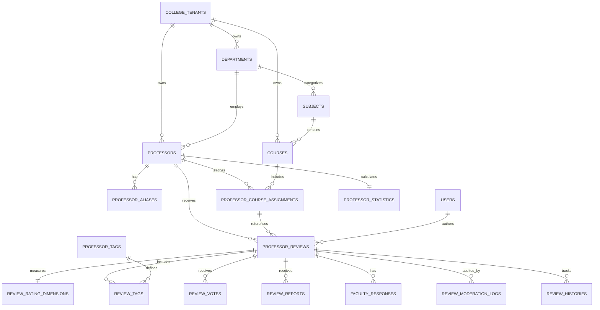
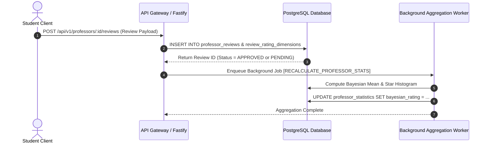

# Database Architecture & Data Model: Rate My Professor Module (MS-18.3)

## Document Information

- **Project**: College Hub (Enterprise Multi-College Platform)
- **Document Title**: Database Architecture, Entity-Relationship Modeling & Multi-Tenant RLS Specification
- **Target Audience**: Principal Database Architects, Backend Engineers, Security Leads
- **Status**: Official Database Architecture Specification (MS-18.3 Complete)
- **Implementation Constraint**: Pure Database Architecture & Schema Design (Zero Code / Zero API Implementation)

---

## 1. Entity-Relationship (ER) Foundation & Diagrams

### 1.1 Complete ER Diagram (Mermaid)



---

## 2. Table Specifications

### 2.1 Table: `departments`

- **Purpose**: Represents academic departments within a specific college (e.g. Computer Science, Mechanical).
- **Ownership**: Owned by `collegeTenants`.
- **Schema Columns**:
  - `id`: UUID (Primary Key, default `gen_random_uuid()`)
  - `college_id`: UUID (FK $\rightarrow$ `college_tenants.id`, NOT NULL)
  - `name`: VARCHAR(255) (e.g. "Department of Computer Science & Engineering")
  - `code`: VARCHAR(50) (e.g. "CSE")
  - `slug`: VARCHAR(100) (e.g. "cse")
  - `created_at`, `updated_at`, `deleted_at`: Standard Audit Timestamps
- **Index Strategy**: `uniqueIndex('dept_college_code_idx').on(college_id, code)`
- **RLS Consideration**: Enforces `college_id = CURRENT_SETTING('app.current_college_id')`.
- **Why Separate?**: Departments exist independently of professors and are shared across courses.

---

### 2.2 Table: `professors`

- **Purpose**: Canonical registry of faculty members in an institution.
- **Ownership**: Owned by `collegeTenants` and associated with a primary `department`.
- **Schema Columns**:
  - `id`: UUID (Primary Key)
  - `college_id`: UUID (FK $\rightarrow$ `college_tenants.id`, NOT NULL)
  - `department_id`: UUID (FK $\rightarrow$ `departments.id`, NOT NULL)
  - `full_name`: VARCHAR(255) (e.g. "Dr. Ananya Subramanian")
  - `slug`: VARCHAR(255) (e.g. "dr-ananya-subramanian")
  - `employee_code`: VARCHAR(100) (Optional internal ERP ID)
  - `designation`: VARCHAR(100) (e.g. "Associate Professor", "Head of Department")
  - `status`: VARCHAR(50) (`ACTIVE`, `VISITING`, `RETIRED`, `ON_LEAVE`)
  - `biography`: TEXT
  - `photo_url`: VARCHAR(500)
  - `official_email`: VARCHAR(255) (Optional, admin visible only)
  - `created_at`, `updated_at`, `deleted_at`: Standard Audit Timestamps
- **Index Strategy**: `uniqueIndex('prof_college_slug_idx').on(college_id, slug)`, `index('prof_dept_idx').on(college_id, department_id)`.
- **RLS Consideration**: Enforces strict `college_id` isolation.

---

### 2.3 Table: `professor_aliases`

- **Purpose**: Stores nicknames, alternate spellings, and search aliases (e.g. "Prof. Ani", "Dr. A. Subramanian").
- **Ownership**: Owned by `professors`.
- **Schema Columns**:
  - `id`: UUID (PK)
  - `college_id`: UUID (FK $\rightarrow$ `college_tenants.id`)
  - `professor_id`: UUID (FK $\rightarrow$ `professors.id`)
  - `alias_name`: VARCHAR(255) (NOT NULL)
- **Why Separate?**: One professor can have 5+ alternate spellings or nicknames. Keeping aliases normalized prevents bloating the primary `professors` table.

---

### 2.4 Table: `subjects` & `courses`

- **Purpose**: Normalizes academic subjects (e.g. "Data Structures") and specific course offerings (`CS201 - Data Structures & Algorithms`).
- **Ownership**: Owned by `collegeTenants` and linked to `departments`.
- **Schema Columns**: `code`, `name`, `credits`, `semester_offered`.

---

### 2.5 Table: `professor_course_assignments`

- **Purpose**: Junction table linking professors to the specific courses they teach in a given academic year/semester.
- **Schema Columns**: `id`, `college_id`, `professor_id`, `course_id`, `academic_year` (e.g. "2024-25"), `semester` (e.g. "5th Sem").

---

### 2.6 Table: `professor_reviews` (Core Review Entity)

- **Purpose**: Primary record of student feedback submitted for a professor.
- **Ownership**: Authored by `users` (linked via blind HMAC hash for anonymity) and targeting `professors`.
- **Schema Columns**:
  - `id`: UUID (PK)
  - `college_id`: UUID (FK $\rightarrow$ `college_tenants.id`, NOT NULL)
  - `professor_id`: UUID (FK $\rightarrow$ `professors.id`, NOT NULL)
  - `course_assignment_id`: UUID (FK $\rightarrow$ `professor_course_assignments.id`, NOT NULL)
  - `author_user_id`: UUID (FK $\rightarrow$ `users.id`, NOT NULL)
  - `author_anonymous_token`: VARCHAR(255) (Blind HMAC-SHA256 hash for public rendering)
  - `is_anonymous`: BOOLEAN (default `true`)
  - `grade_received`: VARCHAR(10) (Optional: "A+", "A", "B", "F", "PASSED")
  - `review_text`: TEXT (Min 20 chars, max 1000 chars)
  - `overall_rating`: NUMERIC(3, 2) (Calculated mean of dimension scores)
  - `moderation_status`: VARCHAR(50) (`PENDING`, `APPROVED`, `FLAGGED`, `REJECTED`)
  - `helpful_count`: INTEGER (default `0`)
  - `unhelpful_count`: INTEGER (default `0`)
  - `created_at`, `updated_at`, `deleted_at`: Standard Audit Timestamps
- **Index Strategy**: `index('rev_prof_status_idx').on(college_id, professor_id, moderation_status, created_at)`.
- **RLS Consideration**: Enforces `college_id` setting. Public queries only return `moderation_status = 'APPROVED'`.

---

### 2.7 Table: `review_rating_dimensions` (Flexible Evaluation Schema)

- **Purpose**: Stores structured ratings for individual academic dimensions without requiring schema migrations when adding new dimensions.
- **Why Separate?**: Prevents hardcoding static columns (`clarity`, `strictness`) on the main `professor_reviews` table.
- **Schema Columns**:
  - `id`: UUID (PK)
  - `college_id`: UUID (FK $\rightarrow$ `college_tenants.id`)
  - `review_id`: UUID (FK $\rightarrow$ `professor_reviews.id`, NOT NULL)
  - `dimension_key`: VARCHAR(100) (e.g. `'teaching_clarity'`, `'grading_fairness'`, `'punctuality'`, `'approachability'`)
  - `score`: NUMERIC(3, 2) (1.00 to 5.00)
- **Index Strategy**: `uniqueIndex('review_dim_uniq_idx').on(review_id, dimension_key)`.

---

### 2.8 Table: `review_votes`

- **Purpose**: Records student helpful/unhelpful votes on reviews while preventing duplicate voting.
- **Schema Columns**:
  - `id`: UUID (PK)
  - `college_id`: UUID (FK $\rightarrow$ `college_tenants.id`)
  - `review_id`: UUID (FK $\rightarrow$ `professor_reviews.id`)
  - `voter_user_id`: UUID (FK $\rightarrow$ `users.id`)
  - `vote_type`: VARCHAR(20) (`HELPFUL`, `UNHELPFUL`)
  - `created_at`: TIMESTAMP
- **Index Strategy**: `uniqueIndex('vote_user_review_uniq_idx').on(review_id, voter_user_id)`.

---

### 2.9 Table: `review_reports` & `review_moderation_logs`

- **Purpose**: Tracks student abuse reports (Spam, Harassment, Retaliation) and moderator audit actions.
- **Schema Columns**: `report_reason`, `reporter_user_id`, `action_taken`, `moderator_user_id`, `audit_notes`.

---

### 2.10 Table: `professor_statistics` (Pre-Aggregated Read Cache)

- **Purpose**: Stores pre-computed Bayesian ratings and 5-bar star distribution charts to serve profile views with $O(1)$ read performance.
- **Why Separate?**: Calculating weighted Bayesian means across thousands of raw review rows on every HTTP request would cause server CPU degradation.
- **Schema Columns**:
  - `professor_id`: UUID (PK, FK $\rightarrow$ `professors.id`)
  - `college_id`: UUID (FK $\rightarrow$ `college_tenants.id`)
  - `bayesian_rating`: NUMERIC(3, 2)
  - `raw_average_rating`: NUMERIC(3, 2)
  - `total_reviews_count`: INTEGER
  - `recommendation_percentage`: NUMERIC(5, 2)
  - `star_5_count`: INTEGER
  - `star_4_count`: INTEGER
  - `star_3_count`: INTEGER
  - `star_2_count`: INTEGER
  - `star_1_count`: INTEGER
  - `last_calculated_at`: TIMESTAMP
- **Index Strategy**: `index('prof_stats_bayesian_idx').on(college_id, bayesian_rating)`.

---

## 3. Read/Write & Aggregation Flow Architectural Diagram



---

## 4. Multi-Tenant RLS & Security Considerations

1. **Strict Tenant Isolation**: Every table contains a `college_id` foreign key. Row-Level Security (RLS) policies enforce:
   ```sql
   CREATE POLICY tenant_isolation_policy ON professor_reviews
     AS RESTRICTIVE
     USING (college_id::text = CURRENT_SETTING('app.current_college_id', true));
   ```
2. **Anonymous Identity Protection**: `author_anonymous_token` stores a blind HMAC-SHA256 digest (`HMAC-SHA256(userId + collegeId, secretSalt)`). The raw `author_user_id` is excluded from all public database views and API contracts.

---

_End of Database Architecture Specification (MS-18.3)._
