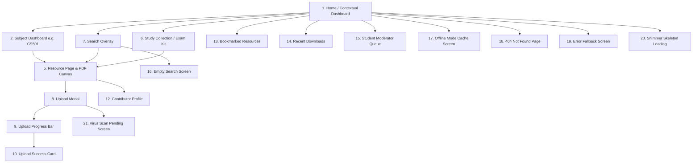

# Visual Design System & UI/UX Specification: Academic Resource Hub (MS-19.7)

## Document Information

- **Project**: College Hub (Enterprise Multi-College Platform)
- **Document Title**: Visual Design System, Design Tokens, Screen Inventory & Interaction Specifications: Academic Resource Hub
- **Target Audience**: UI/UX Designers, Product Managers, Frontend Engineers, Mobile Lead Developers
- **Status**: Official Design System & UI/UX Specification Standard (MS-19.7 Complete)
- **Implementation Constraint**: Pure Visual & Design System Specification (Zero Code Implementation / Zero DB Schemas / Zero API Endpoints / Zero Component Code)

---

## 1. Design Philosophy & Visual Identity

The **Academic Resource Hub** visual design language is governed by five core principles:

1. **Sub-10 Second Material Identification**: Information architecture and visual hierarchy are optimized to ensure a student under extreme exam pressure can identify, preview, and download verified study materials in under 10 seconds.
2. **Academic Trust & Verifiability**: Uses clean, authoritative typography and subtle color badges (Gold for Solution Keys, Emerald for Verified Notes, Blue for Faculty Uploads) to communicate instant credibility.
3. **High Information Density Without Clutter**: Maximizes data utility on screen without overwhelming the student, using structured metadata pills and clean grid alignment.
4. **Mobile-First Thumb Ergonomics**: Primary action controls (`Download PDF`, `Save Offline`, `Upvote`, `Preview Canvas`) are strictly positioned in the bottom 30% thumb reach zone on mobile devices.
5. **Consistency with College Hub Design System**: Fully aligned with the existing College Hub design token engine (`globals.css` and `rate-my-professor.css`), supporting Light Mode, Dark Mode, and High Contrast Mode seamlessly.

---

## 2. Design Tokens Engine

### 2.1 Color Palette System

```
+-----------------------------------------------------------------------------------+
|                            COLOR PALETTE TOKENS                                   |
+-----------------------------------------------------------------------------------+
| Primary Brand Accent      --> Indigo 600 (#4F46E5 [Light] / #6366F1 [Dark])      |
| Academic Secondary        --> Teal 500   (#06B6D4 [Light] / #22D3EE [Dark])      |
| Quality Badge (Gold)      --> Amber 500  (#F59E0B [Light] / #FBBF24 [Dark])      |
| Verified Badge (Emerald)  --> Emerald 500(#10B981 [Light] / #34D399 [Dark])      |
| Alert / Error (Rose)      --> Red 500    (#EF4444 [Light] / #F87171 [Dark])      |
| Surface Base              --> Slate 50   (#FFFFFF [Light] / #0F172A [Dark])      |
| Surface Elevated          --> Slate 100  (#F8FAFC [Light] / #1E293B [Dark])      |
| Text Main                 --> Slate 900  (#0F172A [Light] / #F8FAFC [Dark])      |
| Text Muted                --> Slate 500  (#64748B [Light] / #94A3B8 [Dark])      |
+-----------------------------------------------------------------------------------+
```

### 2.2 Typography Scale

- **Font Families**: 
  - Sans-Serif Body & UI: `Inter`, system-ui, sans-serif
  - Monospace (Subject Codes, Hashes, Tags): `JetBrains Mono`, monospace
- **Font Sizes**:
  - `xs`: `0.75rem` (12px) — Meta text, timestamps, tags
  - `sm`: `0.875rem` (14px) — Button text, body secondary, input labels
  - `base`: `1.000rem` (16px) — Body text, resource title secondary
  - `lg`: `1.125rem` (18px) — Card titles, section headers
  - `xl`: `1.250rem` (20px) — Page titles, modal headers
  - `2xl`: `1.500rem` (24px) — Hero titles, subject names
  - `3xl`: `1.875rem` (30px) — Main hub headers
- **Font Weights**: Regular (`400`), Medium (`500`), Semibold (`600`), Bold (`700`).

### 2.3 Spacing & Radius System

- **Spacing Token**: `4px` (1), `8px` (2), `12px` (3), `16px` (4), `20px` (5), `24px` (6), `32px` (8), `48px` (12), `64px` (16).
- **Border Radius**:
  - `sm`: `4px` — Badges, small input tags
  - `md`: `8px` — Buttons, text inputs, dropdown selects
  - `lg`: `16px` — Resource cards, modal dialogs
  - `xl`: `24px` — Hero cards, dashboard banners
  - `full`: `9999px` — Pill badges, avatar circles

### 2.4 Shadows, Elevation & Motion Tokens

- **Shadows**:
  - `sm`: `0 1px 2px 0 rgba(0, 0, 0, 0.05)`
  - `md`: `0 4px 6px -1px rgba(0, 0, 0, 0.1)`
  - `glass`: `0 8px 32px 0 rgba(31, 38, 135, 0.15)`
- **Elevation Z-Index**: Base (`0`), Dropdown (`50`), Header (`100`), Popover (`200`), Backdrop (`400`), Modal (`500`), Toast (`1000`).
- **Motion Durations**: Fast (`150ms`), Normal (`300ms`), Slow (`500ms`).
- **Easing Curve**: Spring transition `cubic-bezier(0.34, 1.56, 0.64, 1)`.

---

## 3. Screen Inventory Specifications (21 Screens)



### Detailed Screen Specifications

1. **Home / Contextual Dashboard**: Displays active college tenant header, auto-detected current semester enrolled subjects, quick search entry bar, and high-yield PYQs.
2. **Subject Dashboard (`/subjects/:code`)**: Subject header, course code badge, Exam Survival Kit banner, material category tabs (`PYQs`, `Lecture Notes`, `Lab Manuals`, `Formula Sheets`), and material grid.
3. **Semester Dashboard**: Grid of all departments and subjects for a specific semester (e.g. 5th Semester CSE).
4. **Course / Branch Overview**: Academic department overview displaying regulation schemes and curriculum structure.
5. **Resource Page & PDF Canvas Screen**: Hero metadata block, interactive multi-page PDF canvas previewer, quality score metrics, and sticky bottom action bar.
6. **Study Collection ("Exam Survival Kit")**: Multi-material bundle view with ordered checklist, section dividers, and 1-click ZIP download CTA.
7. **Instant Search Overlay**: Full-screen overlay triggered by search bar with debounced input, recent searches pills, and trending subject chips.
8. **Upload Modal (Step 1: Metadata)**: File drag-and-drop zone, subject select, category select, exam type dropdown, scheme year tagger, and anonymity toggle.
9. **Upload Progress Bar & Pre-Flight Validation**: Real-time circular percentage spinner, SHA-256 duplicate check indicator, and cancel button.
10. **Upload Success Card**: Confirmation modal with "+10 Contributor Points" animation and instant resource share link.
11. **Document Canvas Multi-Page Preview Screen**: Full-screen responsive canvas with page navigation steppers, zoom controls, and thumbnail grid drawer.
12. **Contributor Profile Screen**: Contributor avatar, badges ("Peer Tutor", "Verified Scholar"), total uploaded documents, and total community upvotes.
13. **Bookmarked Resources Screen**: Grid of saved study materials stored locally or synced to user account.
14. **Recent Downloads Screen**: Chronological feed of downloaded PDFs for quick re-opening.
15. **Student Moderator Queue Screen**: Moderation queue displaying reported files, reason tags, PDF inspector preview, and `Approve` / `Quarantine` decision CTAs.
16. **Empty Search Screen**: Friendly illustration + *"No study materials match your search. Be the first student to upload!"* + `Upload Material` CTA button.
17. **Offline Mode Cache Screen**: Banner indicating offline state + list of locally cached PDFs stored in PWA Cache Storage.
18. **404 Not Found Page**: Friendly academic error screen with link back to Subject Directory.
19. **Error Fallback Screen**: Non-blocking toast/banner with `Try Again` retry trigger.
20. **Shimmer Skeleton Loading State**: Shimmer cards matching exact card layout height to prevent Cumulative Layout Shift (CLS = 0).
21. **Virus Scan Pending Screen**: File scanning notification banner disabling full download until ClamAV verification completes.

---

## 4. Navigation Hierarchy & Ergonomics

```
+-----------------------------------------------------------------------------------+
|                             DESKTOP & MOBILE NAVIGATION                           |
+-----------------------------------------------------------------------------------+
|  Top Persistent Header: Brand Logo | Subject Quick Jump | Theme Switcher | User  |
|  Breadcrumb Bar: Stanford Univ > CSE > 5th Sem > CS501 Operating Systems          |
|  Mobile Bottom Nav: 🏠 Home  |  🔍 Search  |  📦 Collections  |  👤 Profile       |
|  Mobile Sticky Action: [ 📥 Download PDF (2.4 MB) ]  [ 📖 Preview ]  [ 👍 48 ]    |
+-----------------------------------------------------------------------------------+
```

---

## 5. Subject Dashboard Hierarchy & Visual Ordering

Information on the Subject Dashboard is ordered strategically based on student exam preparation intent:

1. **Subject Header**: Full Name (`CS501: Operating Systems`), Course Code Pill, Credits (`4 Credits`), Department (`CSE`).
2. **Exam Survival Kit Banner**: Prominent gradient banner for active exam kits (*"Mid-Sem 2024 Exam Kit: Notes + 3-Year PYQs + Formula Sheet"*).
3. **Material Category Filter Pills**: `All Materials (25)`, `PYQs (12)`, `Lecture Notes (8)`, `Lab Manuals (3)`, `Formula Sheets (2)`.
4. **Active Material Grid**: 2-column or 3-column card grid sorted by Bayesian Quality Score.
5. **Top Student Contributors Section**: Avatar row of top peer uploaders for this subject.
6. **Related Department Subjects**: Carousel of alternative subjects for the same semester.

---

## 6. Resource Card Anatomy & Visual Priority

```
+-----------------------------------------------------------------------------------+
|  [PYQ]  CS501 — Operating Systems                    [ ★ 4.85 | 93% Retake ]     |
|  2023 End-Sem Question Paper with Solution Key                                   |
|  -------------------------------------------------------------------------------  |
|  🏷️ #2021Scheme   🏷️ #SolutionKey   🏷️ #EndSem                                   |
|  -------------------------------------------------------------------------------  |
|  👤 Uploaded by Priya N. (Verified CR)  •  14 Pages  •  2.4 MB  •  48 Upvotes     |
|  [ 📖 Quick Preview ]                                  [ 📥 Download PDF ]        |
+-----------------------------------------------------------------------------------+
```

### Visual Priority Levels:
- **Level 1 (Highest)**: Category Badge (`[PYQ]`), Course Code (`CS501`), Resource Title.
- **Level 2 (Trust Signals)**: Gold Rating Badge (`4.85 ★`), Verified Solution Key Shield.
- **Level 3 (Context)**: Scheme Tag (`#2021Scheme`), Page Count, File Size, Author Name.
- **Level 4 (Actions)**: `Quick Preview` & `Download PDF` buttons.

---

## 7. Resource Page Information Hierarchy

1. **Header Breadcrumb**: `College → Dept → Sem → Subject → Resource`.
2. **Title & Verification Badges**: Full Title, Category Badge, Verified Badge.
3. **Canvas PDF Multi-Page Viewer**: Embedded canvas rendering PDF pages with thumbnail drawer and page steppers.
4. **Metadata & Quality Metrics Block**: Bayesian Rating (`4.85`), Total Downloads (`142`), Upvotes (`48`), Scheme Year (`2021 Regulation`).
5. **Sticky Bottom Action Bar (Mobile)**: `Download PDF (Primary)`, `Save Offline (Secondary)`, `Upvote`, `Bookmark`, `Report`.
6. **Version History Accordion**: Displays past revision versions and changelogs.
7. **Uploader Profile Card**: Contributor name, avatar, reputation score, and uploader badges.
8. **Related Resources Grid**: Recommended PYQs and notes.

---

## 8. Study Collection ("Exam Survival Kit") UX

```
[📦 OS Mid-Sem Exam Survival Kit]  (Creator: CR Vikram R.)
[ 📥 Download All as ZIP (12.4 MB) ]   [ ⚡ Save Entire Kit Offline ]
---------------------------------------------------------------------------------
Item 1: 📄 Unit 1 & 2 Lecture Notes ............................... [ 📖 Preview ]
Item 2: 📄 2022 Mid-Sem Question Paper ............................. [ 📖 Preview ]
Item 3: 📄 2023 Mid-Sem Paper with Verified Solution Key .......... [ 📖 Preview ]
Item 4: 📄 1-Page Formula Cheat Sheet .............................. [ 📖 Preview ]
```

---

## 9. Upload Experience & Validation UI/UX

1. **Step 1 (Drag & Drop)**: Dropzone accepting PDF, PNG, JPG, DOCX files.
2. **Step 2 (Instant SHA-256 Duplicate Check Alert)**: If hash exists, displays amber toast: *"Duplicate File Detected: This file already exists as 'OS_Notes_Unit1.pdf'. [View Existing File]"*.
3. **Step 3 (Metadata Selection)**: Subject select, Category dropdown, Scheme tagger, Exam Type selector.
4. **Step 4 (Progress & Validation)**: Circular progress spinner ($0\% \rightarrow 100\%$) with cancel button.
5. **Step 5 (Success Confirmation)**: Modal displaying "+10 Contributor Points" animation and instant shareable deep link.

---

## 10. Search Experience & Filter Overlay UX

- **Trigger**: Tapping top search bar opens persistent full-screen search overlay.
- **Debounced Input**: Searches as student types (200ms delay).
- **Filter Chips Row**: `[PYQs Only]`, `[Notes Only]`, `[2021 Scheme]`, `[Min Rating 4.0+]`.
- **Course Code Auto-Jump**: Typing `CS501` displays top suggestion: *"Jump directly to CS501: Operating Systems Hub"*.

---

## 11. Mobile vs. Desktop Ergonomics

```
+-----------------------------------------------------------------------------------+
|                        MOBILE VS. DESKTOP LAYOUT COMPARISON                       |
+-----------------------------------------------------------------------------------+
| Mobile (320px - 640px)        | Desktop (1025px+)                                 |
| ----------------------------- | ------------------------------------------------  |
| Single column vertical stack  | 3-Column Grid (Nav Tree | Preview | Meta Bar)     |
| Bottom 30% thumb action bar   | Fixed right-hand action sidebar                   |
| Swipe gestures for PDF pages  | Keyboard shortcuts (Cmd+K Search, Cmd+D Download) |
| Swipe-down modal sheets       | Hover shadow elevations & tooltip popovers        |
+-----------------------------------------------------------------------------------+
```

---

## 12. Accessibility Standards (WCAG 2.1 AA Compliance)

- **Minimum Touch Targets**: All buttons, star controls, and filter pills satisfy minimum **48x48px** touch target bounds.
- **Focus Rings**: High-visibility focus ring (`outline: 2px solid #4F46E5; outline-offset: 2px`) on keyboard navigation.
- **Color Contrast**: Text-to-background contrast ratio $\ge 4.5:1$ for body text and $\ge 3.0:1$ for badges.
- **Screen Reader Attributes**: ARIA live regions for upload progress (`aria-live="polite"`), explicit ARIA labels on icon controls (`aria-label="Download PDF, 2.4 megabytes"`).
- **Reduced Motion**: Respects `prefers-reduced-motion` OS settings, disabling decorative animations.

---

## 13. Micro-Interactions & Animation System

1. **Upvote Button Bounce**: Tapping `👍 Helpful` triggers a subtle scale bounce animation (`scale(1.15)` for 150ms).
2. **Bookmark Fill**: Tapping bookmark fills icon with Indigo color via spring easing.
3. **Card Lift on Hover**: Hovering a resource card elevates card shadow and translates Y position by `-2px`.
4. **Shimmer Wave**: Skeleton loading blocks animate a continuous 90-degree gradient shimmer wave.

---

## 14. Responsive Breakpoint Layout Matrix

| Breakpoint | Devices | Layout Strategy |
| :--- | :--- | :--- |
| **`320px`** | Small Mobile | 1-Column, compact padding, hidden tags |
| **`375px`** | Standard Mobile | 1-Column, full card details, sticky bottom action bar |
| **`480px`** | Large Mobile / Phablet | 1-Column, expanded filter chips |
| **`768px`** | Tablet Portrait | 2-Column grid, bottom sheet drawers |
| **`1024px`**| Tablet Landscape / Small Laptop | 2-Column layout (Main feed + Sticky right sidebar) |
| **`1280px`**| Desktop | 3-Column layout (Left Nav Tree + Center Feed + Right Meta Bar) |
| **`1600px+`**| Ultra-Wide Display | 3-Column centered max-width container (`max-width: 1440px`) |

---

## 15. College Hub Visual Design Decisions Log

### Decision 1: Sticky Bottom Action Bar on Mobile
- **Inspired By**: E-Commerce & Reading Apps (Amazon, Kindle)
- **Why Chosen**: Ensures the primary CTA (`Download PDF`) is always reachable within the single-thumb reach zone without requiring scrolling past long PDF previews.
- **Why Alternatives Were Rejected**: Top action headers require two-handed phone operation on modern large mobile screens.
- **Adaptation for Indian Colleges**: Optimized for quick single-handed phone usage on crowded student buses/trains during commute to college exams.

### Decision 2: Distinct Verification Badges (Gold, Emerald, Blue)
- **Inspired By**: GitHub Verified Commit & Twitter Blue Checkmarks
- **Why Chosen**: Instantly communicates trust signals (Solution Key vs Verified Notes vs Faculty PPT) to anxious students searching for study material 10 minutes before an exam.
- **Why Alternatives Were Rejected**: Monochrome text labels blend into card bodies and get missed.
- **Adaptation for Indian Colleges**: Tailored to Indian college material types (PYQ Solution Keys, Faculty PPTs, CR Notes).

---

## 16. Visual Definition of Done Verification

| Design Requirement | Verification Status | Rationale / Reference |
| :--- | :--- | :--- |
| **Design Token System** | ✅ Verified | Complete HSL/Hex color tokens, typography scale, spacing, and shadows. |
| **Screen Inventory (21 Screens)**| ✅ Verified | Layout specifications for all 21 core screens and edge cases. |
| **Resource Card Anatomy** | ✅ Verified | Visual hierarchy and priority levels defined. |
| **WCAG 2.1 AA Compliance** | ✅ Verified | Minimum 48px touch targets, focus rings, contrast ratios, and ARIA labels. |
| **No Code Implementation** | ✅ Verified | Pure visual design system & UI/UX specification. |

---

_End of Visual Design System & UI/UX Specification: Academic Resource Hub (MS-19.7)._
