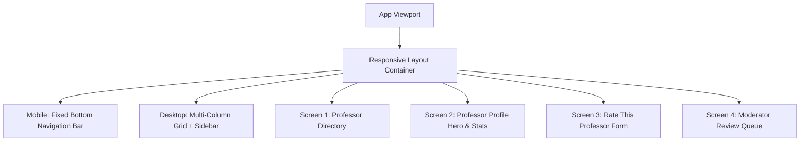

# Visual Design System & UI/UX Specification: Rate My Professor (MS-18.7)

## Document Information

- **Project**: College Hub (Enterprise Multi-College Platform)
- **Document Title**: Visual Design Language, Screen Inventory, Component Hierarchy & Motion Guidelines
- **Target Audience**: Product Designers, Frontend Leads, UI Engineers, Accessibility Officers
- **Status**: Official Design Specification Standard (MS-18.7 Complete)
- **Implementation Constraint**: Pure Design Specification (Zero React Code / Zero HTML / Zero CSS Generation)

---

## 1. Design Principles & Aesthetic Philosophy

1. **Uncompromising Trust**: Design relies on crisp typography, generous whitespace, and subtle borders rather than aggressive gamification or ad clutter.
2. **Instant Information Scannability**: Students browsing professors during course registration need to extract key metrics (_Clarity_, _Strictness_, _Attendance Policy_) in **under 3 seconds**.
3. **Mobile-First Touch Ergonomics**: Primary action triggers (search, rating CTA, filters) are anchored within the lower 30% "natural thumb reach" zone on mobile screens.
4. **Cohesive Multi-College Branding**: Automatically inherits college primary colors (e.g. Stanford Crimson `#8C1515`, MIT Maroon `#A31F34`) while using module accent colors (Indigo `#4F46E5` for Rate My Professor).

---

## 2. Visual Identity & Token System Integration

Integrating `@college-hub/theme-engine` tokens:

- **Color System**:
  - Primary Accent: `--ch-color-accent` (`#4F46E5` Indigo)
  - Surface Background: `--ch-color-surface` (`#F9FAFB` Light / `#1E293B` Dark)
  - Border Token: `--ch-color-border` (`#E5E7EB` Light / `#334155` Dark)
  - Success Badge: `--ch-color-success` (`#10B981` Emerald)
- **Corner Radius**:
  - Cards: `--ch-radius-md` (`8px`)
  - Buttons & Chips: `--ch-radius-full` (`9999px`)
- **Elevation & Glassmorphism**:
  - Floating Modals: `--ch-shadow-glass` (`0 8px 32px 0 rgba(31, 38, 135, 0.15)`)
- **Typography Hierarchy**:
  - Page Title: `font-size: 2.25rem (36px)`, `font-weight: 700`
  - Rating Badge: `font-size: 1.875rem (30px)`, `font-weight: 700`
  - Body Text: `font-size: 1rem (16px)`, `line-height: 1.5`

---

## 3. Screen Inventory & Component Layout Specs



### Screen 1: Professor Directory Screen

- **Header**: Persistent search bar + Department filter pill carousel (`All`, `Computer Science`, `Electrical`, `Mechanical`).
- **Content Feed**: Vertical list of `ProfessorSummaryCard` components displaying name, designation, department, Bayesian quality score badge, recommendation %, and top tag pills.

### Screen 2: Professor Profile & Stats Screen

- **Hero Banner**: Large professor name, department link, verified faculty badge, and primary action CTA ("Rate This Professor").
- **Score & Distribution Section**:
  - Left: Bayesian Score Badge (e.g. `4.6 / 5.0`) + IMDb-style Confidence Indicator (`Based on 42 verified reviews`).
  - Right: 5-Bar Star Distribution Histogram (`5★: 65%`, `4★: 25%`, `3★: 5%`, `2★: 3%`, `1★: 2%`).
- **4-Dimension Score Grid**: Visual 1-5 progress bars for _Lecture Clarity_, _Grading Strictness_, _Punctuality_, and _Approachability_.
- **Reviews List**: Sort dropdown (_Most Helpful_, _Recent_) + search-in-reviews bar + review cards feed.

### Screen 3: Write Review Modal / Screen

- **Step 1**: 4 Star-Rating Sliders (Clarity, Strictness, Punctuality, Approachability).
- **Step 2**: Course Code & Term Selection Dropdown (`CS201`, `5th Sem`, `2024-25`).
- **Step 3**: Tag Pill Selector (Select up to 3 tags).
- **Step 4**: Written Feedback Text Area + "Post Anonymously" toggle + Grade Disclosure.

---

## 4. Review Card Design Specification

Visual order of elements within a `ReviewCard` component:

```
+-----------------------------------------------------------------------+
| [4.5 / 5.0]  Data Structures (CS201) • 5th Sem (2024-25)   [Verified] |
|              Posted 2 days ago • Anonymous Student                    |
+-----------------------------------------------------------------------+
| Clarity: 5.0  | Strictness: 3.0  | Punctuality: 5.0  | Approach: 4.0     |
+-----------------------------------------------------------------------+
| "Prof. Subramanian explains complex algorithms with great visual     |
| examples. Mid-term exam was tough but grading was fair."              |
+-----------------------------------------------------------------------+
| Tags: [#ToughGrader] [#GreatLectures] [#LabFocused]                   |
+-----------------------------------------------------------------------+
| [👍 Helpful (12)]   [👎 Unhelpful (1)]             [🚩 Report Review]  |
+-----------------------------------------------------------------------+
| ↳ Verified Faculty Reply: "Thank you for the detailed feedback!"      |
+-----------------------------------------------------------------------+
```

- **Rationale for Ordering**: Rating score and course context at the top allow instant scanning; quantitative dimensions provide structured context before reading qualitative text; engagement actions (helpful votes/reports) are anchored at the bottom.

---

## 5. Mobile vs. Desktop Ergonomics

- **Mobile Ergonomics**:
  - Fixed bottom action bar containing "Rate This Professor" CTA button.
  - Filters open as swipeable **Bottom Sheet Drawers**.
  - Infinite scrolling feed with shimmer skeleton loaders.
- **Desktop Ergonomics**:
  - 3-Column Grid: Left (Navigation & Department Filters), Middle (Main Feed & Reviews), Right (Sticky Professor Profile Summary & Distribution Chart).
  - Keyboard Shortcuts: `/` to focus search bar, `Esc` to close modals.

---

## 6. Accessibility & Motion Design Guidelines

- **WCAG 2.1 AA Compliance**:
  - Text contrast $\ge 4.5:1$ against background.
  - Visible focus rings (`outline: 2px solid --ch-color-accent`) on interactive elements during keyboard navigation.
  - Screen reader labels (`aria-label="Rating 4.5 out of 5 stars"`).
  - Touch target sizes $\ge 48\times 48\text{px}$.
- **Motion & Transitions**:
  - Page transitions: Subtle 200ms slide-fade (`cubic-bezier(0.4, 0, 0.2, 1)`).
  - Reduced Motion: Respects `prefers-reduced-motion` settings, reducing animation durations to `0ms`.

---

_End of Visual Design System Specification (MS-18.7)._
