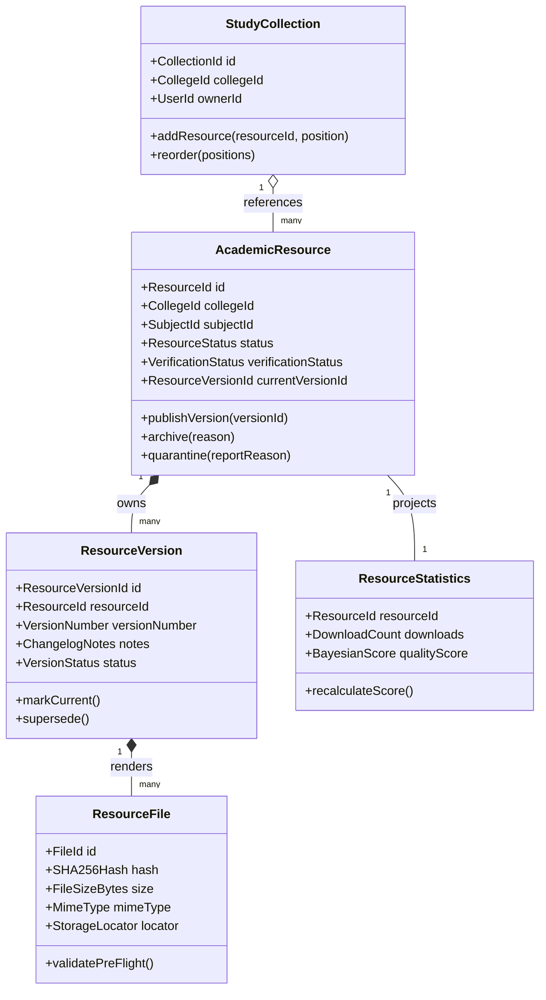
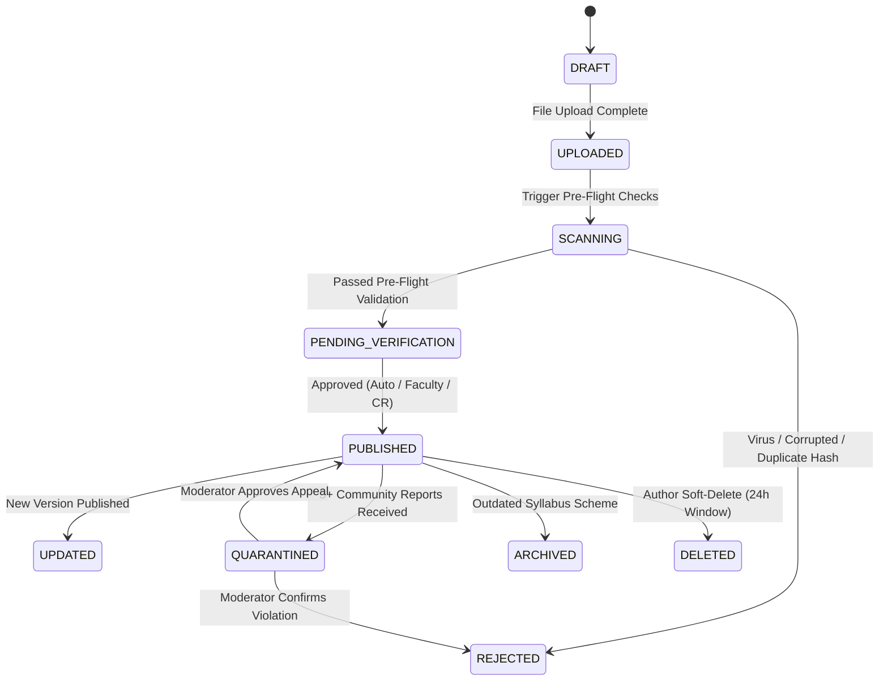
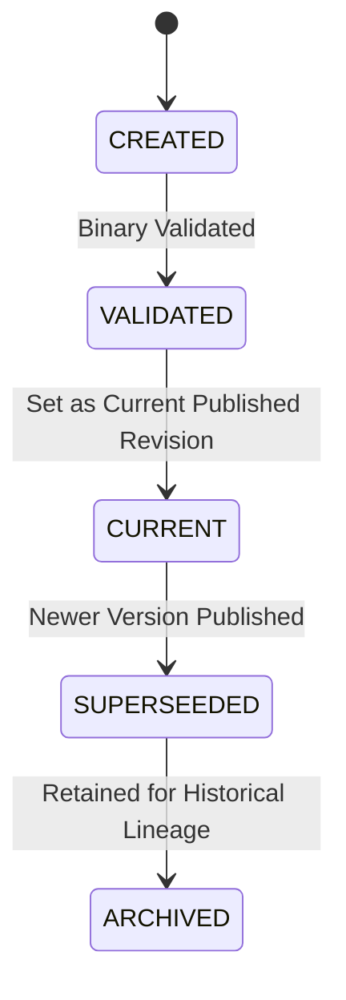

# Domain Model & Business Rules Specification: Academic Resource Hub (MS-19.4)

## Document Information

- **Project**: College Hub (Enterprise Multi-College Platform)
- **Document Title**: Domain-Driven Design (DDD) Bounded Context Specification: Academic Resource Hub
- **Target Audience**: Software Architecture Team, Lead Backend Engineers, Domain Engineers, QA Leads
- **Status**: Official DDD Domain Model Specification Standard (MS-19.4 Complete)
- **Implementation Constraint**: Pure DDD Business Model Specification (Zero Code Implementation / Zero DB Schema Definitions / Zero API Endpoints / Zero UI Mockups)

---

## 1. Domain Bounded Context & Design Overview

The **Academic Resource Hub Bounded Context** governs the lifecycle, verification, classification, versioning, quality evaluation, and community distribution of academic study materials within a multi-tenant university environment.

### Core Domain Principles

1. **Explicit Invariants Over Implicit Expectations**: Every aggregate root enforces strict business invariants prior to emitting domain events or mutating internal state.
2. **Immutable Lineage & Append-Only History**: Historical versions, activity logs, and moderation audit trails are strictly immutable.
3. **Event-Driven Asynchronous Aggregation**: Domain events (`ResourceDownloaded`, `ResourceVoteAdded`, `ResourceReported`) drive secondary projections (read-model statistics, contributor badges, quality rankings) asynchronously.

---

## 2. Aggregate Roots, Entities & Value Objects Catalogue



---

### 2.1 `AcademicResource` (Aggregate Root)

- **Purpose**: The primary aggregate root maintaining the identity, lifecycle state, ownership, and classification of a study resource.
- **Responsibilities**: Enforces business invariants regarding publication, replacement, archiving, and status transitions.
- **Ownership**: Belongs strictly to one `CollegeId` and one `SubjectId`.
- **Business Invariants**:
  1. Must always be associated with a valid `CollegeId` matching the uploader's verified college.
  2. Cannot be published without at least one valid, validated `ResourceVersion`.
  3. Cannot transition to `PUBLISHED` if its status is `QUARANTINED` or `REJECTED`.

---

### 2.2 `ResourceVersion` (Entity)

- **Purpose**: Represents a specific immutable revision of an `AcademicResource`.
- **Responsibilities**: Tracks changelogs, version numbers, and attached `ResourceFile` renditions.
- **Business Invariants**:
  1. Version numbers must be monotonically increasing integers (`1`, `2`, `3`).
  2. A `ResourceVersion` once published can never be mutated or deleted (immutable history).

---

### 2.3 `ResourceFile` (Value Object / Entity)

- **Purpose**: Represents physical binary file locators and integrity metadata.
- **Business Invariants**:
  1. `SHA256Hash` must be unique per file binary across the tenant storage workspace.
  2. File size must satisfy $50\text{ KB} \le \text{FileSizeBytes} \le 50\text{ MB}$.
  3. Must pass virus scanning (`virusScanStatus == 'CLEAN'`) prior to attachment.

---

### 2.4 `StudyCollection` (Aggregate Root)

- **Purpose**: Manages ordered bundles of resources curated by students or faculty ("Exam Survival Kits").
- **Business Invariants**:
  1. A collection cannot exceed 50 resources.
  2. Resource positions must be unique sequential integers starting from 1.

---

### 2.5 `Contributor` (Domain Entity)

- **Purpose**: Tracks student uploader standing, total verified contributions, and reputation badges.
- **Business Invariants**:
  1. A contributor's reputation score cannot be manually updated; it is updated purely via domain events.

---

## 3. Core Business Rules

### 3.1 Resource Creation & Ownership Rules
1. **Tenant Membership Constraint**: A user can only upload study materials for the college institution to which their verified `.edu` / `.ac.in` email or student ID belongs.
2. **Single Subject Mapping**: An academic resource must belong to exactly **one canonical Subject** (`subject_id`) and **one Department** (`department_id`).
3. **Mandatory Scheme & Exam Classification**: Materials categorized as `PYQ` must specify `exam_type` (`MID_SEM` or `END_SEM`) and `academic_year`.

### 3.2 Upload & Deduplication Rules
1. **SHA-256 Pre-Flight Block**: If an uploaded file's binary SHA-256 hash matches an existing file in the college tenant repository, the upload is rejected as a duplicate, and the user is redirected to the existing resource.
2. **File Sanitation**: Uploads containing password protection, zero renderable pages, or unapproved MIME types (`.exe`, `.bat`, `.zip` with executables) are automatically rejected.

### 3.3 Version Control & Replacement Rules
1. **History Immutability**: Editing a resource creates a new `ResourceVersion` (e.g. Version 2). Version 1 remains accessible in the version history log.
2. **Current Version Pointer**: Only one `ResourceVersion` per `AcademicResource` can hold the `is_current = true` flag at any point in time.

### 3.4 Voting & Self-Vote Prohibition Rules
1. **Self-Voting Prohibition**: An uploader **cannot vote (Helpful/Unhelpful) on their own uploaded resource**. Attempting to do so triggers a `SelfVoteProhibitedException`.
2. **Single Vote Constraint**: A student can cast at most **one active vote** (`HELPFUL` or `UNHELPFUL`) per resource. Tapping the same vote type again toggles the vote off.

### 3.5 Download Tracking & Rate Limit Rules
1. **Session Deduplication**: Multiple downloads of the same file by the same user within 24 hours count as **1 unique download** in the `total_downloads` statistics counter.

### 3.6 Reporting & Automated Quarantine Rules
1. **Quarantine Circuit Breaker**: If a published resource receives **3 unique community reports within a 24-hour window**, the domain automatically transitions its status from `PUBLISHED` to `QUARANTINED` and enqueues a `ResourceQuarantined` domain event.

---

## 4. State Machines & Lifecycle Transitions

### 4.1 Resource Lifecycle State Machine



#### Transition Rules:
- `DRAFT → UPLOADED`: Triggered when file bytes are received in temporary storage.
- `UPLOADED → SCANNING`: Pre-flight sanitation runner verifies SHA-256 hash, virus status, and MIME type.
- `SCANNING → PENDING_VERIFICATION`: File passes validation; awaits publishing.
- `PENDING_VERIFICATION → PUBLISHED`: Resource becomes visible in public search and subject directories.
- `PUBLISHED → QUARANTINED`: Automated safety circuit breaker triggered by community reports.

---

### 4.2 Version Lifecycle State Machine



---

## 5. Domain Events Catalogue

Every state change in the domain emits an immutable Domain Event:

```typescript
export interface DomainEvent<T> {
  eventId: string;
  eventType: string;
  aggregateId: string;
  collegeId: string;
  timestamp: string;
  payload: T;
}
```

### Event Catalogue Table

| Event Name | Trigger Condition | Primary Consumers | Business Rationale |
| :--- | :--- | :--- | :--- |
| `AcademicResourceCreated` | Draft resource record initialized | Audit Log, Search Indexer | Initializes tracking for new resource. |
| `AcademicResourcePublished` | Resource transitions to `PUBLISHED` | Search Indexer, Notification Worker | Makes file searchable & notifies enrolled students. |
| `ResourceVersionPublished` | New version published | Cache Manager, Search Indexer | Invalidates stale file caches. |
| `ResourceDownloaded` | Student downloads PDF | Stats Aggregator Worker | Increments download stats & uploader points. |
| `ResourceVoteAdded` | Student votes `HELPFUL`/`UNHELPFUL` | Bayesian Score Engine | Recalculates Bayesian Quality Score. |
| `ResourceReported` | Student flags file for violation | Moderation Circuit Breaker | Evaluates 3-report quarantine threshold. |
| `ResourceQuarantined` | Resource status set to `QUARANTINED` | Search Indexer, Mod Queue | Removes file from search & alerts moderators. |
| `ContributorPromoted` | Uploader hits 50+ helpful votes | Reputation System, Notifications | Grants "Peer Tutor" badge to uploader. |

---

## 6. Strict Domain Invariants (Non-Negotiable Business Rules)

```
+-----------------------------------------------------------------------------------+
|                        STRICT DOMAIN INVARIANTS (MUST NEVER FAIL)                 |
+-----------------------------------------------------------------------------------+
| 1. Tenant Boundary: Resource.collegeId MUST equal Uploader.collegeId              |
| 2. File Availability: Published Resource MUST have at least 1 Published Version   |
| 3. Unique Current Pointer: Exactly 1 ResourceVersion per Resource has isCurrent   |
| 4. Self-Vote Lock: Uploader.userId MUST NOT equal Voter.userId                    |
| 5. Hash Uniqueness: SHA256Hash MUST be unique across active tenant files          |
| 6. Audit Immutability: ResourceHistory & Moderation logs CANNOT be edited         |
+-----------------------------------------------------------------------------------+
```

---

## 7. Abuse Prevention & Fraud Resistance Business Rules

1. **SHA-256 Duplicate Ban**: Prevents users from dumping identical files to farm contributor points.
2. **Mass Reporting Circuit Breaker**: Prevents targeted harassment by auto-quarantining files receiving $\ge 3$ reports within 24 hours while routing to human moderators for final decision.
3. **Download Inflation Shield**: Ignores rapid repeated download clicks from the same IP/User within 24 hours to prevent artificial download count manipulation.

---

## 8. Architecture Decision Log (ADR)

### Decision 1: Strict Domain Self-Voting Prohibition
- **Inspired By**: Stack Overflow & Academic Peer Review Standards
- **Why Chosen**: Allowing uploaders to upvote their own study notes skews Bayesian quality scores and undermines community trust.
- **Why Alternatives Were Rejected**: Allowing self-voting with a 1-vote limit still artificially boosts new uploads.
- **Adaptation for Indian Colleges**: Prevents Class Representatives or student groups from artificially inflating their own notes above official faculty slides.

### Decision 2: 3-Report Automated Quarantine Circuit Breaker
- **Inspired By**: Wikipedia Abuse Filter
- **Why Chosen**: Protects students on exam nights from studying corrupted, incorrect, or offensive files before human moderators can review them.
- **Why Alternatives Were Rejected**: Pure post-moderation allows toxic or wrong syllabus files to remain live during peak exam hours.
- **Adaptation for Indian Colleges**: Essential during exam week when upload volume spikes rapidly.

---

## 9. Future Extensibility Points (Architectural Reservations)

1. **AI OCR Text Indexing Sub-Domain**: Reserved domain subscriber for `ResourceVersionPublished` to trigger background OCR parsing and full-text index generation.
2. **Interactive Quiz & Flashcard Bounded Context**: Reserved relationship links (`FLASHCARD_FOR`, `QUIZ_FOR`) linking study resources to interactive evaluation modules.

---

## 10. DDD Definition of Done Verification

| DDD Requirement | Verification Status | Rationale / Reference |
| :--- | :--- | :--- |
| **Aggregate Roots & Entities** | ✅ Verified | Defined `AcademicResource`, `ResourceVersion`, `StudyCollection`, `Contributor`. |
| **Domain Events** | ✅ Verified | Specified payloads and consumers for 15+ events. |
| **State Machines** | ✅ Verified | Mermaid state diagrams for Resource & Version lifecycles. |
| **Domain Invariants** | ✅ Verified | 6 non-negotiable domain rules defined. |
| **No Code / No APIs** | ✅ Verified | Pure domain model specification. |

---

_End of Domain Model & Business Rules Specification: Academic Resource Hub (MS-19.4)._
