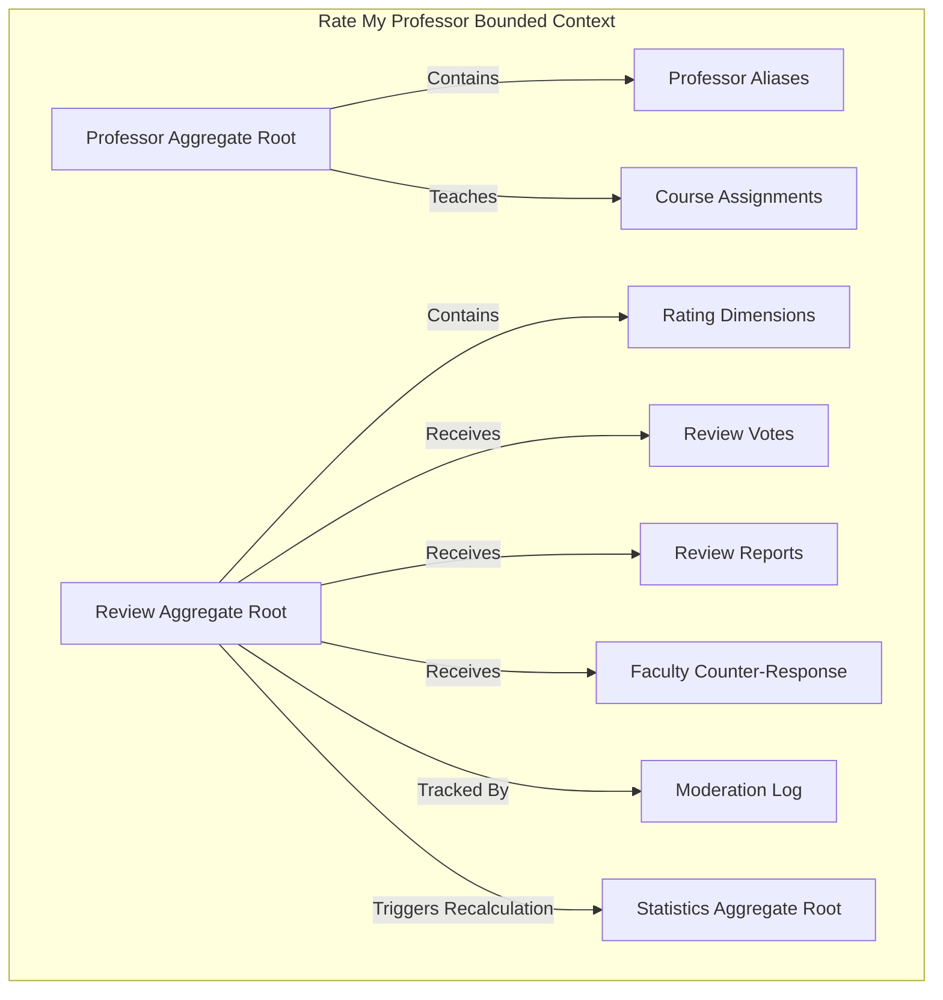
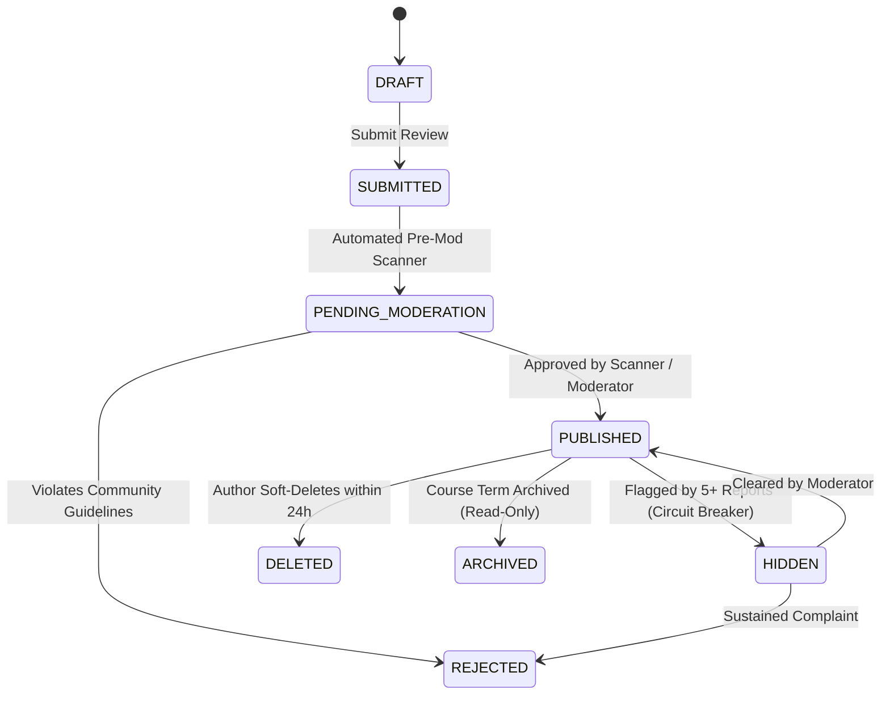
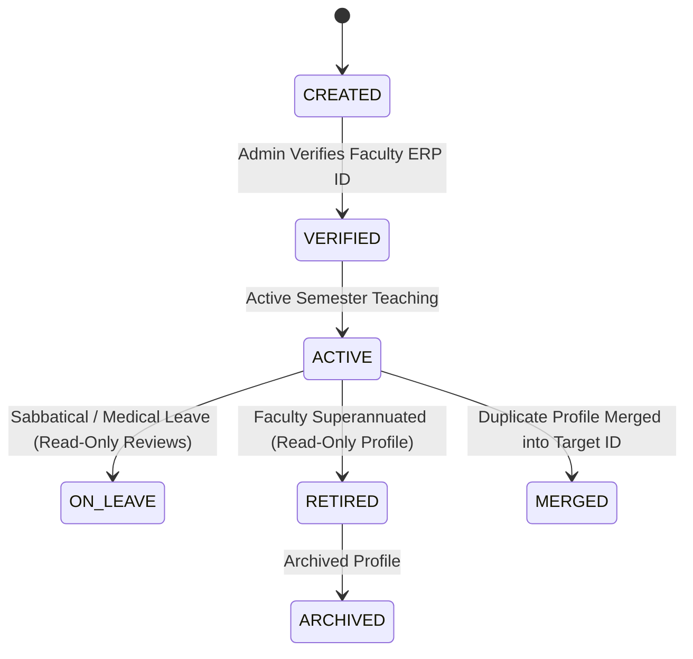

# Domain-Driven Design (DDD) & Business Rules Specification: Rate My Professor Module (MS-18.4)

## Document Information

- **Project**: College Hub (Enterprise Multi-College Platform)
- **Document Title**: Domain Model, Business Invariants, State Machines & Event Specifications
- **Target Audience**: Principal Software Architects, Domain Modelers, Lead Engineers
- **Status**: Official Domain Specification (MS-18.4 Complete)
- **Implementation Constraint**: Pure Domain-Driven Specification (Zero Code / Zero DB Schemas / Zero APIs / Zero UI)

---

## 1. Domain Entities & Bounded Context

### 1.1 Entity 1: `Professor` (Aggregate Root)

- **Purpose**: Represents a faculty member entity within an institution.
- **Responsibilities**: Maintains faculty profile state, academic department links, course teaching assignments, and status flags.
- **Business Invariants**:
  1. A `Professor` MUST belong to exactly one tenant college (`collegeId`).
  2. A `Professor` MUST have a non-empty full name and slug.
  3. A `Professor` in `RETIRED` or `INACTIVE` state cannot receive new student reviews.

### 1.2 Entity 2: `Review` (Aggregate Root)

- **Purpose**: Encapsulates student evaluation feedback for a professor.
- **Responsibilities**: Captures 4-dimension rating scores, course context, written text, and author anonymity tokens.
- **State Machine**: `DRAFT` $\rightarrow$ `SUBMITTED` $\rightarrow$ `PENDING_MODERATION` $\rightarrow$ `PUBLISHED` (or `REJECTED` / `HIDDEN` / `DELETED`).
- **Business Invariants**:
  1. A student can submit at most **one review per professor per course per academic term**.
  2. A review CANNOT be authored by the professor being reviewed.
  3. Author identity MUST be anonymized via blind HMAC-SHA256 token before public projection.

### 1.3 Entity 3: `FacultyResponse`

- **Purpose**: Formal counter-response issued by a verified professor.
- **Business Invariants**: At most **one active response** allowed per review. Faculty cannot alter or delete student reviews.

### 1.4 Entity 4: `ProfessorStatistics` (Aggregate Root)

- **Purpose**: Holds pre-computed Bayesian weighted averages, recommendation percentages, and 5-bar star distributions.
- **Business Invariants**: Statistics are **read-only** to users and can ONLY be mutated via domain event handlers responding to review state changes.

---

## 2. Comprehensive Business Rules

### 2.1 Review Submission & Edit Rules

1. **Term Limit Rule**: A student can submit at most 1 review per professor per course per semester.
   - _Rationale_: Prevents emotional review-stuffing by a single dissatisfied student.
2. **24-Hour Edit Window**: Review text and score updates are ONLY permitted within **24 hours** of submission.
   - _Rationale_: Prevents retroactive review tampering after final semester grades are published.
3. **Self-Review Prohibition**: Users cannot submit reviews for professor profiles linked to their own user account.

### 2.2 Voting & Engagement Rules

1. **One Vote Per User Per Review**: A user can vote `HELPFUL` or `UNHELPFUL` once per review.
2. **Self-Vote Prohibition**: Authors CANNOT vote on their own reviews.

### 2.3 Reporting & Moderation Rules

1. **Reporting Threshold**: If 5 distinct students flag a review within 1 hour, the domain automatically transitions the review state from `PUBLISHED` to `HIDDEN` and enqueues a `ReviewReported` event for moderator review.

---

## 3. Review Lifecycle State Machine

---

## 4. Professor Lifecycle State Machine

---

## 5. Statistics & Bayesian Calculation Engine Rules

### 5.1 IMDb-Inspired Bayesian Weighted Rating Formula

$$\text{BayesianRating} = \frac{v}{v + m} \cdot R + \frac{m}{v + m} \cdot C$$

- $v$ = Total approved review count for professor.
- $m$ = Minimum review threshold constant for college branch (e.g. $m = 5$).
- $R$ = Raw arithmetic mean of professor's approved reviews.
- $C$ = Mean quality rating across all professors in the college.

### 5.2 Recalculation Triggers

Recalculation occurs asynchronously via `StatisticsUpdated` domain events whenever:

- A review transitions to `PUBLISHED`.
- A review transitions to `HIDDEN`, `REJECTED`, or `DELETED`.

---

## 6. Domain Events Specification

| Event Name              | Trigger Condition        | Payload Data                                             | Primary Consumers                      |
| ----------------------- | ------------------------ | -------------------------------------------------------- | -------------------------------------- |
| **`ProfessorCreated`**  | New faculty onboarded    | `professorId`, `collegeId`, `departmentId`, `name`       | Search Indexer, Analytics              |
| **`ProfessorMerged`**   | Duplicate profile merged | `sourceProfId`, `targetProfId`, `collegeId`              | Review Migrator, Search Indexer        |
| **`ReviewCreated`**     | Student submits review   | `reviewId`, `professorId`, `collegeId`, `anonymousToken` | Pre-Mod Scanner, Audit Log             |
| **`ReviewPublished`**   | Review approved          | `reviewId`, `professorId`, `collegeId`, `overallRating`  | Statistics Engine, Search Indexer      |
| **`ReviewReported`**    | Review receives report   | `reviewId`, `reporterUserId`, `reason`, `reportCount`    | Moderator Queue, Circuit Breaker       |
| **`ReviewVoteAdded`**   | Helpful/Unhelpful voted  | `reviewId`, `voterUserId`, `voteType`                    | Review Counter Engine                  |
| **`FacultyResponded`**  | Faculty posts reply      | `responseId`, `reviewId`, `professorId`                  | Notification Service, Review Projector |
| **`StatisticsUpdated`** | Recalculation finished   | `professorId`, `bayesianRating`, `totalReviewsCount`     | Read Cache, Profile Projector          |

---

## 7. Abuse Prevention Domain Rules

1. **Review Bombing Protection**: Sudden velocity spikes ($\ge 10$ reviews for a single professor in under 30 minutes) trigger an automatic **velocity lock**, placing all new reviews into `PENDING_MODERATION`.
2. **Duplicate Account Detection**: Multiple accounts sharing identical device footprints or IP subnets within the same college context cannot vote or review the same target professor.

---

## 8. Domain Invariants (Unbreakable Business Laws)

1. **Strict College Isolation**: A professor or review MUST belong to exactly one college tenant (`collegeId`). Cross-tenant pollution is impossible.
2. **Irreversible Anonymous Identity**: Student identity CANNOT be exposed in public read models or API contracts.
3. **Immutable Moderation Audit**: Once a moderator action or review state change is logged, it CANNOT be modified or deleted.

---

_End of DDD Domain Specification (MS-18.4)._
