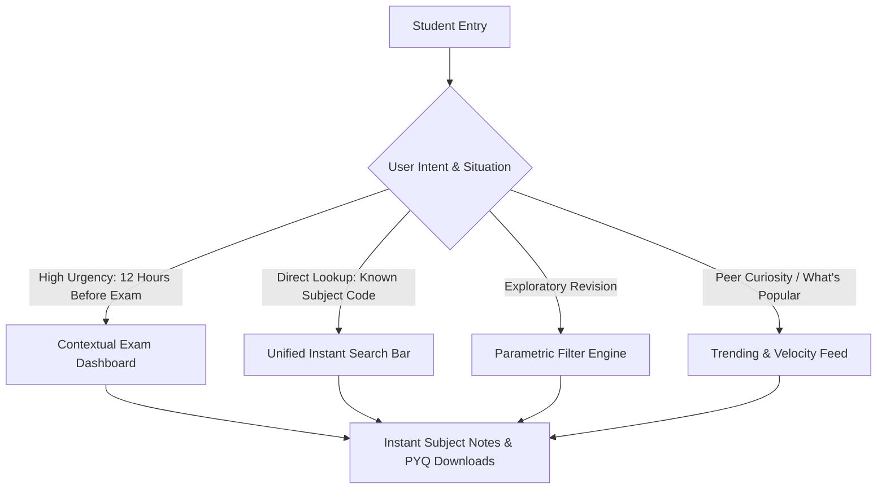

# Product Research & Competitive Analysis: Academic Resource Hub (MS-19.1)

## Document Information

- **Project**: College Hub (Enterprise Multi-College Platform)
- **Document Title**: Benchmark Analysis, User Reality & Product Architecture: Academic Resource Hub
- **Target Audience**: Software Architecture Team, Product Managers, UI/UX Lead Engineers, Operations Team
- **Status**: Official Product Research & Competitive Analysis (MS-19.1 Complete)
- **Implementation Constraint**: Pure Architecture & Product Specification (Zero Code / Zero DB Implementation / Zero API Design / Zero UI Mockups)

---

## 1. Executive Summary & Research Scope

The **Academic Resource Hub** is the core knowledge engine of College Hub. Its singular mission is to serve as the **fastest, most reliable way for a college student in India to find verified, syllabus-aligned study material before an exam**.

During exam periods (Mid-Semesters, End-Semesters, and University Board Exams), students experience extreme time pressure and cognitive overload. Today, student academic material distribution in Indian colleges is fragmented across chaotic WhatsApp groups, unindexed Telegram channels, expired Google Drive links, and outdated college LMS platforms.

This research document analyzes 14 global and domestic benchmark platforms across Academic, Knowledge, Cloud Storage, Developer, and Community domains. It synthesizes user behaviors, systemic friction points, organizational hierarchies, discovery mechanisms, non-AI quality assurance engines, and rating models to establish the architectural foundation for College Hub's Academic Resource Hub.

---

## 2. In-Depth Competitive Analysis

### 2.1 Academic Platforms

#### 2.1.1 Studocu

- **User Journey**: Search institution $\rightarrow$ Search course code $\rightarrow$ Filter by document type $\rightarrow$ Preview first 3 pages $\rightarrow$ Encounter paywall/upload wall $\rightarrow$ Upload document or subscribe to unlock full PDF.
- **Information Architecture & Navigation**: Institution-centric hierarchy leading to course pages. Deep navigation paths require selecting University $\rightarrow$ Faculty $\rightarrow$ Course.
- **Mobile vs. Desktop UX**: Desktop offers split-screen document previewing; mobile web is heavily crippled with aggressive full-screen paywalls and intrusive popups forcing app installation.
- **Upload & Download Experience**: Two-way exchange model (upload 1 document to download 2 documents). High friction for casual readers; encourages low-quality "junk uploads" just to bypass paywalls.
- **Search & Filters**: Search operates primarily on course names and user-provided document titles. Lacks fine-grained filtering for specific semester exam years.
- **Preview & Metadata**: High-speed canvas-based PDF renderer. Metadata displays university name, course, academic year, and vote count.
- **Feature Evaluation Matrix**:
  1. *What is excellent?*: Ultra-fast document previewer with instant page thumbnail rendering and keyword search within PDFs.
  2. *What is poor?*: Aggressive paywalling and forced upload quotas that lead to spam file submissions.
  3. *Why does it work?*: High SEO domain authority captures students searching Google for specific assignment answers.
  4. *What do users complain about?*: Paywalls during exam nights, low-quality duplicate uploads, and recurring subscription charges.
  5. *How College Hub can improve it*: Provide **100% free, un-paywalled access** for verified college students while using community reputation badges rather than paywalls to incentivize uploads.

#### 2.1.2 Course Hero

- **User Journey**: Google search for specific question $\rightarrow$ Land on blurred document page $\rightarrow$ Prompted to unblur by paying or uploading $\rightarrow$ Access document.
- **Information Architecture & Navigation**: Search-first entry point. Weak browsing hierarchy; heavily relies on direct document landing pages.
- **Mobile vs. Desktop UX**: Mobile experience is optimized for quick Q&A lookup; desktop provides side-by-side document and related questions view.
- **Upload & Download Experience**: Credit-based unlock system (upload 10 documents = 5 unlocks). Users frequently upload public domain or dummy files to get credits.
- **Search & Filters**: Specialized text-matching algorithm targeting specific assignment questions.
- **Feature Evaluation Matrix**:
  1. *What is excellent?*: Exact text matching for specific homework and exam questions.
  2. *What is poor?*: Blurred text paywalls create hostile UX; pervasive copyright infringement complaints from professors.
  3. *Why does it work?*: Monetizes extreme student urgency when solving specific homework problems.
  4. *What do users complain about*: Misleading preview text, expensive monthly fees, and copyright takedowns.
  5. *How College Hub can improve it*: Focus on **syllabus-structured exam preparation** (PYQs, lecture notes, lab manuals) rather than single-question unlocking, with strict uploader attribution.

#### 2.1.3 Moodle / Canvas LMS / Blackboard (Institutional LMS)

- **User Journey**: Login via university credentials $\rightarrow$ View enrolled courses grid $\rightarrow$ Click course $\rightarrow$ Navigate folder tree $\rightarrow$ Download PDF uploaded by professor.
- **Information Architecture & Navigation**: Rigid course-semester mapping controlled strictly by university administrators and faculty.
- **Mobile vs. Desktop UX**: Dated, non-responsive interfaces (especially Moodle). Mobile native apps often suffer from session timeout issues and slow file syncing.
- **Upload Experience**: Restricted strictly to professors and teaching assistants. Students cannot upload or share peer-created study guides, handwritten notes, or previous year question papers.
- **Search Experience**: Extremely poor or non-existent cross-course search. A student cannot search for "Data Structures Question Paper 2023" across the entire college database.
- **Feature Evaluation Matrix**:
  1. *What is excellent*: Official, authoritative source for official syllabus, assignment briefs, and slide decks.
  2. *What is poor*: One-way communication (faculty $\rightarrow$ student); zero peer-to-peer sharing; dismal search and dated UI.
  3. *Why does it work*: Mandatory adoption enforced by university administration.
  4. *What do users complain about*: Clunky navigation, slow download speeds, missing previous years' materials, and inability to upload student-made notes.
  5. *How College Hub can improve it*: Combine official course structures with **crowdsourced peer student uploads**, modern UI/UX, and instant cross-subject search.

---

### 2.2 Knowledge Platforms

#### 2.2.1 Notion

- **User Journey**: Open workspace $\rightarrow$ Navigate nested sidebar page tree $\rightarrow$ Search via `Cmd+K` / `Ctrl+K` $\rightarrow$ View inline databases, embedded PDFs, or rich text notes.
- **Information Architecture & Navigation**: Infinite nested page tree combined with relational database views (Gallery, Board, Table, List).
- **Mobile vs. Desktop UX**: Desktop app is powerful and highly productive; mobile app suffers from slow cold-start times and awkward multi-column layout rendering.
- **Search Experience**: Quick switcher (`Cmd+K`) provides instant title and content matching across pages.
- **Feature Evaluation Matrix**:
  1. *What is excellent*: Flexible database properties (tags, multi-select, relations, formulas) allowing rich metadata customization.
  2. *What is poor*: Slow mobile load times; lacks native multi-page binary PDF rendering and annotation features.
  3. *Why does it work*: Customizability allows power users to build personal study dashboards.
  4. *What do users complain about*: Overwhelming setup complexity for casual users; poor offline performance on mobile.
  5. *How College Hub can improve it*: Provide Notion-like rich metadata tagging (Semester, Exam Type, Subject Code) out-of-the-box **without requiring students to configure databases manually**.

#### 2.2.2 Obsidian

- **User Journey**: Open local vault $\rightarrow$ Instant search or Graph View navigation $\rightarrow$ Read/edit markdown notes with bidirectional links (`[[Subject Code]]`).
- **Information Architecture & Navigation**: Graph-based network of interconnected notes and local folder hierarchies.
- **Mobile vs. Desktop UX**: Blazing fast performance on both desktop and mobile due to local plain-text file storage.
- **Feature Evaluation Matrix**:
  1. *What is excellent*: Zero latency, offline-first performance, and powerful tag/link navigation.
  2. *What is poor*: Steep learning curve; non-trivial setup for sharing files with a group of 100+ classmates.
  3. *Why does it work*: Loved by power users for personal knowledge management (PKM).
  4. *What do users complain about*: Lack of frictionless cloud collaboration for non-technical users.
  5. *How College Hub can improve it*: Adopt Obsidian's **instant search speed and tag linking mental model** while providing seamless multi-tenant cloud storage.

#### 2.2.3 GitBook

- **User Journey**: Open documentation URL $\rightarrow$ Left sidebar navigation by chapter/topic $\rightarrow$ Read clean, typography-focused content $\rightarrow$ Search via persistent header bar.
- **Information Architecture & Navigation**: Two-level sidebar hierarchy (Categories $\rightarrow$ Pages) designed for sequential reading.
- **Feature Evaluation Matrix**:
  1. *What is excellent*: World-class reading typography, clean visual hierarchy, and fast static page loading.
  2. *What is poor*: Optimized for structured text/markdown, not for PDF lecture slides or scanned handwritten exam papers.
  3. *Why does it work*: Provides the gold standard in technical documentation navigation.
  4. *How College Hub can improve it*: Adopt GitBook's **clean sidebar subject navigation and reading layout** for viewing digital study materials.

---

### 2.3 Cloud Storage Platforms

#### 2.3.1 Google Drive

- **User Journey**: Click shared WhatsApp link $\rightarrow$ Opens Google Drive folder $\rightarrow$ Browse subfolders (`/Semester 5/CSE/Notes/`) $\rightarrow$ Click PDF to view $\rightarrow$ Download.
- **Information Architecture & Navigation**: Deep folder trees. Navigation depends entirely on how meticulously the folder creator organized it.
- **Mobile vs. Desktop UX**: Good mobile app performance, but deep folder navigation requires repeated back-and-forth taps.
- **Search Experience**: Powerful text search, but returns uncontextualized results from across the entire personal drive without academic filters (e.g. searching "Math" returns personal bills, old photos, and unrelated PDFs).
- **Feature Evaluation Matrix**:
  1. *What is excellent*: Ubiquitous availability, instant PDF previewing, and seamless Google account integration.
  2. *What is poor*: Complete lack of academic metadata (cannot filter by "Mid-Sem 2023" or "3rd Semester"); links break when creators delete files or revoke access; folder chaos.
  3. *Why does it work*: Free 15GB storage makes it the default fallback for Class Representatives (CRs).
  4. *What do users complain about*: Broken links, duplicate files, unorganized "junk drawer" folders, and permission denied errors (`Access Requested`).
  5. *How College Hub can improve it*: Replace arbitrary folder trees with **structured, auto-curated subject channels** backed by strict academic metadata.

---

### 2.4 Developer & Community Platforms

#### 2.4.1 GitHub

- **User Journey**: Search repository $\rightarrow$ Inspect folder structure & README $\rightarrow$ View release tags $\rightarrow$ Clone/Download ZIP $\rightarrow$ Star/Fork or open Issue.
- **Information Architecture & Navigation**: Branch/Tag selection, file tree viewer, integrated markdown README preview, and issue tracking.
- **Feature Evaluation Matrix**:
  1. *What is excellent*: Version control, clear file attribution, repository stars/forks as quality metrics, and issue reporting for broken content.
  2. *What is poor*: Intimidating interface for non-engineering students (e.g., Arts, Medical, Management).
  3. *Why does it work*: Establishes definitive single-source-of-truth repositories for code and open-source projects.
  4. *How College Hub can improve it*: Adapt GitHub's **versioning, issue/broken-file reporting, and star/upvote signals** into a simple, non-technical student UI.

#### 2.4.2 Stack Overflow

- **User Journey**: Search problem $\rightarrow$ View question page $\rightarrow$ Inspect accepted answer badge $\rightarrow$ Upvote/Downvote answers $\rightarrow$ Flag duplicates.
- **Feature Evaluation Matrix**:
  1. *What is excellent*: Strict community moderation, accepted answer badges, duplicate question closing, and reputation points.
  2. *What is poor*: Toxic moderation culture intimidating new users from asking questions.
  3. *Why does it work*: High trust signal; users instantly spot the verified correct solution.
  4. *How College Hub can improve it*: Implement **"Verified Solution Key" badges for PYQs** and community duplicate flagging without toxic elitism.

---

## 3. Product Comparison Matrix

| Feature / Dimension | Studocu | Course Hero | Moodle / Canvas | Google Drive | GitHub | **College Hub Target** |
| :--- | :--- | :--- | :--- | :--- | :--- | :--- |
| **Primary Access Model** | Paywall / Upload Wall | Credit Paywall | Institutional Login | Open / Link Share | Open Source | **100% Free Verified Student Access** |
| **Academic Hierarchy** | Univ $\rightarrow$ Course | Univ $\rightarrow$ Course | Dept $\rightarrow$ Course | Manual Folder Tree | Repo $\rightarrow$ Folder | **College $\rightarrow$ Dept $\rightarrow$ Sem $\rightarrow$ Subject** |
| **Search Capabilities** | Document Title | Question Matching | Basic Title Match | Full-Text (Unfiltered) | Code / File Search | **Parametric Academic + PDF Text Search** |
| **Peer Upload Support** | Yes (Encouraged) | Yes (Encouraged) | ❌ No (Faculty Only) | Yes | Yes | **✅ Yes (Student + Faculty Verified)** |
| **Quality Control** | Low (Spam Uploads) | Low (Spam Uploads) | High (Official Only) | None | High (PR Review) | **Pre-Flight Checks + Community Voting** |
| **Mobile Experience** | Poor (Aggressive Ads) | Moderate | Poor (Outdated UI) | Good | Moderate | **Mobile-First, Zero-Ad Responsive UI** |
| **Offline Access** | App-only download | None | Basic Mobile Cache | Offline Sync | Git Clone | **PWA Cached PDF Reading** |
| **Material Tagging** | Basic Category | Question Tags | None | None | Topic Badges | **Rich Tags (PYQ, Notes, Lab, Year, Scheme)** |
| **Version History** | ❌ No | ❌ No | ❌ No | Basic File History | Git Commits | **File Lineage & Updated Syllabus Versioning** |

---

## 4. Indian College Research & Student Reality

### 4.1 How Indian Students Currently Share Study Materials

In Indian engineering, medical, degree, and autonomous colleges, academic material sharing relies on informal, fragmented channels:

1. **WhatsApp Class Groups**: Class Representatives (CRs) or top-performing students drop PDF scans into official or unofficial WhatsApp groups 24–48 hours before an exam.
2. **Telegram Broadcast Channels**: Senior students or student unions run unofficial Telegram channels containing Google Drive links, compressed ZIP files, or pirated textbook PDFs.
3. **Google Drive Folder Links**: A dedicated CR creates a shared Drive folder (e.g. `BTech_CSE_2022-26`). Over time, links get lost, permissions break, or files get deleted by accident.
4. **Physical Pen Drives & Photostat Shops**: Local photocopy shops outside the college campus act as physical material hubs, selling printed previous year question paper bundles ("Series" / "Pass Books").
5. **College LMS**: Rarely used by students for exam preparation because faculty slides are often theoretical, missing previous year question solutions and practical lab exam shortcuts.

---

### 4.2 Why Students Still Struggle: The 5 Critical Pain Points

```
+-----------------------------------------------------------------------------------+
|                            THE EXAM NIGHT PANIC LOOP                              |
+-----------------------------------------------------------------------------------+
| 1. WhatsApp Search Chaos  --> Search "CS301 PYQ" in 5000+ media messages          |
| 2. Broken Drive Links     --> "Access Denied: Request Permission from Owner"      |
| 3. Version Confusion      --> Is this for the 2021 Regulation or 2024 Scheme?     |
| 4. Poor Quality Scans     --> Blurry, rotated, dark CamScanner PDFs missing Page 3 |
| 5. Missing Answer Keys    --> PYQs available, but zero verified step-by-step keys  |
+-----------------------------------------------------------------------------------+
```

#### Pain Point 1: Exam Night Search Friction & Media Loss
On the night before a Mid-Sem or End-Sem exam, students waste 30 to 60 minutes scrolling through thousands of WhatsApp messages or searching Telegram channels trying to locate a specific PDF dropped 3 months prior.

#### Pain Point 2: Broken Access & Ownership Single Points of Failure
When a Class Representative graduates, changes their Google account, or revokes Drive permissions, entire semesters of curated notes become inaccessible overnight.

#### Pain Point 3: Syllabus Drift & Regulation Mismatch
Indian universities (e.g. AKTU, VTU, GTU, Anna University, Mumbai University, Autonomous Colleges) update their academic regulations every 3 to 4 years (e.g. 2018 Scheme vs 2021 Scheme vs 2024 NEP Scheme). Students frequently study from outdated notes containing obsolete topics or missing newly added modules.

#### Pain Point 4: Unreadable, Poorly Scanned PDFs
Handwritten notes scanned via phone apps are frequently blurry, poorly lit, cropped incorrectly, or missing crucial odd-numbered pages.

#### Pain Point 5: PYQs Without Verified Solutions
While question papers are easily found, verified step-by-step solution keys (especially for numerical subjects like Mathematics, Thermodynamics, Electrical Circuits, and Algorithms) are missing, forcing students to cross-check unverified answers across multiple sources.

---

### 4.3 How College Hub Solves These Pain Points

1. **Zero-Search Instant Contextual Dashboard**: When a student opens College Hub, the system automatically detects their enrolled College, Department, and Current Semester, presenting a 1-click grid of active subjects and materials.
2. **Permanent Multi-Tenant Cloud Storage**: Materials uploaded to College Hub belong to the institutional module space, eliminating broken personal Drive links.
3. **Regulation & Scheme Explicit Tagging**: Every study material is explicitly tagged with its academic scheme/regulation year (e.g. `2021 Scheme`, `2024 NEP Scheme`), warning students if a file belongs to an older syllabus.
4. **Pre-Flight File Sanitation**: Automated upload validators inspect PDF resolution, page counts, orientation, and file integrity before saving.
5. **Verified Answer Key Crowdsourcing**: PYQ posts support linked community solution keys with upvotes and faculty/CR verification badges.

---

## 5. Academic Resource Organization Strategy

### 5.1 Evaluation of Structural Models

We evaluated three architectural hierarchy models for organizing academic materials:

#### Model A: Traditional Deep Tree
`College → Department → Semester → Subject → Material Type → File`
- **Pros**: Perfectly mirrors university administrative structures. Highly intuitive for browsing.
- **Cons**: Deep navigation path ( requires 5 to 6 clicks to reach a file).

#### Model B: Course-Code Centric Flat Model
`Course Code (e.g. CS501) → All Filterable Materials`
- **Pros**: Fast for students who memorize their course codes (`CS501`, `KCS-501`). Excellent for direct search.
- **Cons**: Fails for first-year students or non-engineering departments where course codes are non-standard or inconsistent across electives.

#### Model C: Professor-Centric Model
`Professor → Subject → Materials`
- **Pros**: Useful when specific professors set custom exam papers or require specific lecture slide notes.
- **Cons**: In Indian colleges, multiple professors teach the same subject across different class sections, and syllabus papers are frequently set by external university boards.

---

### 5.2 Recommended Architecture: Hybrid Contextual Course-Centric Model

College Hub adopts a **Hybrid Contextual Model** combining the intuitive structure of Model A with the speed of Model B:

```
[Authenticated Student Session Context]
           │
           ├── Default View: Auto-Resolved (College / Department / Current Semester)
           │      └── Subject Grid (e.g., CS501: Operating Systems)
           │             └── Categorized Material Tabs (PYQs, Notes, Lab, Slides)
           │
           └── Search View: Direct Jump via Course Code / Keyword Search
```

#### Why This Model Wins:
1. **Zero-Click Onboarding**: A 5th-semester CSE student at Stanford/NIT Trichy doesn't need to select College $\rightarrow$ Dept $\rightarrow$ Semester every time. The app defaults to their current active subjects.
2. **Unified Course Code Alias**: Supports university-specific subject code aliases (`CS302`, `KCS-501`, `PCC-CS501`) pointing to the same canonical subject hub.

---

## 6. Material Types Taxonomy & Scope Strategy

To prevent clutter while ensuring total coverage, materials are categorized into a structured taxonomy, divided into **V1 Launch Essentials** and **V2 Extended Expansion**:

```
+-----------------------------------------------------------------------------------+
|                            MATERIAL TYPES TAXONOMY                                |
+-----------------------------------------------------------------------------------+
|  V1 LAUNCH ESSENTIALS (HIGH EXAM INTENT)                                          |
|  ├── 1. PYQs (Previous Year Question Papers) [Tagged by Exam Type & Year]         |
|  ├── 2. Verified Lecture Notes [Handwritten / Typed by Top Students / Faculty]     |
|  ├── 3. Lab Manuals & Executable Code Files [Programs, Circuits, Viva Qs]         |
|  ├── 4. Formula & Cheat Sheets [1-2 Page Quick Revision Summaries]                 |
|  └── 5. Official Syllabus Copies & Course Outlines                                |
|                                                                                   |
|  V2 EXTENDED EXPANSION (PROJECT & ADVANCED KNOWLEDGE)                             |
|  ├── 6. Assignments & Homework Solution Guides                                    |
|  ├── 7. Faculty Slide Decks & Lecture Presentation PPTs                           |
|  ├── 8. Mini Project Reports & Source Code Repositories                           |
|  ├── 9. Major Project / Capstone Thesis Documentation                             |
|  └── 10. Reference E-Books & Open Educational Resources (OER)                     |
+-----------------------------------------------------------------------------------+
```

### Mandatory Metadata Schema Per Material Type (V1)

1. **PYQs**:
   - `Exam Type`: Mid-Sem-1 | Mid-Sem-2 | End-Sem | Makeup / Backlog Exam
   - `Academic Year`: e.g. 2023-24
   - `Regulation / Scheme Year`: e.g. 2021 Scheme
   - `Has Solution Key`: Boolean
2. **Lecture Notes**:
   - `Unit / Module Number`: Unit 1 through Unit 5, or Full Syllabus
   - `Author Type`: Faculty Verified | Student Top Scorer | General Student
   - `Format`: Handwritten Scan | Typed Digital Note
3. **Lab Manuals & Code**:
   - `Programming Language / Tool`: C++ | Java | Python | MATLAB | Cadence | Verilog
   - `Lab Exam Viva Questions Included`: Boolean

---

## 7. Multi-Tier Discovery Strategy

Students discover materials through 4 distinct discovery paths depending on their intent and urgency:



### 1. Contextual Exam Dashboard (Highest Priority)
When the academic calendar indicates an upcoming exam week, the home screen dynamically morphs into an **Exam Survival Mode**, grouping PYQs and quick-revision formula sheets for the student's registered subjects at the very top.

### 2. Unified Instant Search
- **Debounced 200ms Search**: Matches subject names (`Operating Systems`), course codes (`CS501`), topic keywords (`Page Replacement Algorithms`), and uploader names.
- **In-Document Full-Text Search**: Queries OCR text indexed from stored PDF documents.

### 3. Parametric Filter Engine
Allows granular filtering across:
- `Department`: CSE, ECE, ME, EE, Civil, Basic Sciences
- `Semester`: Semester 1 through 8
- `Material Category`: PYQ, Lecture Notes, Lab Manual, Formula Sheet
- `Upload Recency`: Past 30 Days, Past Year, All Time
- `Verification Status`: Faculty Approved, High Helpfulness Rating

### 4. Trending & Download Velocity Feed
Displays "Top Downloaded Notes in your College this week", surfacing high-quality peer notes during peak exam preparation cycles.

---

## 8. Non-AI Quality & Moderation System

To ensure absolute reliability without relying on unpredictable AI models, College Hub enforces a deterministic, rules-based quality control pipeline:

```
+-----------------------------------------------------------------------------------+
|                         NON-AI QUALITY ENFORCEMENT PIPELINE                       |
+-----------------------------------------------------------------------------------+
| 1. Binary Hash Check   --> SHA-256 hash matching prevents duplicate file uploads   |
| 2. Pre-Flight Validator--> Rejects <10KB PDFs, corrupted files, & password-locks  |
| 3. Metadata Integrity  --> Zod schema validates mandatory Subject Code & Semester |
| 4. Quarantine Trigger  --> 3+ community flags automatically quarantine file       |
| 5. Uploader Trust Level--> Verified CR / Top Contributor uploads bypass queue      |
+-----------------------------------------------------------------------------------+
```

### 8.1 Duplicate File Prevention Engine
- **SHA-256 Hash Verification**: During pre-upload, the client computes the binary SHA-256 checksum of the file. If the hash already exists in the tenant's database, the upload is halted instantly, and the user is redirected to the existing file.

### 8.2 File Pre-Flight Validation Rules
1. **File Size Bounds**: Minimum 50KB (prevents blank/corrupted files); Maximum 50MB (prevents video/raw binary dumps).
2. **MIME & Header Verification**: Enforces strict PDF/image magic bytes (`%PDF-`, `\xFF\xD8\xFF`).
3. **Password Protection Inspection**: Attempts reading PDF catalog; rejects encrypted/password-locked PDFs immediately.
4. **Minimum Page Count Check**: Reject 0-page or un-parseable document structures.

### 8.3 Community Moderation & Quarantine Circuit Breaker
- **Multi-Reason Reporting**: Students can flag files for:
  - `Wrong Subject / Semester`
  - `Outdated Syllabus / Scheme`
  - `Blurry / Unreadable Pages`
  - `Copyright / Plagiarism Violation`
  - `Spam / Advertising / Irrelevant Content`
- **Automated Quarantine Threshold**: If a material receives **3 unique student reports within 24 hours**, its visibility is suspended, and it is routed to the Student Moderator Queue for review.

---

## 9. Rating, Ranking & Reputation Architecture

### 9.1 Multi-Signal Quality Score (QS) Formula

To rank search results and material feeds, College Hub combines helpfulness votes, verified downloads, and report penalties into a weighted Bayesian Quality Score:

$$QS = \frac{(H \times 3.0) + (D_{val} \times 1.0) - (R \times 5.0)}{1.0 + \lambda \cdot \Delta t}$$

Where:
- $H$: Net Helpful votes ($\text{Upvotes} - \text{Downvotes}$)
- $D_{val}$: Verified unique student downloads (1 download per authenticated student session)
- $R$: Active community reports
- $\Delta t$: Age of file in months
- $\lambda$: Decaying factor for old academic schemes ($\lambda = 0.1$)

### 9.2 Verified Uploader Reputation Hierarchy

Students build academic standing within their college based on the utility of their shared study materials:

```
[Peer Contributor] --> 5+ Helpful Votes  (Gains "Contributor" Badge)
[Top Academic Guide] --> 50+ Helpful Votes (Gains "Peer Tutor" Badge)
[Verified Scholar] --> Faculty / CR Endorsed Notes (Gains "Verified Notes" Gold Shield)
```

---

## 10. Search Experience Architecture

### 10.1 Search Query Resolution Flow

```
User Input Query (e.g., "cs301 mid sem 2023 pyq")
                   │
                   ▼
       [Tokenizer & Normalizer]
       (Strips noise words, extracts: Subject="CS301", Type="PYQ", Year="2023")
                   │
                   ▼
  ┌────────────────┴────────────────┐
  ▼                                 ▼
[Structured DB Index Match]   [PDF Full-Text OCR Match]
  │                                 │
  └────────────────┬────────────────┘
                   ▼
       [Weighted Ranking Engine]
       (Sorts by Quality Score + Subject Match Precision)
                   │
                   ▼
     Instant Result Cards Rendering
```

### 10.2 Supported Search Filters
- Exact Subject Code match (`CS501`, `MAT201`)
- Keyword match in title/description (`Fourier Transform`, `Concurrency`)
- Professor name tag (`Prof. Raman Notes`)
- Material type filter chip (`[PYQ]`, `[Formula Sheet]`)

---

## 11. Risks & Mitigation Strategies

| Identified Risk | Severity | Mitigation Strategy |
| :--- | :--- | :--- |
| **Copyright Takedown Notices (Textbook Publishers)** | High | Restrict uploads to handwritten student notes, PYQs, and faculty slides. Proactively block pirated commercial textbook uploads via filename & hash filters. |
| **Outdated Notes Skewing Exam Preparation** | Medium | Require mandatory `Regulation/Scheme Year` metadata tag. Display warning banner on files older than 3 years. |
| **Spam File Dumping During Exam Week** | Medium | Limit uploads to maximum 5 files per student per day unless uploader has "Verified Contributor" status. |
| **Storage Abuse (Large Video / Binary Files)** | Low | Strict MIME-type checking permitting only PDF, PNG, JPG, and DOCX files under 50MB. |

---

## 12. College Hub Architectural Design Decisions Log

### Decision 1: 100% Free Unlocked Access for Verified Students
- **Inspired By**: Wikipedia & Open-Source Software (vs. Studocu / Course Hero)
- **Why Chosen**: Paywalls during exam nights create intense anger and encourage junk uploads. Requiring verified `.edu` / institutional logins guarantees a trusted student community without needing paywalls.
- **Why Alternatives Were Rejected**: Paywall models destroy student trust and degrade material quality.
- **Adaptation for Indian Colleges**: Authenticates via `.ac.in` email or College ERP Student ID.

### Decision 2: Hybrid Contextual Subject Grid Navigation
- **Inspired By**: GitBook (Navigation) + Notion (Database Tagging)
- **Why Chosen**: Reduces the time needed to locate study material from 45 minutes on WhatsApp to under 10 seconds on College Hub.
- **Why Alternatives Were Rejected**: Pure folder trees (Google Drive) become chaotic; pure search (Course Hero) fails when students don't know exact search keywords.
- **Adaptation for Indian Colleges**: Tailored to Indian University semester schemes (Semesters 1 through 8, Mid-Sem vs End-Sem PYQ patterns).

### Decision 3: Deterministic SHA-256 + Rule-Based Quality Control
- **Inspired By**: GitHub (SHA Checksums) & Stack Overflow (Community Moderation)
- **Why Chosen**: Non-AI deterministic validation provides 100% predictable, zero-latency quality control without LLM API costs or hallucination errors.
- **Why Alternatives Were Rejected**: AI content moderation is expensive, slow, and prone to false positives on handwritten math/circuit diagrams.
- **Adaptation for Indian Colleges**: Handles typical Indian student upload formats (CamScanner scans, handwritten lecture notes, university exam papers).

---

_End of Product Research Specification: Academic Resource Hub (MS-19.1)._
