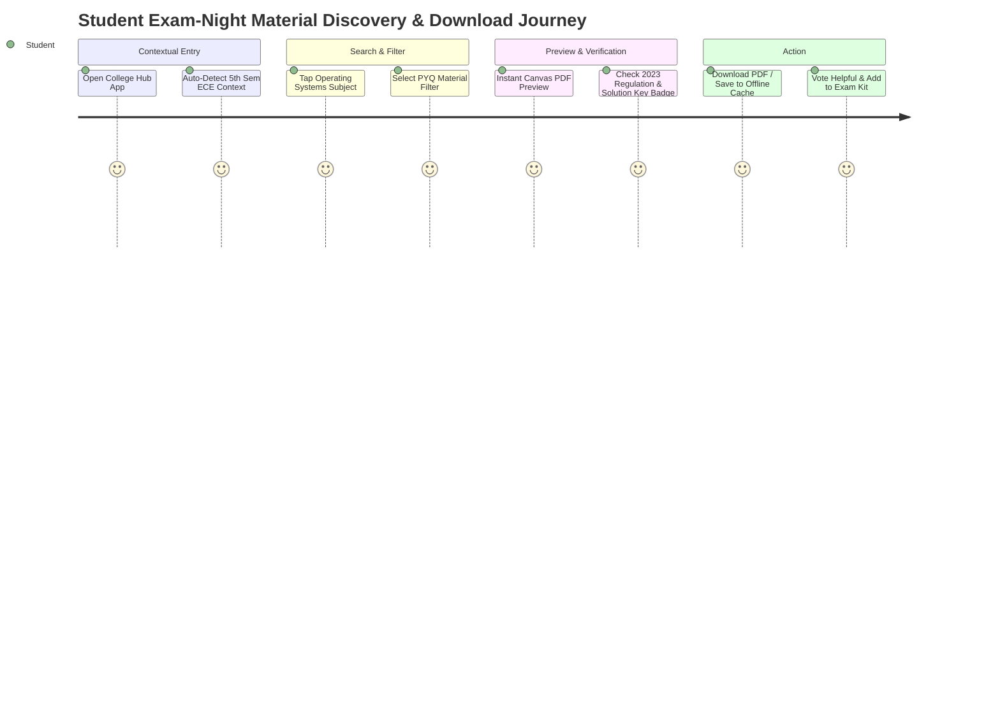
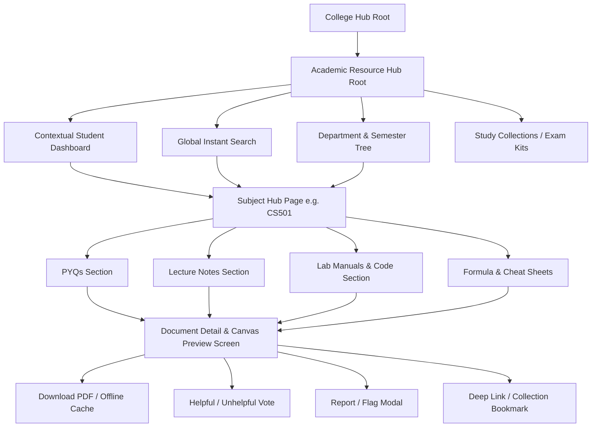

# User Experience & Information Architecture: Academic Resource Hub (MS-19.2)

## Document Information

- **Project**: College Hub (Enterprise Multi-College Platform)
- **Document Title**: User Experience, Personas, User Journeys, Information Architecture & Interaction Design: Academic Resource Hub
- **Target Audience**: UI/UX Designers, Product Managers, Frontend Engineers, Mobile Lead Developers, Architecture Team
- **Status**: Official UX/IA Specification Standard (MS-19.2 Complete)
- **Implementation Constraint**: Pure Architecture & Product Specification (Zero Code / Zero DB Implementation / Zero API Design / Zero UI Mockups)

---

## 1. Core UX Mission Statement

> **"A student in an Indian college under extreme exam pressure must be able to locate, preview, and download the exact verified study material or PYQ they need in under 10 seconds."**

Every interaction model, information hierarchy, search index priority, and touch target in the Academic Resource Hub is engineered to eliminate cognitive friction, eliminate broken search paths, and achieve this 10-second target.

---

## 2. Comprehensive User Personas

### 2.1 Persona 1: Aarav Sharma — 1st Year B.Tech Student (The Novice Explorer)

- **Demographics**: 18 years old, 1st Year Electronics & Communication, autonomous engineering college.
- **Goals**: Needs official syllabus copy, lab manuals for Physics/Chemistry, and previous year mid-term question papers.
- **Pain Points**: Unfamiliar with college course codes (`EC101` vs `ECE-101`); confused by senior student terminology; afraid of studying wrong syllabus schemes.
- **Usage Patterns & Frequency**: Uses app 2–3 times per week for assignment reference; daily during mid-term exam week.
- **Device Preference**: 90% Mobile (Android device on 4G/5G).

### 2.2 Persona 2: Priya Nair — 4th Year Senior Student (The Exam Night Sprinting Student)

- **Demographics**: 21 years old, 4th Year Computer Science.
- **Goals**: Wants to find high-yield formula sheets, 1-page unit summaries, and 5-year End-Sem PYQ solution keys 8 hours before a university exam.
- **Pain Points**: Wastes hours scrolling through old WhatsApp media; frustrated by broken Google Drive links and un-indexed PDFs.
- **Usage Patterns & Frequency**: Extreme spikes during exam weeks (late night 11 PM – 4 AM); low usage during early semester weeks.
- **Device Preference**: Mobile-first during late night studying, Laptop/Desktop during multi-window study sessions.

### 2.3 Persona 3: Vikram Reddy — Class Representative (CR) / Top Contributor

- **Demographics**: 20 years old, 3rd Year Mechanical Engineering.
- **Goals**: Distribute official assignment briefs, lecture notes, and lab manuals to 60+ classmates without getting 50 individual WhatsApp messages.
- **Pain Points**: Constant pinging from classmates asking for lost files; difficulty keeping track of updated assignment versions.
- **Usage Patterns & Frequency**: High uploader frequency (weekly uploads after lectures/labs).
- **Device Preference**: 60% Laptop/Desktop (for PDF uploads), 40% Mobile (for link sharing).

### 2.4 Persona 4: Prof. S. Krishnamurthy — Verified Faculty Member

- **Demographics**: 52 years old, Senior Professor, Department of Mathematics.
- **Goals**: Wants to publish official lecture slide decks, tutorial problem sets, and syllabus notices directly to enrolled students.
- **Pain Points**: Frustrated when students study from incorrect or outdated peer notes containing mathematical errors.
- **Usage Patterns & Frequency**: Uploads material 1–2 times per month at the start of new units.
- **Device Preference**: 100% Desktop / Laptop web browser.

### 2.5 Persona 5: Student Moderator (Community Guardian)

- **Demographics**: 20 years old, 3rd Year Student Council Tech Lead.
- **Goals**: Maintain repository quality by reviewing reported files, removing copyright violations, and resolving duplicate uploads.
- **Pain Points**: High volume of reported files during exam periods; needs quick preview tools to verify flagged documents.
- **Usage Patterns & Frequency**: Daily 15-minute moderation queue check.
- **Device Preference**: 70% Desktop, 30% Tablet.

### 2.6 Persona 6: College Platform Administrator

- **Demographics**: 35 years old, Institutional IT Administrator.
- **Goals**: Ensure platform compliance with copyright regulations and storage quotas; inspect college-wide analytics.
- **Usage Patterns & Frequency**: Monthly audit review.
- **Device Preference**: Desktop web portal.

---

## 3. End-to-End User Journeys & Flow Diagrams



### Key Journeys & Lifecycle States

#### Journey 1: Search & Filter Resource (< 10 Seconds)

1. **Entry**: Student opens app $\rightarrow$ Search bar pre-populated with active enrolled subjects.
2. **Input**: Types `CS501` or `Operating Systems`.
3. **Instant Results**: System renders instant debounced suggestion cards grouped by `PYQs` and `Lecture Notes`.
4. **Filter Selection**: Taps `2023 End-Sem` chip.
5. **Result**: Exact PDF card displays with `Verified Solution Key` badge.

#### Journey 2: Browse by Semester / Subject / Material Type

1. **Entry**: Student taps `Academic Hub` tab.
2. **Auto-Context**: System pre-selects student's current college (`Stanford/NIT`), department (`CSE`), and semester (`Sem 5`).
3. **Subject Carousel**: Horizontal scroll of enrolled subjects (`Database Systems`, `Computer Networks`, `Software Engineering`).
4. **Material Tabs**: Tapping `Database Systems` displays 4 filter pills: `PYQs (12)`, `Notes (8)`, `Lab Manuals (3)`, `Formula Sheets (2)`.

#### Journey 3: Resource Preview & Instant Download

1. **Selection**: Taps document card.
2. **Instant Preview Modal**: Renders multi-page PDF canvas with thumbnail sidebar without downloading full binary to file manager.
3. **Metadata Inspection**: Page count (`14 pages`), Uploader (`Verified CR`), Academic Scheme (`2021 Regulation`), Upvotes (`48`).
4. **Download**: Taps persistent bottom CTA `Download PDF (2.4 MB)` or `Save Offline`.

#### Journey 4: Uploading Resource (Student / Faculty)

1. **Trigger**: Clicks `Upload Study Material` CTA.
2. **File Selection**: Drag-and-drop or file picker selects `OS_Unit3_Notes.pdf`.
3. **Pre-Flight Validation**: System runs client-side binary check (`SHA-256 hash match check`, `MIME check`, `Page count check`).
4. **Metadata Auto-Tagging**: Selects Subject (`Operating Systems`), Category (`Lecture Notes`), Unit (`Unit 3`), Scheme (`2021 Scheme`).
5. **Anonymity & Attribution Toggle**: Toggles `Post with Profile Name` or `Post Anonymously`.
6. **Publish**: Progress bar fills $\rightarrow$ Confirmation screen: _"Material live! Earned +10 Contributor Points."_

#### Journey 5: Study Collection ("Exam Survival Kit")

1. **Creation**: Student taps `+ Create Study Collection` $\rightarrow$ Names it `"OS Mid-Sem Survival Kit"`.
2. **Bundling**: Adds Unit 1 Notes, 2022 PYQ, 2023 PYQ, and Formula Cheat Sheet into a single bundle.
3. **1-Click Share**: Generates deep link `/collections/os-midsem-kit` to share with study group.

---

### Comprehensive Lifecycle State Matrix

| User Journey         | Loading State                                        | Empty State                                                            | Error State                                                   | Offline State                                                          | Permission Denied                                     |
| :------------------- | :--------------------------------------------------- | :--------------------------------------------------------------------- | :------------------------------------------------------------ | :--------------------------------------------------------------------- | :---------------------------------------------------- |
| **Directory Search** | 3 Shimmer Card Skeletons retaining exact card height | "No study materials match 'XYZ'. Be the first to upload!" + Upload CTA | "Unable to connect to resource hub. Retry"                    | "Viewing cached subjects. Connect to internet to search full catalog." | N/A (Public Student View)                             |
| **PDF Preview**      | Center Spinner + Blurred thumbnail skeleton          | "Document contains 0 pages or is corrupted."                           | "Failed to render PDF preview."                               | "Offline PDF preview available from device cache."                     | "Access Restricted to Verified College Students."     |
| **Resource Upload**  | Circular progress percentage bar (0% - 100%)         | N/A                                                                    | "Duplicate File Detected: SHA-256 matches existing document." | "Upload queued. File will auto-upload when connection restores."       | "Only verified students with .edu emails can upload." |

---

## 4. Information Architecture & Navigation Hierarchy



### Deep Linking Structure

- **Subject Hub**: `/colleges/:collegeSlug/departments/:deptCode/semesters/:semNo/subjects/:subjectCode`
- **Material Detail**: `/resources/:resourceId`
- **Direct PDF Canvas**: `/resources/:resourceId/preview`
- **Study Collection**: `/collections/:collectionId`
- **Uploader Profile**: `/users/:userSlug/contributions`

### Breadcrumb & Context Preservation Architecture

Every sub-page retains a top persistent breadcrumb bar:
`Stanford Univ` $\rightarrow$ `CSE` $\rightarrow$ `5th Sem` $\rightarrow$ `CS501: Operating Systems` $\rightarrow$ `PYQs (2023)`

---

## 5. Search Experience Architecture

The search experience is designed for high intent and rapid query resolution:

```
+-----------------------------------------------------------------------------------+
|                           INSTANT SEARCH OVERLAY UX                               |
+-----------------------------------------------------------------------------------+
|  [🔍 Search subject, course code (e.g. CS501), PYQ year, or professor...  ]     |
+-----------------------------------------------------------------------------------+
|  RECENT SEARCHES:   🕒 CS301 PYQ    🕒 Operating Systems Notes    [Clear]        |
|  TRENDING IN ECE:   🔥 Mid-Sem 2023 Solutions    🔥 Digital Signal Processing  |
+-----------------------------------------------------------------------------------+
|  SUGGESTED SUBJECT HUBS:                                                          |
|  📚 CS501 — Operating Systems (5th Sem CSE)                                       |
|  📚 EC302 — Digital Electronics (3rd Sem ECE)                                     |
+-----------------------------------------------------------------------------------+
|  EXACT MATCHING MATERIALS:                                                        |
|  📄 CS501 End-Sem PYQ 2023 with Solution Key [PDF • 14 Pages • 48 Upvotes]        |
+-----------------------------------------------------------------------------------+
```

### Key Search Capabilities

1. **Course Code Priority Matching**: Searching `CS501`, `KCS501`, or `CS-501` instantly resolves to the canonical Operating Systems subject hub regardless of hyphenation.
2. **Instant Keyword Highlight**: In-search preview snippets highlight query terms directly inside indexed document titles and OCR tags.
3. **Recent & Trending Filters**: Displays the user's last 5 searches + "Trending Exam Materials in Your College" carousel.

---

## 6. Resource Page Information Hierarchy

Information on the Resource Detail Screen is ordered according to student decision priority:

1. **Title Header & Category Badge**: File Name (`Operating Systems Unit 3 Notes`), Category Tag (`Lecture Notes`), Scheme Tag (`2021 Scheme`).
2. **Verification & Quality Badges**:
   - `Verified Solution Key` (Gold Badge)
   - `Faculty Approved` (Blue Shield)
   - `High Helpfulness Score` (`48 Upvotes • 142 Downloads`)
3. **Canvas PDF Multi-Page Previewer**: Interactive canvas rendering pages 1 through N with zoom, page navigation, and full-screen preview toggle.
4. **Academic Metadata Block**:
   - `Subject`: CS501 — Operating Systems
   - `Semester`: 5th Semester
   - `Academic Year / Exam`: 2023-24 End-Sem
   - `Page Count & File Size`: 14 Pages • 2.4 MB
5. **Uploader Profile Card**: Uploader avatar, display name / anonymous token, verified student badge, and uploader reputation score.
6. **Action Bar (Sticky Bottom on Mobile)**:
   - `Download PDF` (Primary CTA)
   - `Save Offline` (Secondary CTA)
   - `👍 Helpful` / `👎 Unhelpful`
   - `🔖 Bookmark` / `➕ Add to Study Collection`
   - `🚩 Report`
7. **Version History & File Lineage**: Shows if a newer version of the file or syllabus scheme exists (e.g. _"Updated version uploaded on Aug 2024"_).
8. **Related Resources Grid**: Cards for similar PYQs or lecture notes for the same subject.

---

## 7. Upload Experience & Validation Journey

```
+-----------------------------------------------------------------------------------+
|                            UPLOAD EXPERIENCE FLOW                                 |
+-----------------------------------------------------------------------------------+
|  Step 1: File Selection   --> Drag & drop PDF or tap file picker                  |
|  Step 2: Binary Check     --> Client SHA-256 check (Detects duplicates instantly) |
|  Step 3: Metadata Form    --> Auto-filled Subject, Category, Exam Type, Scheme     |
|  Step 4: Anonymity Toggle --> Choose "Post as Aarav" or "Post Anonymously"         |
|  Step 5: Upload Progress  --> Real-time % progress bar + Cancel button            |
|  Step 6: Completion       --> Success Card + "+10 Contributor Points" toast       |
+-----------------------------------------------------------------------------------+
```

### Validation & Duplicate Rules

- **Instant Hash Matching**: If the file's SHA-256 hash matches an existing document in the college repository, the upload halts immediately with a warning: _"This exact file has already been uploaded by Priya N. View existing document."_
- **File Integrity Checks**: Rejects files $<50\text{ KB}$, corrupted binaries, or password-protected PDFs.

---

## 8. Download & Offline Experience

1. **Pre-Download Instant Preview**: Students can read the entire PDF in the built-in Canvas viewer without downloading the file to their device's local storage.
2. **1-Click PDF Download**: Direct binary download preserving original file naming convention (`CS501_Operating_Systems_PYQ_2023.pdf`).
3. **PWA Offline Study Storage**: Tapping `Save Offline` stores the rendered document in browser Cache Storage using Service Workers, allowing students to read study guides during travel or network outages without internet.

---

## 9. Study Collections ("Exam Survival Kits")

Study Collections allow students to bundle multiple related materials into a single, shareable study package:

```
[OS Mid-Sem Survival Kit] (Collection Title)
   ├── 📄 Unit 1 & 2 Handwritten Lecture Notes
   ├── 📄 2022 Mid-Sem Question Paper
   ├── 📄 2023 Mid-Sem Question Paper with Solution Key
   ├── 📄 1-Page Formula & Cheat Sheet
   └── 📄 Lab Exam Viva Question Bank
```

- **Navigation**: Students browse collections by subject or creator.
- **1-Click Bulk Action**: `Download All Files as ZIP` or `Save Entire Kit Offline`.

---

## 10. Mobile-First Experience & Touch Ergonomics

- **Thumb Zone Optimization**: Primary action buttons (`Download PDF`, `Preview Canvas`, `Helpful Vote`) are placed within the bottom 30% thumb reach zone.
- **Swipe Gestures**: Swipe left/right between document preview pages; swipe down to dismiss modals.
- **Responsive Breakpoints**:
  - Mobile: `320px` – `640px` (Single column stacked view, sticky bottom download bar).
  - Tablet: `641px` – `1024px` (2-column layout: PDF Preview on left, Metadata & Actions on right).
  - Desktop: `1025px+` (3-column layout with fixed sidebar subject tree).

---

## 11. Accessibility Standards (WCAG 2.1 AA Compliance)

- **Keyboard Navigation**: Full `Tab`, `Shift+Tab`, `Arrow Key`, and `Enter` support across PDF preview controls and filter chips.
- **Screen Reader Attributes**: ARIA live regions for upload progress (`aria-live="polite"`), explicit ARIA labels on icon buttons (`aria-label="Download PDF, size 2.4 MB"`).
- **Color Contrast**: Text-to-background contrast ratio $\ge 4.5:1$ across light and dark themes.
- **PDF Accessibility**: Renders fallback plain text transcripts for scanned image PDFs when available.

---

## 12. Abuse Prevention UX

1. **Duplicate Upload Shield**: Instant SHA-256 hash detection prevents uploader spam.
2. **Quarantine Notice**: Flagged files display a non-intrusive warning: _"This document has been reported by 3 students for wrong categorization and is under review."_
3. **Vote Manipulation Defense**: Upvote/downvote actions are rate-limited per student session ID to prevent bot brigading.

---

## 13. College Hub UX Design Decisions Log

### Decision 1: Built-In Canvas PDF Preview Before Download

- **Inspired By**: Studocu & Scribd (Preview Engine)
- **Why Chosen**: Saves student mobile data and storage space by allowing them to verify file content before downloading full 20MB binaries.
- **Why Alternatives Were Rejected**: Direct file downloads without preview force students to open external PDF apps, cluttering local device downloads.
- **Adaptation for Indian Colleges**: Optimized for low-bandwidth 3G/4G networks with incremental page loading.

### Decision 2: Study Collections ("Exam Survival Kits")

- **Inspired By**: Spotify Playlists & GitHub Repositories
- **Why Chosen**: Exam preparation requires multiple document types (Notes + PYQ + Solutions). Bundling them into 1-click kits eliminates multi-file search friction.
- **Why Alternatives Were Rejected**: Isolated file listings require students to search 5 separate times for 5 different exam files.
- **Adaptation for Indian Colleges**: Tailored to Indian college exam study patterns (Mid-Sem kits, End-Sem kits, Lab Viva kits).

### Decision 3: Contextual Auto-Filtering based on Enrolled Student Profile

- **Inspired By**: Notion (Contextual Views)
- **Why Chosen**: Eliminates the 5-step navigation tree (`College → Dept → Sem → Subject`) for 90% of daily student visits.
- **Why Alternatives Were Rejected**: Generic homepages require manual searching on every single page load.
- **Adaptation for Indian Colleges**: Auto-syncs with Indian university semester structures (Semesters 1 through 8).

---

_End of UX & Information Architecture Specification: Academic Resource Hub (MS-19.2)._
