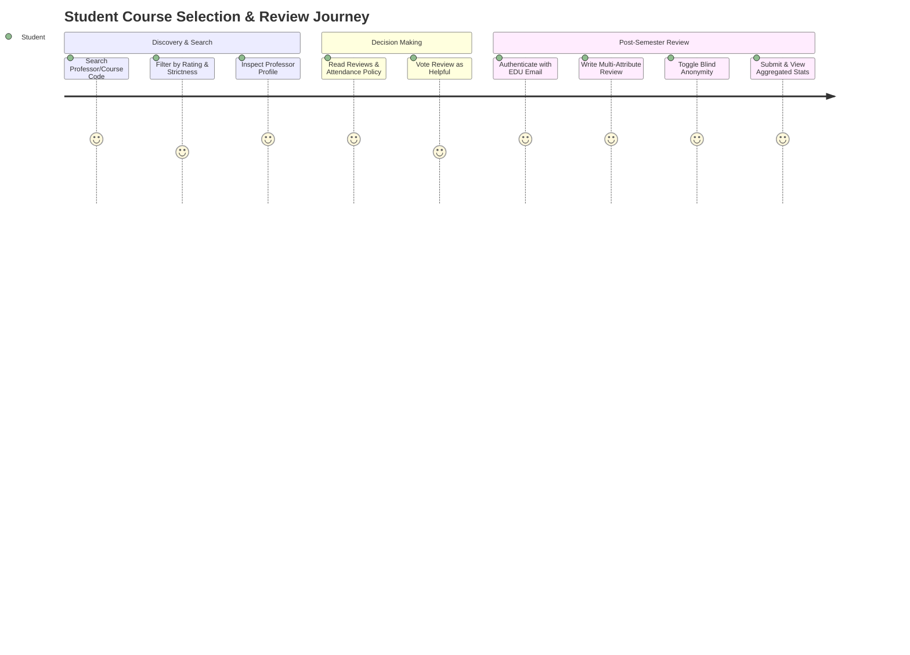
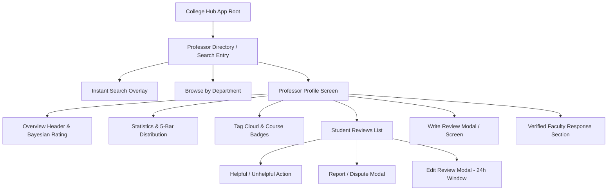

# User Experience & Information Architecture: Rate My Professor Module (MS-18.2)

## Document Information

- **Project**: College Hub (Enterprise Multi-College Platform)
- **Document Title**: User Experience, Personas, User Journeys & Information Architecture
- **Target Audience**: UI/UX Designers, Product Managers, Frontend Leads, Architecture Team
- **Status**: Official UX/IA Specification (MS-18.2 Complete)
- **Implementation Constraint**: Pure Architecture & Product Specification (Zero Code / Zero APIs / Zero DB Schemas)

---

## 1. User Personas

### Persona 1: Rohan Sharma — First Year B.Tech Student (The Novice Explorer)

- **Demographics**: 18 years old, 1st Year Computer Science, Stanford/NIT Trichy.
- **Goals**: Wants to understand professor expectations, attendance strictness, and lab assignment workloads before choosing elective courses.
- **Pain Points**: Overwhelmed by new college environment; afraid of getting low internal marks or "viva" penalties.
- **Usage Patterns**: Mobile-first user; accesses platform late at night during course registration week; searches by subject code (e.g., `CS101`).

### Persona 2: Ananya Patel — Final Year Senior Student (The Seasoned Reviewer)

- **Demographics**: 21 years old, 4th Year Mechanical Engineering.
- **Goals**: Wants to give honest advice to juniors about project guides and elective professors; wants to ensure feedback is completely anonymous.
- **Pain Points**: Frustrated by unhelpful or abusive reviews; fears faculty retaliation if identity is leaked.
- **Usage Patterns**: Writes detailed reviews after semester exam results are announced; votes on review helpfulness.

### Persona 3: Prof. K. V. Raman — Verified Faculty Member (The Educator)

- **Demographics**: 45 years old, Associate Professor, Department of Electronics.
- **Goals**: Wants to understand constructive student feedback to improve teaching methodology; wants a formal, dignified channel to clarify course grading policies.
- **Pain Points**: Upset by unfair review-bombing after strict exam grading; lacks a official platform counter-response mechanism.
- **Usage Patterns**: Desktop user; logs in quarterly to inspect course feedback and publish official faculty responses.

### Persona 4: Student Moderator (The Community Guardian)

- **Demographics**: 20 years old, 3rd Year Student Council Representative.
- **Goals**: Ensures reviews remain constructive and free of hate speech, profanity, or personal harassment.
- **Pain Points**: High volume of flagged reviews during exam result week.
- **Usage Patterns**: Uses desktop/tablet moderator queue; reviews audit logs and action histories.

---

## 2. Complete User Journeys

### Key Journeys & Lifecycle States

#### Journey A: Professor Search & Decision Making

1. **Entry**: Student opens College Hub app $\rightarrow$ Selects "Professors" tab.
2. **Search**: Student types subject code `CS201` or professor name in instant search.
3. **Filtering**: Applies filters: _Grading Fairness $\ge$ 4.0_, _Attendance Policy: Flexible_.
4. **Profile Reading**: Inspects 5-bar star distribution, top tag chips, and Bayesian quality score.
5. **Helpful Vote**: Taps "Helpful" on a detailed review explaining viva questions.

#### Journey B: Writing & Submitting an Anonymous Review

1. **Entry**: Clicks "Rate This Professor" on profile page.
2. **Verification**: System checks active `.ac.in` / `.edu` authenticated session.
3. **Rating Attributes**: Rates 4 dimensions (Clarity, Strictness, Punctuality, Approachability) on 1-5 scales.
4. **Course Context**: Selects Academic Year (`2024-25`), Semester (`5th Sem`), and Course (`Data Structures`).
5. **Anonymity Toggle**: Verified "Post Anonymously" toggle enabled by default (generates blind HMAC hash).
6. **Submission**: Review posted instantly; author has **24 hours** to edit or delete their review.

#### Journey C: Edge & State Handlers

- **Empty State**: When a professor has 0 reviews $\rightarrow$ Displays friendly illustration + "Be the first student from your college to review Prof. X!" CTA button.
- **Loading State**: Skeleton cards shimmer effect retaining exact visual height of review cards to prevent layout shifts (CLS = 0).
- **Error State**: Non-blocking toast alert + fallback retry trigger if network connection drops.
- **Offline State**: Cached offline view displaying last-fetched reviews with a banner: _"Viewing cached reviews. Connect to internet to submit new reviews."_

---

## 3. Information Architecture (IA) & Navigation Hierarchy

### Deep Linking Structure

- **Professor Profile**: `/colleges/:collegeSlug/professors/:professorSlug`
- **Department Directory**: `/colleges/:collegeSlug/departments/:deptSlug`
- **Write Review Flow**: `/colleges/:collegeSlug/professors/:professorSlug/rate`
- **Direct Review Link**: `/colleges/:collegeSlug/professors/:professorSlug#review-:reviewId`

---

## 4. Search Experience Architecture

- **Instant Search**: Debounced 200ms input trigger matching professor names, course codes (`CS101`), and department names (`Electronics & Communication`).
- **Search Entry Points**: Top persistent search bar on web and bottom nav search tab on mobile.
- **Filter Chips**:
  - _Department_: Computer Science, Electrical, Mechanical, Civil, Applied Sciences.
  - _Rating_: $\ge 4.0$, $\ge 3.0$.
  - _Strictness_: Flexible Grading, Strict Grading.
  - _Semester_: 1st Sem through 8th Sem.
- **Recent & Trending**: Shows user's last 5 searches + "Trending Professors in Your College" carousel.

---

## 5. Professor Profile Information Hierarchy

Information is ordered strategically based on user decision hierarchy:

1. **Profile Header & Verified Badge**: Name, Department, Designation, Avatar, Verified Faculty Badge.
2. **Bayesian Overall Quality Rating (1-5)**: Prominent score card + IMDb-inspired rating confidence score (e.g. _"4.6/5 based on 42 verified reviews"_).
3. **Recommendation Percentage**: _"88% of students recommend taking courses with this professor."_
4. **4-Attribute Academic Rating Matrix**: Breakdown bars for _Lecture Clarity_, _Grading Strictness_, _Punctuality_, and _Approachability_.
5. **Interactive Rating Distribution (5-Bar Histogram)**: Visual breakdown of 5-star, 4-star, 3-star, 2-star, 1-star review distributions.
6. **Top Teaching Style Tags**: Pill cloud (`#ToughGrader`, `#PopQuizzes`, `#IndustryExpert`, `#LabFocused`).
7. **Verified Faculty Response (If present)**: Official response section styled with institutional border accents.
8. **Student Reviews List**: Sortable by _Most Helpful_, _Recent_, _Highest Rated_, _Lowest Rated_.
9. **Similar Department Professors**: Carousel for discovering alternative elective guides.

---

## 6. Review Writing & Editing Experience

- **Before Writing**: Displays community guidelines and reminder that ratings are tied to verified `.edu` credentials while published blindly.
- **During Writing**:
  - 4 Star-Rating Sliders / Steppers (Clarity, Strictness, Punctuality, Approachability).
  - Mandatory Course Selection (`Course Code` & `Semester`).
  - Tag Selector (up to 3 tags).
  - Review Text Box (minimum 20 characters, maximum 1000 characters).
  - Optional Grade Disclosure dropdown (`Grade Received: A+, A, B, C, F, Passed`).
- **After Submission**: Success confirmation + instant preview of posted review.
- **24-Hour Edit Window**: Review authors can edit or delete their review within **24 hours** of submission. After 24 hours, reviews become immutable to prevent post-hoc review manipulation.

---

## 7. Mobile-First Experience & Ergonomics

- **Thumb Zone Ergonomics**: All primary CTA buttons ("Rate Professor", "Filter", "Submit Review") positioned in the bottom 30% of the screen for single-thumb reachability.
- **Bottom Sheet Drawers**: Filters, report forms, and course selectors open as swipeable bottom sheet drawers on mobile devices.
- **Touch Targets**: Minimum touch target size of **48x48px** for all interactive buttons and star icons.
- **Responsive Breakpoints**:
  - Mobile: `320px` to `640px` (Single column layout).
  - Tablet: `641px` to `1024px` (2-column layout).
  - Desktop: `1025px+` (3-column layout with sticky profile summary sidebar).

---

## 8. Accessibility Standards (WCAG 2.1 AA Compliance)

- **Contrast**: Text-to-background contrast ratio $\ge 4.5:1$ for body text and $\ge 3.0:1$ for large headings.
- **Keyboard Navigation**: Full keyboard tab navigation support (`Tab`, `Shift+Tab`, `Enter`, `Escape` to close modals).
- **Screen Reader Attributes**: ARIA labels for non-text icons (`aria-label="4 out of 5 stars"`).
- **Reduced Motion**: Respects `prefers-reduced-motion` OS preferences, disabling decorative animations.

---

## 9. Abuse Prevention & Integrity UX

1. **Verified Student Requirement**: Only authenticated students with active college domains can submit reviews.
2. **Velocity Rate Limits**: Maximum 1 review per professor per student per semester.
3. **Automated Toxicity Filter**: Pre-submission scanner detecting abusive language, personal attacks, or phone numbers before review reaches public feed.
4. **Mass Reporting Circuit Breaker**: If a review receives 5+ unique student reports in 1 hour, it is automatically hidden and routed to the Moderator Queue for review.

---

## 10. College Hub UX Decisions Summary

| UX Decision                     | Inspired By          | Why Chosen                                             | Why Alternatives Rejected                           | Suitability for Indian Colleges                                      |
| ------------------------------- | -------------------- | ------------------------------------------------------ | --------------------------------------------------- | -------------------------------------------------------------------- |
| **Bayesian Confidence Badge**   | IMDb                 | Eliminates rating skew from 1 or 2 outlier reviews.    | Arithmetic averages overrate low-volume professors. | Matches fixed Indian branch section sizes (60-120 students).         |
| **4-Attribute Academic Rating** | Google Reviews       | Separates lecture clarity from strict grading.         | Single overall star rating hides critical nuances.  | Accommodates Indian internal vs external exam grading strictness.    |
| **24-Hour Edit Limit**          | Professional Systems | Prevents retroactive review manipulation after grades. | Permanent editing allows review tampering.          | Prevents emotional edits after mid-term/end-term results release.    |
| **Verified Faculty Reply**      | Google Business      | Provides dignified right-of-reply for professors.      | One-sided platforms create faculty hostility.       | Builds constructive faculty-student relationship in Indian colleges. |

---

_End of UX & Information Architecture Specification (MS-18.2)._
